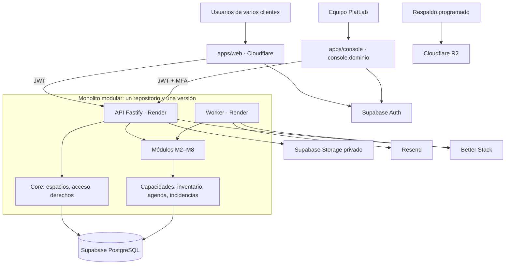

# 02 — Arquitectura e infraestructura

Revisión: 30 de septiembre de 2026. Única fuente del contrato de módulo, el aislamiento, el stack, la infraestructura y los parámetros iniciales. El modelo detallado está en [03](03_datos.md) y las decisiones en [05](05_decisiones.md).

## 1. Vista general



- API y worker ejecutan el mismo código y la misma versión. El worker procesa avisos, importaciones y exportaciones fuera de la petición.
- Hay una sola base PostgreSQL compartida y cada fila institucional lleva `workspace_id`.
- No hay un servidor por módulo ni por cliente. Un servicio solo se extrae ante una necesidad medida (escala, ciclo de entrega o aislamiento operativo).

## 2. Stack

| Capa | Elección |
|---|---|
| Lenguaje | TypeScript estricto |
| Web y consola | React + Vite, React Router, TanStack Query, React Hook Form + Zod, Tailwind + Radix/shadcn |
| API y worker | Node.js 24 LTS + Fastify, con un plugin por módulo |
| Datos | PostgreSQL de Supabase; `pg` + PgTyped; migraciones SQL en `supabase/migrations/` |
| Identidad y archivos | Supabase Auth (JWT asimétrico) y Storage privado |
| Tareas | Outbox y trabajos persistentes en PostgreSQL; pg-boss solo si hace falta |
| Calidad | pnpm workspaces, ESLint, dependency-cruiser, Vitest, pgTAP (`supabase test db`), Playwright y CI |

Las versiones exactas y el lockfile se fijan al crear el proyecto (T-01), sin aceptar automáticamente versiones mayores futuras.

Descartados sin una necesidad medida: Next.js, API en Workers, CRUD directo a Supabase, microservicios, Redis, Kafka, motor BPM, event sourcing completo, microfrontends y réplicas de lectura.

## 3. Repositorio

```text
apps/
  web/src/{app,features/<módulo>}      # aplicación de clientes
  console/src/                         # consola del Equipo PlatLab
  server/src/
    entrypoints/{api,worker}.ts
    modules/<módulo>/{domain,application,infrastructure,http}
    capabilities/{inventory,scheduling,incidents}
    platform/{db,auth,storage,jobs,observability}
packages/
  contracts/   # DTO, esquemas Zod y errores; sin acceso a la base
  modules/     # manifiestos de módulos: registro único
  ui/          # componentes y tokens visuales
supabase/{migrations,tests,seed.sql}
infra/         # Dockerfile, render.yaml, wrangler y runbooks
```

dependency-cruiser verifica en CI:

- No hay ciclos.
- Un módulo usa otro solo mediante su interfaz pública.
- Core no importa módulos.
- `domain` no importa HTTP ni infraestructura.
- Los frontends no importan código del servidor y `web` no importa `console`.

Cada tabla la escribe solo su módulo propietario. Un caso de uso puede coordinar varios módulos dentro de la misma transacción.

## 4. Contrato de módulo

Cada módulo es una rebanada vertical registrada en `packages/modules`. Su manifiesto es la única fuente para validar contratos, sembrar permisos y componer la interfaz.

```ts
defineModule({
  code: 'reagents',            // estable; coincide con core.module_definitions.code
  name: 'Reactivos',
  requires: ['core'],          // dependencias obligatorias
  integrates: ['practices'],   // integraciones opcionales
  permissions: ['reagents.catalog.read', 'inventory.issue.create', 'inventory.adjust.create' /* … */],
  roleGrants: { admin: [/* … */], operator: [/* … */], teacher: ['reagents.requestable.read'] },
  nav: [{ path: 'reactivos', label: 'Reactivos', permission: 'reagents.catalog.read' }],
  homeCard: { permission: 'reagents.catalog.read' },  // el servidor aporta su resumen a /home
  published: false,            // true al superar su puerta
});
```

Los nombres de permisos del ejemplo son ilustrativos; el catálogo definitivo se fija al implementar cada módulo.

Para agregar un módulo:

1. Registrar la decisión en [05](05_decisiones.md): qué resuelve, dependencias, permisos y roles que los reciben.
2. Escribir el manifiesto en `packages/modules`.
3. Crear la migración con esquema propio: `workspace_id`, FKs compuestas, RLS, grants y pruebas pgTAP.
4. Implementar el servidor en `modules/<código>`, con comandos transaccionales y un plugin Fastify bajo `/v1/workspaces/:workspaceId/<ruta>`.
5. Definir los contratos en `packages/contracts`.
6. Crear la web en `features/<código>`: rutas diferidas, tablero del módulo y tarjeta de Inicio.
7. Cubrir exportación, importación y disposición de sus datos.
8. Crear una versión de paquete en la consola para venderlo; se habilita por contrato ([ADR 0002](05_decisiones.md#adr-0002)).
9. Marcar `published: true` cuando pase su puerta ([04](04_roadmap.md)).

Un módulo nuevo no modifica tablas de otros módulos. Se integra por su interfaz pública o por eventos de outbox.

## 5. Aislamiento entre clientes

Cuatro barreras independientes:

1. **API.** JWT verificado por JWKS → membresía vigente en el espacio → derecho del módulo → permiso y ámbito → reglas del recurso. El `workspaceId` de la URL solo selecciona el espacio; no autoriza.
2. **Esquema.** `workspace_id NOT NULL` en toda tabla institucional. `UNIQUE (workspace_id, id)` y las FKs compuestas impiden referenciar filas de otro espacio.
3. **RLS.** El runtime usa un rol sin propiedad de tablas ni `BYPASSRLS`, con contexto local en cada transacción. Los esquemas de dominio no se exponen por la Data API.
4. **Periferia.** Archivos (`<workspace_id>/<documento>/<versión>`), trabajos, exportaciones, caché del navegador y logs llevan el espacio.

Cada comando sigue estos pasos:

1. Verificar el JWT y validar la entrada.
2. Tomar un `PoolClient` y abrir la transacción con el rol de la API.
3. Fijar actor y espacio con `set_config(..., true)`.
4. Comprobar membresía, estado del espacio, módulo, permiso y ámbito, y reclamar la clave de idempotencia.
5. Bloquear en orden estable y escribir negocio, auditoría, idempotencia y outbox. Confirmar o revertir todo.

Nunca se usa `pool.query` a mitad de una transacción.

Pruebas obligatorias:

- IDs de otro espacio.
- Espacio sin membresía y membresía revocada.
- Módulo apagado.
- Pool reutilizado sin fuga de contexto.

## 6. Autorización y activación de módulos

Una operación nueva exige **módulo publicado + derecho vigente + estado operativo + dependencias + permiso + ámbito + reglas del recurso**.

- **Roles.** Catálogo fijo y versionado en código, sincronizado a SQL por migración, con asignaciones por espacio y ámbito ([01 §5](01_producto.md#5-actores-y-roles)). No hay editor de roles personalizados.
- **Derechos.** Solo el comando `apply_contract_revision` del Equipo PlatLab los crea o cambia, junto con los límites, en una transacción auditada.
- **Estados del módulo:** `disabled → enabled → draining → read_only`.

| Acción | `enabled` | `draining` | `read_only` |
|---|:-:|:-:|:-:|
| Nuevas operaciones y compromisos | ✔ | — | — |
| Resolver pendientes: entregas, devoluciones y reservas | ✔ | ✔ | — |
| Consultar y exportar el historial | ✔ | ✔ | ✔ |

- La expiración del contrato bloquea operaciones nuevas en cada petición, aunque el estado siga en `enabled`.
- Desactivar un módulo nunca borra tablas.
- No se puede apagar una dependencia mientras haya módulos dependientes activos.
- Contrato, permiso del usuario y bandera de despliegue son controles distintos.

## 7. Comandos y consistencia

- API REST con OpenAPI generado desde los contratos.
- Comandos explícitos (`receipts`, `issues`, `adjustments`, `approve`, `accept-proposal`, `relocate`, `prepare`, `close`). Nunca un `PATCH` libre sobre estados o saldos.
- Cada comando crítico admite `Idempotency-Key` y versión esperada.
- Errores estables: `INSUFFICIENT_STOCK`, `SCHEDULE_CONFLICT`, `VERSION_CONFLICT`, `MODULE_READ_ONLY` y `QUOTA_EXCEEDED`.
- Cantidades como cadenas decimales en JSON y `numeric` en SQL; nunca aritmética con `number`.
- Lo que debe cumplirse junto se hace de forma síncrona: aprobar y reservar, entregar y mover stock.
- Correo, exportaciones e indicadores se procesan después del commit mediante outbox.
- Los conflictos de agenda se impiden con exclusión GiST y los saldos con bloqueo de fila.
- Lo que muestra la pantalla es orientativo: la confirmación vuelve a validar.

## 8. Frontend

- `GET /v1/workspaces/:workspaceId/me` devuelve los módulos habilitados y los permisos efectivos; con eso se arman el menú y las rutas.
- `GET /v1/workspaces/:workspaceId/home` compone en el servidor los resúmenes de los módulos visibles para el usuario, con una sola petición por vista.
- Una URL directa recibe la misma denegación que la interfaz.
- Hay rutas diferidas por módulo y un endpoint agregado por vista.
- La caché distingue espacio, identidad y filtros, y se limpia al cambiar de usuario o de espacio.
- No hay actualización optimista de existencias ni de aprobaciones.
- El tablero operativo se refresca con sondeo solo cuando está visible. Docentes y estudiantes no tienen sondeo periódico. Los valores están en §12.

## 9. Infraestructura y ambientes

| Pieza | Servicio |
|---|---|
| `app.<dominio>` | Cloudflare Workers Static Assets (SPA) |
| `console.<dominio>` | Compilación separada de `apps/console` |
| `api.<dominio>` | Render Web Service para la API y Background Worker, con el mismo release |
| Base, Auth y Storage | Supabase Pro |
| Correo | Resend: SMTP de Auth y avisos del worker |
| Respaldos externos | Cloudflare R2 en una cuenta separada, cifrados |
| Observabilidad | Better Stack: errores, logs, métricas y heartbeats |

- **Región candidata:** Render Virginia + Supabase `us-east-1`. Se confirma midiendo desde Ecuador en el spike S-01.
- **Ambientes:**
  - Desarrollo: Supabase local y datos sintéticos.
  - Staging: proyecto separado.
  - Producción.

  Los previews nunca apuntan a producción.
- **Entrega:**
  1. Tipos y pruebas.
  2. Compilación.
  3. Staging con el flujo completo.
  4. Copia verificada.
  5. Migraciones aditivas.
  6. API y worker del mismo release.
  7. Frontend.

  Un rollback de código no revierte la base.
- **Alternativa:** VPS con Cloudflare Tunnel y el mismo Dockerfile, solo si una institución lo exige o el ahorro neto lo justifica.
- **Presupuesto de referencia:** USD 150–185/mes con tarifas publicadas, no contractual, para varios clientes pequeños en producción compartida más staging. Excluye trabajo humano y PITR. Con un solo cliente, la licencia histórica de USD 100/mes no lo cubre.

## 10. Seguridad y operación

- **JWT e identidad.** Se verifica con `jose` y JWKS, sin secreto compartido. OAuth de Google y Microsoft llega en F3. Las invitaciones exigen una acción explícita: nunca se aceptan por GET ni con `email_confirm: true`.
- **Consola.** Cada ruta `/v1/console/*` exige JWT + `aal2` + cuenta de staff activa + permiso, y queda auditada en `platform.staff_audit_events`. La consola no da lectura de inventarios.
- **Accesos privilegiados.** Hay tres caminos separados:
  - La consola, para contratos.
  - La automatización: migraciones, copias y disposición.
  - La intervención excepcional nominativa, con MFA, motivo y evidencia.
- **Secretos y respuestas.** Los secretos se guardan por ambiente en los proveedores y en CI, nunca en Git ni en variables `VITE_*`. Las respuestas privadas llevan `Cache-Control: no-store` y CORS acepta solo orígenes exactos.
- **Storage.** Es privado: la API autoriza y emite URL firmadas de corta duración. Cada cambio crea una versión nueva en vez de sobrescribir.
- **Respaldos.**
  - Supabase Pro cubre la base y los metadatos, no los bytes de los archivos.
  - Se añade una copia diaria cifrada de base y archivos en R2, con manifiesto y checksums.
  - La restauración aislada se ensaya antes del piloto y después de forma periódica.
- **Monitoreo.** Alertas por API caída, errores, pool agotado, consultas lentas, outbox antigua, worker sin heartbeat, tareas fallidas y copia vencida.

## 11. Datos reales y salida del cliente

- PlatLab actúa como encargado del tratamiento de los datos operativos del cliente (LOPDP Ecuador).
- Antes de cargar datos reales hacen falta:
  - Contrato de encargo aceptado por un representante autorizado.
  - Inventario de proveedores.
  - Procedimientos probados.
- **Estados del espacio:** `provisioning → trial/active → closing → terminated`, con `suspended` como estado reversible.
- **Admisión de datos:** `synthetic → controlled_loading → operational` (G1).
- Baja de un usuario, solicitud de eliminación, desactivación de un módulo y fin del encargo son procesos distintos. Ninguno borra tablas compartidas.
- **Disposición al terminar:** `pending → exporting → deletion_pending → deleting → completed`, o `retained_exception`. Cada repositorio deja evidencia: base, archivos, Auth, R2, exportaciones y logs.
- **Plazos:** la Resolución SPDP-SPD-2025-0030-R da 3 días para ejecutar una eliminación comunicada y 5 al terminar la relación; su cómputo se valida con asesoría.
- **Retención de copias:** se fija por repositorio antes de G1. Ni 7 ni 30 días se asumen como cumplimiento.
- Un registro minimizado de supresiones se vuelve a aplicar antes de abrir una restauración.
- Fuentes:
  - [LOPDP](https://www.telecomunicaciones.gob.ec/wp-content/uploads/2023/11/LOPDP-LEXIS.pdf)
  - [Reglamento General](https://www.gob.ec/sites/default/files/regulations/2025-01/02%20Reglamento%20General%20a%20la%20Ley%20Org%C3%A1nica%20de%20Protecci%C3%B3n%20de%20Datos%20Personales_0.pdf)
  - [SPDP-SPD-2025-0030-R](https://spdp.gob.ec/wp-content/uploads/2025/08/0030-R.pdf)
  - [SPDP-SPD-2026-0004-R](https://spdp.gob.ec/wp-content/uploads/2026/01/04.01.01-SPSP-SPD-2026-0004-R-Norma-general-de-transferencias-signed.pdf)
  - [DPA de Supabase](https://supabase.com/legal/customer-resources/data-processing-addendum)

## 12. Parámetros iniciales

Son valores de arranque para pruebas. Se ajustan con mediciones y no son compromisos comerciales.

| Área | Valor |
|---|---|
| Sondeo del tablero operativo | 30 s, solo con la pestaña visible, con variación aleatoria y retroceso ante error o 429 |
| Docentes y estudiantes | Sin sondeo: se actualiza al cargar, al volver a la pestaña, tras una acción y con el botón «Actualizar» |
| Límite de lecturas | 120/min por actor y espacio; 3 000/min por espacio |
| Límite de comandos | 30/min por actor y espacio; 300/min por espacio |
| Tráfico sin identidad | 300/min por IP |
| Limitador | `@fastify/rate-limit` en memoria; Redis compatible antes de tener varias réplicas |
| Pool SQL | 5 conexiones para la API y 3 para el worker |
| Tiempos SQL | Interactivos: `statement_timeout` 5 s y espera de bloqueo 1 s. Worker: 30 s por lote |
| Archivos | 20 MiB por archivo; 5 GiB por espacio |
| Logo del espacio | PNG, WebP o JPEG de hasta 2 MiB y 2048 × 2048 px |
| Importación CSV | 10 MiB, 10 000 filas, en lotes de 500 |
| Trabajos pesados | 1 simultáneo por espacio, 2 en total, 5 pendientes por espacio |
| Recuperación objetivo | Piloto de inventario: RPO 24 h y RTO 8 h. Operación con prácticas: RPO ≤ 1 h y RTO 4 h, lo que exige PITR o equivalente |
| Monitoreo | Disponibilidad cada minuto; alerta tras 3 heartbeats ausentes o una copia con más de 26 h |
| Rendimiento objetivo | p95 < 1 s en consultas paginadas y < 2 s en comandos, con el escenario de carga acordado |
| Cantidades | `numeric(24,9)` inicial |
