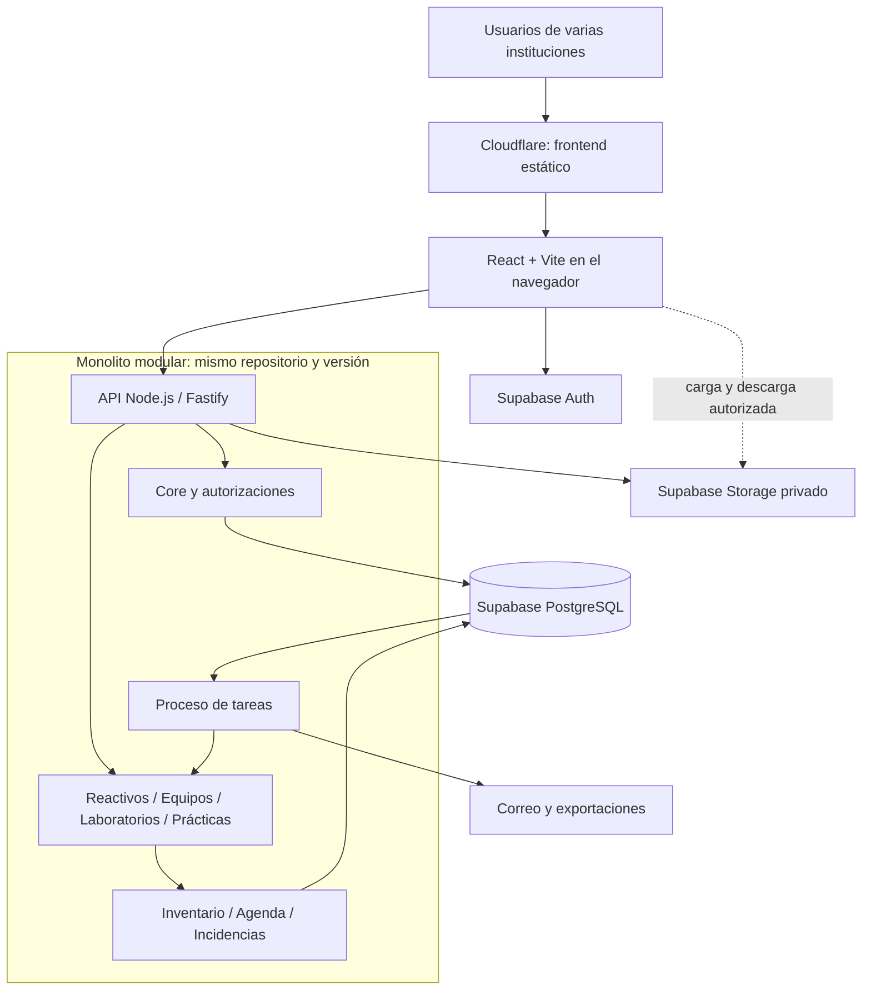

# Arquitectura y stack

Fecha: 24 de septiembre de 2026; revisado el 26 de septiembre. Diseño para varios clientes con espacios independientes.

## 1. Arquitectura elegida

**Monolito modular con una API de negocio y PostgreSQL compartido entre espacios de trabajo aislados.** Cada contratación operativa independiente dispone de un espacio con propietario, miembros y módulos propios. Una universidad puede contratar varios espacios departamentales bajo el mismo titular jurídico. El titular, el contrato, el espacio y la persona propietaria son conceptos distintos. Frontend y backend están separados para desplegar cada uno donde conviene. La API y las tareas de fondo ejecutan el mismo código de dominio y evolucionan en una misma versión de producto.



Cloudflare entrega HTML, CSS y JavaScript; el navegador realiza las llamadas de API. La flecha desde la base al proceso de tareas representa lectura de trabajos pendientes, no llamadas HTTP desde PostgreSQL. API/worker son la vía ordinaria al dominio de la aplicación; Auth, Storage, migraciones y respaldos también acceden a PostgreSQL con funciones y credenciales propias. Los archivos van normalmente directos a Storage mediante autorización firmada; una descarga que exija revocación inmediata puede atravesar la API.

Separar API y tareas en procesos no crea microservicios: comparten módulos, migraciones, contratos y base de datos. No habrá un servidor por módulo ni por cliente en la modalidad estándar.

## 2. Stack concreto

| Capa | Elección | Motivo |
|---|---|---|
| Lenguaje | TypeScript estricto | Compartir contratos y reducir variaciones entre frontend/backend |
| Frontend | React + Vite, SPA | Aplicación autenticada con tablas, formularios y agenda; sin necesidad inicial de SEO o renderizado en servidor |
| Navegación y datos | React Router + TanStack Query | Rutas por módulo, caché e invalidación explícitas |
| Formularios | React Hook Form + Zod | Reutilizar validaciones estructurales de contratos; negocio se valida en backend |
| Interfaz | Tailwind CSS + componentes accesibles basados en Radix/shadcn | Adaptar tokens del PDF con componentes mantenibles y semánticos |
| API | Node.js 24 LTS + Fastify | Runtime estándar, transacciones con conexión persistente y encapsulación por módulo |
| Acceso a datos | `pg` / node-postgres, SQL parametrizado y repositorios tipados | Control directo de bloqueos, RLS, exclusiones y transacciones; sin dos sistemas de migración |
| Base | PostgreSQL administrado en Supabase | Relaciones, integridad, aislamiento y almacenamiento transaccional |
| Identidad y archivos | Supabase Auth + Storage privado | Evitar construir autenticación y almacenamiento binario |
| Migraciones | SQL versionado en `supabase/migrations/` | Una sola historia capaz de reconstruir la base desde cero |
| Tareas | Outbox y trabajos persistentes en PostgreSQL, proceso Node del monolito | Reintentos durables sin añadir Redis al inicio |
| Hosting | Cloudflare Workers Static Assets + Render para API/tareas | Frontend estático y cómputo Node administrado; detalles en infraestructura |
| Repositorio y calidad | pnpm workspaces, ESLint, dependency-cruiser, Vitest, Playwright, CI | Contratos compartidos, límites de importación y pruebas de comportamiento |

Node 24 aparece como LTS en la consulta realizada. Las demás versiones exactas deben fijarse al crear el proyecto, comprobando compatibilidad y guardando lockfile; no instalar automáticamente cualquier versión mayor futura. [Ciclo oficial de Node.js](https://nodejs.org/en/about/previous-releases).

Fastify permite encapsular plugins y dependencias; lo usaremos para registrar cada módulo, manteniendo el dominio independiente del framework. [Encapsulación de Fastify](https://fastify.dev/docs/latest/Reference/Encapsulation/).

Workers Static Assets admite servir una SPA y resolver rutas hacia `index.html`. Usarlo no obliga a ejecutar el backend de negocio en Workers. Cloudflare Pages también sirve para este frontend si se prefiere mantener ese flujo de despliegue. [Static Assets y rutas SPA](https://developers.cloudflare.com/workers/static-assets/).

## 3. Por qué esta combinación

| Opción | Evaluación para PlatLab |
|---|---|
| React/Vite + API Node + Supabase | Recomendada: transacciones claras, reutilización de experiencia y frontend sencillo de alojar |
| Next.js completo en Node administrado | Viable si el equipo es mucho más productivo con Next o aparece un portal público relevante; conservar casos de uso fuera de las rutas |
| Next.js en Cloudflare | Viable tras una prueba del runtime/adaptador y dependencias; no aporta por sí mismo valor a reservas o inventario |
| SPA con todo el CRUD directo a Supabase | Útil para aplicaciones simples; aquí obligaría a concentrar comandos atómicos en funciones SQL/RPC y cuidar que ningún CRUD evada las reglas |
| API en Cloudflare Workers + PostgreSQL | Posible alternativa si se valida conectividad, transacciones, librerías y trabajos; agrega decisiones de runtime sin una necesidad inicial demostrada |
| VPS + túnel Cloudflare | Conserva el mismo monolito; traslada a tu equipo parcheo, disponibilidad y recuperación del servidor |
| Microservicios/Kubernetes | No justificados por tamaño del equipo, carga conocida ni independencia de dominios |

La documentación de Cloudflare consultada presenta `vinext` como opción predeterminada para Next.js, todavía en beta, y mantiene OpenNext como alternativa. Esto debe revisarse de nuevo si se elige Next; no conviene decidir sobre una integración antigua por memoria. [Guía actual de Next.js en Cloudflare](https://developers.cloudflare.com/workers/framework-guides/web-apps/nextjs/).

Supabase seguirá resolviendo base, identidad y archivos. **La API será la autoridad del negocio**: no habrá reglas de reservas repartidas entre componentes React, rutas Next, varias Edge Functions y triggers independientes. SQL conservará las restricciones y operaciones que necesitan atomicidad.

## 4. Estructura del repositorio a crear

```text
apps/
  web/src/
    app/                     # sesión, navegación, composición
    features/                # reactivos, equipos, prácticas...
    operator/                # consola del proveedor, rutas /ops
  server/src/
    entrypoints/             # api.ts y worker.ts
    modules/
      core/
      reagents/
      equipment/
      laboratories/
      practices/
      materials/
      maintenance/
      analytics/
    capabilities/            # inventory, scheduling, incidents
    platform/                # db, auth, storage, jobs, observabilidad, administración SaaS
packages/
  contracts/                 # DTO, esquemas, errores; sin acceso a DB
  ui/                        # componentes y tokens visuales
supabase/
  migrations/
  seed.sql                   # datos sintéticos
infra/                       # Dockerfile, Render, Wrangler, runbooks
docs/plan/
```

Dentro de un módulo: `domain/` para reglas, `application/` para casos de uso y puertos, `infrastructure/` para repositorios/adaptadores y `http/` para rutas. `application` depende de dominio y contratos de puertos; infraestructura implementa esos puertos; el entrypoint compone dependencias. «Todo apunta hacia abajo» no describe por sí solo estas reglas. Crear subcarpetas cuando haya contenido; no generar todas las clases posibles por adelantado.

Reglas comprobables en CI:

- Un módulo importa otro mediante su interfaz pública; no accede a sus repositorios internos.
- El frontend no importa código de servidor ni tipos de filas como contrato público.
- Core no importa módulos comerciales. Los módulos se registran en el punto de composición.
- Las escrituras de cada tabla pertenecen a su módulo/capacidad propietaria.
- Un caso de uso puede coordinar varios módulos pasando el mismo contexto transaccional.
- Los informes usan consultas de lectura controladas; no modifican tablas de otros dominios.
- No crear variantes del código por institución: usar configuración limitada y validada.

Elegir **dependency-cruiser** con errores en CI para ciclos, accesos internos entre módulos, dominio→HTTP/infraestructura y web→server. La herramienta inspecciona dependencias de código; no demuestra propiedad de escrituras SQL ni atomicidad. Esas reglas requieren revisión de repositorios y pruebas PostgreSQL. [Reglas de dependency-cruiser](https://github.com/sverweij/dependency-cruiser/blob/main/doc/rules-reference.md).

## 5. Core institucional y capacidades comunes

| Responsabilidad | Incluye | Límite |
|---|---|---|
| Identidad institucional | Organizaciones, membresías, invitaciones, roles y alcances | La identidad de autenticación pertenece a Supabase Auth |
| Estructura | Sedes/departamentos opcionales y árbol de ubicaciones | Capacidad y horarios pertenecen a Laboratorios |
| Contratación | Derechos de uso, vigencia, límites y estado de módulos | Sin cobros automáticos ni lógica por nombre de cliente |
| Configuración | Zona horaria, idioma, unidades admitidas y políticas versionadas | Sin constructor universal de workflows |
| Trazabilidad | Auditoría y referencias a documentos/importaciones | No guardar secretos ni duplicar documentos en auditoría |
| Operación de plataforma | Outbox, idempotencia, tareas y observabilidad | No convertir Core en dueño de todos los procesos |

`inventory` comparte cantidades, saldos y movimientos entre Reactivos y Materiales; `scheduling` protege ocupación de espacios y activos; `incidents` conserva contexto y seguimiento mínimo. Son capacidades internas, sin una licencia adicional. Las ampliaciones se implementan cuando las necesita un módulo contratado.

Incidencias tendrá el esquema `incidents` y su capacidad propietaria; Core conserva identidad, documentos y auditoría, pero no las tablas de incidencias. La primera implementación de incidencias se entrega junto con Equipos en F2.

### Consola del operador del SaaS

F1 incluye `/ops` en la misma SPA y `/v1/operator/*` en la misma API: clientes/titulares, espacios, contratos, invitación del propietario inicial, paquetes, límites, vigencia, suspensión y auditoría administrativa. El alta permanece en `provisioning` hasta que el propietario acepta; no crea un espacio operativo sin responsable. F2 añade estado de importaciones, cuota consumida, avisos de entrega y enlaces al monitoreo, sin mostrar contenido institucional por defecto.

Los operadores se autorizan contra `platform.operator_accounts`, con MFA, permisos específicos y auditoría en `platform.operator_audit_events`. Un administrador de un espacio nunca puede autoasignarse como operador. Los comandos administrativos usan un repositorio/rol SQL separado, limitado a metadatos de contratación y configuración; no obtiene lectura general de inventarios ni puede cambiar el tenant de una fila de dominio.

Registrar contratos se limita a sus derechos y vigencia; no construir facturación ni CRM. El canje de la invitación inicial crea la membresía/principal y asigna propiedad mediante una operación acotada y auditada. Repetir el comando de alta no duplica el cliente ni sus invitaciones.

El acceso interactivo de soporte a datos de clientes (`support_grants`/suplantación) se difiere. Durante el MVP, soporte por pantalla compartida y diagnósticos saneados, sin acceso implícito del proveedor a los datos. Si antes del piloto se demuestra indispensable, entra como ampliación explícita de alcance con concesión temporal, aprobación, revocación y auditoría.

## 6. Dependencias y activación por institución

| Módulo comercial | Dependencia obligatoria | Integración opcional |
|---|---|---|
| 1. Core | — | Siempre presente |
| 2. Reactivos | Core | Prácticas; ubicación existe sin Laboratorios |
| 3. Equipos | Core | Agenda, Prácticas, Mantenimiento |
| 4. Laboratorios | Core | Equipos; agenda independiente |
| 5. Prácticas | Core + Laboratorios | Reactivos, Equipos, Materiales |
| 6. Materiales y Préstamos | Core | Prácticas y agenda |
| 7. Mantenimiento | Core + Equipos | Incidencias, agenda y Prácticas |
| 8. Analítica y alertas avanzadas | Core + al menos un módulo operativo | Indicadores, reglas configurables, resúmenes y escalamiento de fuentes autorizadas |

Un registro de módulos en código declara ID, versión, dependencias, permisos, rutas y si está listo para contratación. La base registra derechos por espacio; pertenecer a la misma universidad no los comparte. Una misma definición de dependencias alimenta validación administrativa y experiencia de configuración.

Para nuevas operaciones, la habilitación efectiva exige: **módulo publicado + derecho vigente según contrato + estado operativo permitido + dependencias + permiso del usuario + alcance + reglas del recurso**. Resolver pendientes y consultar/exportar historial tienen reglas de continuidad distintas: pueden seguir autorizados tras vencer la contratación. La matriz de acciones está en [dominio y datos](03_dominio_y_datos.md). Las banderas temporales de despliegue son otro control, nunca la licencia.

No instalar tablas por cliente ni borrarlas al desactivar un módulo. Las migraciones despliegan el esquema común por entregas, sin crear por anticipado todas las capacidades futuras. La desactivación transita de activo a cierre de pendientes y luego consulta durante el periodo autorizado. La eliminación por fin del encargo o ejercicio de derechos usa un procedimiento separado con permisos y evidencia; no se confunde con apagar un módulo. Ver [ciclo del cliente y datos](08_ciclo_cliente_y_datos.md).

El administrador del espacio administra usuarios y solicita ampliaciones. Solo un operador autorizado del proveedor cambia derechos contractuales; todas esas acciones se auditan. Una expiración se verifica en cada nueva operación; el MVP no necesita un scheduler que cambie automáticamente la etiqueta a `draining`. La transición administrativa será explícita y auditada.

## 7. Autenticación, permisos y datos

1. El navegador inicia sesión en Supabase Auth y obtiene su token.
2. La API verifica firma, emisor, audiencia, expiración y sujeto. El identificador de organización enviado por el navegador solo es una selección, no una autorización.
3. Dentro de una transacción se establece actor y organización con contexto local; se comprueba membresía vigente, permisos, alcance, clase de acción permitida por el módulo y estado del recurso.
4. Los repositorios usan exclusivamente esa conexión y ese contexto; PostgreSQL aplica restricciones y RLS adicionales.
5. El comando confirma cambios, auditoría y eventos conjuntamente; luego responde al navegador.

La conexión SQL normal usa un rol sin propiedad de tablas y sin `BYPASSRLS`. Activar RLS no basta si se conecta con un propietario/superusuario. No usar `postgres` ni la clave `service_role` como acceso ordinario de la API. [Políticas RLS de PostgreSQL](https://www.postgresql.org/docs/17/ddl-rowsecurity.html) y [RLS en Supabase](https://supabase.com/docs/guides/database/postgres/row-level-security).

Los esquemas del dominio serán privados, sin permisos de acceso directo para `anon`/`authenticated` a través de la Data API. Auth sigue disponible. Storage admite cargas/descargas autorizadas por API, con claves privadas, rutas por institución y enlaces firmados de duración corta. Roles de migración y funciones administrativas quedan separados del runtime.

RLS protege aislamiento; la API también aplica permisos por acción, transiciones y reglas comerciales. El contexto SQL lo establece exclusivamente un servidor confiable. No se ofrece conexión SQL a usuarios finales.

| Función | Facultades iniciales | Límite |
|---|---|---|
| Propietario del espacio | Invitar administradores/miembros, configurar el espacio, solicitar cambios comerciales y transferir propiedad | Una persona vigente por espacio; no cambia licencias ni obtiene permisos operativos implícitos |
| Administrador del espacio | Gestionar miembros, roles delegables, ubicaciones y configuración | No transfiere propiedad, desactiva al propietario ni se convierte en operador del SaaS |
| Técnico u operador del laboratorio | Catálogos, movimientos, aprobación, preparación y cierre según permisos y ubicaciones | No administra contratos; ajuste de stock exige permiso y motivo |
| Docente | Crear y seguir actividades propias, aceptar propuestas y consultar recursos autorizados | No aprueba su propia solicitud ni ajusta existencias por defecto |
| Tesista | Solicitar y seguir actividades propias de investigación, aceptar propuestas, consultar catálogo autorizado | Participación con alcance y vencimiento; responsable académico según política; sin aprobación técnica ni ajustes |

Propiedad es una referencia única en el espacio, no un rol libremente duplicable. Administrador, técnico, docente y tesista son plantillas combinables de permisos; coordinador puede añadirse como plantilla cuando una institución lo necesite. La autorización combina capacidades y alcances. El propietario puede recibir también un rol técnico, conservando las reglas de separación de funciones.

La facultad de **delegar** roles se declara por separado de la de **ejecutar** operaciones: el propietario puede nombrar a un técnico sin tener él permiso de ajustar existencias. Ningún administrador delega más allá del catálogo y ámbito autorizados. F1 implementa propiedad, administración y permisos base; los flujos de docente/tesista llegan con F3. No se construye un expediente académico de estudiantes.

La propiedad se transfiere a una membresía activa del mismo espacio mediante aceptación y comando atómico auditado. No traslada datos, contratos ni licencias a otra cuenta. La baja del propietario exige transferencia o procedimiento de cierre/recuperación verificado; las solicitudes de protección de datos siguen su procedimiento y no se bloquean indefinidamente. Detalles e invariantes en [dominio](03_dominio_y_datos.md).

El docente usa un portal de solicitudes y un catálogo de recursos solicitables. Consultar/pedir un reactivo exige módulo contratado y permiso de solicitud, pero no permisos para editar catálogo, entradas o saldos. La API verifica tanto al actor técnico como la elegibilidad actual del solicitante al aprobar. El propietario delega funciones de módulos contratados; el proveedor conserva la autoridad sobre suscripciones. [Acceso institucional y docentes](10_acceso_institucional_y_docentes.md) concreta invitaciones por lote, permisos y casos de aislamiento.

## 8. Contratos y transacciones

API REST con OpenAPI generado desde contratos validados. Preferir comandos explícitos a un `PATCH` que permita cambiar libremente estados o saldos.

| Comando ilustrativo | Efecto |
|---|---|
| `POST /v1/orgs/:org/reagent-receipts` | Entrada y movimiento histórico |
| `POST /v1/orgs/:org/stock-adjustments` | Ajuste autorizado con motivo e historial |
| `POST /v1/orgs/:org/activities/:id/approve` | Decisión y reservas atómicas |
| `POST /v1/orgs/:org/activities/:id/prepare` | Asignación/entrega a custodia |
| `POST /v1/orgs/:org/activities/:id/close` | Consumos, devoluciones, pendientes y estado |
| `POST /v1/orgs/:org/transfers/:id/receive` | Recepción y conciliación de tránsito |

Cada comando crítico admite clave de idempotencia y versión esperada. Errores con código estable y explicación: `INSUFFICIENT_STOCK`, `SCHEDULE_CONFLICT`, `VERSION_CONFLICT`, `MODULE_READ_ONLY`. La UI ofrece corregir o recargar sin reintentar ciegamente una operación de negocio. Las cantidades viajan como cadenas decimales en JSON; los cálculos autoritativos se hacen en SQL o aritmética decimal exacta, evitando convertirlas a `number` para operar.

`BEGIN`, comprobaciones, escrituras y `COMMIT` usan el mismo cliente de `pg`, nunca llamadas independientes a `pool.query` dentro de la transacción. [Transacciones en node-postgres](https://node-postgres.com/features/transactions).

Las reglas que deben cumplirse juntas permanecen síncronas: aprobar y reservar, entregar y mover stock, devolver y verificar. Correo, exportaciones y agregados analíticos se ejecutan después mediante outbox persistente. Un fallo de correo no revierte una aprobación válida.

La auditoría de una operación confirmada pertenece a esa transacción. Un intento denegado o un error que termina en rollback se registra por separado en logs de seguridad saneados: también interesa conservar el intento fallido. JWT inválido, límite HTTP o payload inválido pueden rechazarse antes de abrir transacción. El rollback tampoco puede retirar un correo ya enviado; por eso los efectos externos se procesan después del commit.

## 9. Frontend modular y evolución

Menú y rutas se componen desde capacidades recibidas del servidor. Las rutas se cargan por módulo. Una URL directa o una llamada manual a la API debe recibir la misma denegación que la interfaz.

La caché incluye espacio, identidad/alcance y filtros; se limpia al cambiar usuario o espacio. No actualizar optimistamente existencias o aprobaciones como si ya estuvieran confirmadas. Decisión inicial: consultar panel/agenda cada **30 segundos con pestaña visible**, con variación aleatoria para repartir carga; refrescar también tras mutaciones, al recuperar foco y al reconectar. Aplicar retroceso ante errores/429 y mostrar última actualización. Los catálogos secundarios no necesitan ese intervalo. La exclusión concurrente siempre reside en PostgreSQL.

Cerrar la Data API no elimina todas las opciones de Supabase Realtime: se puede publicar Broadcast desde servidor y autorizar canales privados. Se difiere porque añade otra superficie de permisos y revocación. Si las pruebas demuestran necesidad de avisos en menos de unos segundos, evaluar SSE desde la API o Broadcast privado que transporte solo invalidaciones mínimas; los datos se recuperarán por API. No prometer revocación instantánea de un canal ya autorizado sin resolver renovación y cierre de conexión. [Broadcast de Supabase](https://supabase.com/docs/guides/realtime/broadcast).

Primero consultas e índices PostgreSQL; más adelante vistas/materializaciones para indicadores. Una réplica de lectura solo se considera si la medición demuestra contención analítica después de optimizar; no sirve como autoridad para permisos, cuotas, stock o reservas por su posible retraso. No incorporar Elasticsearch, Redis, Kafka, motor BPM, IA, microfrontends ni event sourcing completo sin un problema medido.

Extraer un servicio en el futuro solo si requiere escalado, ciclo de entrega o aislamiento operativo independiente. Los candidatos probables son exportaciones pesadas o integraciones; no separar inventario de reservas mientras dependan de una única transacción.
