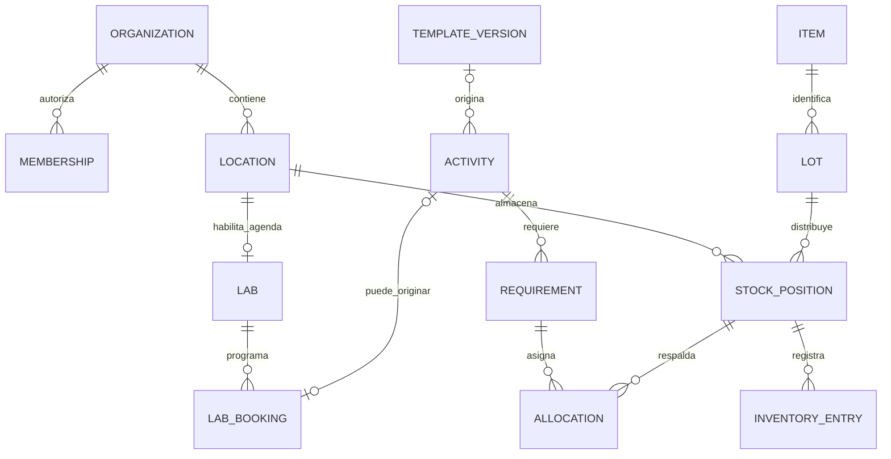

# Dominio y modelo de datos

Fecha: 24 de septiembre de 2026.
Estado: diseño propuesto; las reglas indicadas como «por validar» todavía requieren acuerdo con los clientes piloto.
Prioridad: vender distintos paquetes desde la primera oferta. Reactivos y Equipos funcionan por separado sobre Core.
Las prácticas son el centro de la operación cuando ese módulo está contratado; no son una dependencia del inventario.

## 1. Decisiones que ordenan el modelo

- Un cliente es una organización o tenant. Sedes, departamentos y laboratorios pertenecen a ella.
- Una persona puede pertenecer a varias organizaciones con permisos diferentes.
- Ubicación física no equivale a laboratorio programable: Core administra ubicaciones; Laboratorios añade capacidad y agenda.
- Producto, lote, envase, saldo, reserva y movimiento son conceptos distintos.
- Plantilla de práctica, versión publicada y ejecución en una fecha son registros distintos.
- La condición física de un equipo se separa de su reserva, bloqueo temporal y custodia.
- Los movimientos y decisiones confirmados se corrigen con nuevos registros; no se reescribe su historia.
- El inventario y la agenda son capacidades internas compartidas, no módulos comerciales adicionales.
- Todos los módulos pertenecen al mismo monolito y release. La licencia controla uso, no instalaciones distintas por cliente.
- Las migraciones SQL versionadas son la única autoridad del esquema. No mantener un segundo esquema generado por un ORM.

## 2. Propiedad de datos y módulos

Cada esquema PostgreSQL tiene un propietario funcional. Otro módulo lo consulta mediante servicios internos; sus escrituras pasan por el propietario.
Esto no impide transacciones entre módulos: el caso de uso coordina sus servicios usando la misma conexión y transacción.

| Esquema | Propietario / alcance | Primera implementación |
|---|---|---|
| `core` | Organizaciones, personas, ubicaciones, permisos, licencias, documentos, incidencias mínimas y auditoría | F1 |
| `inventory` | Catálogo cuantificable, lotes, saldos, movimientos y traslado mínimo; después reservas y transferencias ampliadas | F2; ampliaciones F3–F4 |
| `reagents` | Datos químicos y documentos de reactivos, módulo 2 | F2 |
| `equipment` | Activos, condición y responsables, módulo 3 | F2 |
| `laboratories` | Capacidad, horarios y reglas de espacios, módulo 4 | F3 |
| `scheduling` | Reservas de espacios y activos; motor interno de conflictos | F3 |
| `practices` | Plantillas, ejecuciones, aprobación, preparación y cierre, módulo 5 | F3 |
| `materials` | Consumibles, reutilizables, préstamos y devoluciones, módulo 6 | F4 |
| `maintenance` | Planes y órdenes, módulo 7 | F5 |
| `analytics` | Consultas/proyecciones e indicadores avanzados, módulo 8 | F5 |
| `platform` | Outbox, idempotencia, trabajos e importaciones | F1; ampliar según cada entrega |

F2 entrega al menos dos configuraciones probadas: Core + Reactivos y Core + Equipos, en organizaciones distintas.
Las reservas se diseñan ahora para evitar cambios incompatibles, pero no bloquean la primera oferta de inventario.
En F2 «disponibilidad» de equipos significa condición actual utilizable; la disponibilidad futura por horario llega en F3.

## 3. Convenciones de todas las tablas

- UUID para identificadores; `created_at` y `updated_at` como `timestamptz` cuando corresponda.
- Cada tabla institucional lleva `tenant_id NOT NULL`, FK a `core.organizations`.
- Patrón: `PRIMARY KEY(id)` y `UNIQUE(tenant_id,id)`; las FKs institucionales incluyen siempre el tenant.
- Ejemplo: `(tenant_id, location_id)` referencia `core.locations(tenant_id,id)`, nunca solamente `location_id`.
- Toda FK que añada item, lote u otro discriminador requiere una clave única correspondiente en su destino; el modelo lógico debe convertirse en esas restricciones al escribir la migración.
- Índices para las FKs y consultas habituales empezando por `tenant_id`; no añadir índices sin una consulta que los justifique.
- Códigos de laboratorio, producto y activo únicos dentro del tenant. Nombres, CAS y lotes de proveedor no son claves únicas.
- Estados como texto con `CHECK` y transiciones controladas; no dejar estados libres en JSON.
- `version` entero para detectar modificaciones concurrentes de solicitudes y configuraciones editables.
- Archivar catálogos con `archived_at`; desactivar membresías con `status`. No borrar información referenciada por operaciones.
- JSONB para instantáneas, configuración acotada y metadatos; relaciones, cantidades y permisos permanecen normalizados.
- Las tablas globales de identidad, permisos, módulos y unidades son excepciones explícitas a `tenant_id`.
- Las fechas de caducidad pueden ser `date`; la política institucional define hasta qué momento permiten uso.

## 4. Core, identidad y autorización

| Tabla | Campos y relaciones principales |
|---|---|
| `core.organizations` | `id`, `code`, `name`, `timezone`, `status`; zona IANA, no un desplazamiento horario fijo |
| `core.identities` | `id`, `provider`, `provider_subject`, datos mínimos; único `(provider,provider_subject)` |
| `core.memberships` | `id`, `tenant_id`, `identity_id`, `status`; único `(tenant_id,identity_id)` |
| `core.invitations` | Email normalizado, hash de token, expiración, invitador, roles/alcances propuestos y estado; canje único con identidad verificada |
| `core.principals` | Actor institucional: `kind` humano/servicio/soporte; membresía, código de servicio o concesión de soporte según tipo |
| `core.support_grants` | Identidad del operador del proveedor, aprobador institucional, permisos, alcance, vencimiento y revocación |
| `core.permissions`, `core.roles`, `core.role_permissions` | Catálogo global de códigos de permiso; roles institucionales y relaciones con permisos |
| `core.role_assignments` | `principal_id`, `role_id`, `scope_kind`, `location_id` opcional; organización o ámbito de ubicación |
| `core.locations` | `id`, `parent_id`, `code`, `name`, `kind`, `status`; sede, edificio, sala, almacén, custodia o tránsito |
| `core.tenant_settings` | Políticas validadas y versionadas; evitar una colección ilimitada de ajustes arbitrarios |
| `core.documents` | `id`, `storage_key`, nombre, MIME, tamaño, hash, actor, clasificación y estado de carga |
| `core.incidents` | `id`, `location_id`, reportante, gravedad, descripción, estado, fecha y responsable |
| `core.audit_events` | Actor, tenant, acción, entidad, momento, correlación, motivo y cambios relevantes |

Los vínculos a documentos/incidencias son tablas con FKs reales del módulo correspondiente, por ejemplo `equipment.incident_links`.
Evitar un campo genérico `resource_type/resource_id` sin integridad referencial para relacionar operaciones críticas.
Las membresías históricas permanecen aunque el usuario pierda acceso. Conservar autoría no concede permiso vigente.

Todo campo de autoría operativa (`actor_id`, creador, reportante, ejecutor) referencia `(tenant_id, principal_id)` con FK compuesta.
El principal humano referencia la membresía del mismo tenant; el de servicio tiene capacidades y alcance explícitos; el de soporte referencia una concesión temporal del mismo tenant. Un `CHECK` impide mezclar clases. La identidad global autentica, pero no demuestra pertenencia institucional.
Custodios, docentes y prestatarios humanos internos referencian membresías mediante FK compuesta; las bajas no eliminan esas referencias. Prestatarios externos quedan pendientes de alcance en F4.
En trabajos iniciados por personas se conservan por separado `requested_by_principal_id` y `executed_by_principal_id`. El operador del proveedor no obtiene acceso al dominio por gestionar una licencia.

Permisos iniciales: consultar, crear, editar catálogo, ajustar stock, aprobar, preparar, cerrar, transferir, recibir y administrar acceso.
Roles iniciales sugeridos: administrador institucional, coordinador, técnico y docente; el rol estudiante queda para una necesidad validada.
Asignar un rol no convierte a su titular en administrador de todos los laboratorios.
La herencia de ámbitos usa la jerarquía de ubicaciones; mover una ubicación exige revisar el cambio de alcance de permisos.
Consultar inventario institucional puede permitirse sin autorizar salidas de otro laboratorio.
Transferir requiere permiso en origen; recibir requiere permiso en destino.
Autorizar la propia solicitud: deshabilitado por defecto propuesto, pendiente de confirmar con cada institución.
Las invitaciones y asignaciones no pueden otorgar permisos o alcances que el administrador no esté autorizado a delegar. Una invitación no crea una membresía activa hasta verificar su destinatario y canjearla transaccionalmente.

## 5. RLS y contexto de cada operación

Toda operación del dominio entra por la API Node/Fastify, que usa SQL parametrizado mediante `pg`.
Supabase Auth autentica a la persona; la API verifica el token y resuelve identidad, membresía y organización activa.
El tenant que envía el navegador es una selección a validar, nunca una prueba de pertenencia.

Flujo de cada transacción:

1. Verificar token y obtener la identidad desde su emisor y sujeto.
2. Abrir transacción con un rol SQL de aplicación sin propiedad de tablas ni `BYPASSRLS`.
3. Establecer actor y tenant con `set_config(..., ..., true)` parametrizado: contexto local a esa transacción.
4. Verificar principal autorizado, membresía activa si es humano, permisos, ámbito y clase de acción permitida por el módulo dentro de la transacción.
5. Ejecutar consultas y comandos; confirmar o revertir y devolver la conexión al pool.

RLS aplica filtros de tenant y principal autorizado en lectura (`USING`) y escritura (`WITH CHECK`). Para humanos exige membresía activa; para soporte, concesión vigente; para servicios, principal habilitado, capacidad y rol SQL ejecutor admitidos.
Las políticas de membresía permiten comprobar la membresía propia sin referencias recursivas entre políticas.
La API además valida permisos de la acción, ámbito y transición; RLS no sustituye el workflow del dominio.
El rol de migraciones es distinto y no se utiliza para atender peticiones. El navegador no recibe credenciales SQL ni `service_role`.
Los esquemas del dominio no se exponen para lectura ni escritura mediante la Data API de Supabase.
El worker usa tenant y actor de servicio explícitos y mínimos permisos; cada trabajo abre su propia transacción.
La API deriva el principal del token y la membresía/concesión, nunca de un actor de servicio enviado por el navegador. La conexión de worker no puede seleccionar libremente una identidad humana para saltarse sus límites.
Un dispatcher necesita descubrir trabajos antes de fijar tenant: usar una función estrecha `platform.claim_jobs(limit)` con `SECURITY DEFINER`, `search_path` fijo, SQL estático y dueño limitado a tablas de cola. Revocar ejecución a `PUBLIC`; concederla solo al rol de dispatcher. Reclama únicamente tipos permitidos y devuelve ID, tenant y concesión temporal, sin leer datos del dominio. El ejecutor usa después su rol limitado y contexto institucional. La función no concede `BYPASSRLS` general ni permite consultas arbitrarias.
Importaciones/exportaciones pedidas por usuarios revalidan al solicitante antes de ejecutar y antes de publicar el resultado; avisos de hechos confirmados usan una política de servicio. Revocar al usuario no deshace movimientos confirmados, pero sí puede impedir nuevas exportaciones.
Los enlaces temporales a Storage solo se emiten después de autorizar el documento; los buckets institucionales son privados.
No guardar secretos, tokens o archivos completos dentro de auditoría.

RLS omite normalmente propietarios y roles con `BYPASSRLS`; habilitarla sin revisar el rol SQL no ofrece el aislamiento esperado.
Referencia: [políticas de seguridad por fila de PostgreSQL](https://www.postgresql.org/docs/current/ddl-rowsecurity.html).

## 6. Licencias, dependencias y desactivación

| Tabla | Campos principales |
|---|---|
| `core.module_definitions` | Código estable, nombre y versión de definición; catálogo global |
| `core.module_dependencies` | Módulo, dependencia obligatoria; las integraciones opcionales se definen aparte |
| `core.tenant_entitlements` | Tenant, módulo, adquisición, vigencia, estado operativo, fecha y versión; único `(tenant_id,module_code)` |
| `core.entitlement_changes` | Historial de activación, cambios, actor y motivo |

Dependencias obligatorias: M2/M3/M4/M6 → M1; M5 → M1 + M4; M7 → M1 + M3; M8 → M1 + algún módulo operativo.
M5 incorpora nuevos requisitos de reactivos, equipos o materiales únicamente cuando M2, M3 o M6 admiten operaciones nuevas. Las referencias históricas y resolución de entregas existentes conservan acceso según la matriz de continuidad.
La adquisición comercial, la vigencia, el permiso de usuario y una bandera de despliegue son conceptos separados.
La configuración del menú es una consecuencia de los permisos; no constituye su control.

Estados operativos propuestos: `disabled` → `enabled` → `draining` → `read_only`; reactivación controlada desde consulta.
`disabled` representa un módulo sin uso habilitado; `read_only` conserva información de una contratación previa.

| Clase de acción | `enabled`, vigencia válida | `draining` o vigencia terminada en periodo de cierre | `read_only` |
|---|---|---|---|
| Crear nuevas operaciones/compromisos | Sí, con dependencias admitiendo nuevas operaciones | No | No |
| Resolver entrega, cancelar reserva, recibir devolución o conciliar pendiente existente | Sí | Sí, acotado al pendiente y sus dependencias históricas | No; reabrir cierre de pendientes con autorización si se descubre uno |
| Consulta, documento histórico y exportación | Sí | Sí | Sí, dentro del periodo de conservación/acceso pactado |

Todas las celdas siguen requiriendo identidad activa, permiso y alcance. La continuidad comercial no permite a un usuario revocado entrar; la suspensión por seguridad es independiente. La expiración bloquea nuevas operaciones aunque el scheduler todavía no haya actualizado la etiqueta a `draining`. Core mantiene identidad, consulta y resolución durante la salida contractual.

- Activar: validar dependencias, registrar concesión y habilitar acciones en API.
- Desactivar: cerrar admisión de operaciones nuevas y permitir devolver, finalizar, cancelar y corregir operaciones abiertas.
- Pasar a consulta: verificar que no quedan préstamos, reservas o custodias sin resolver.
- Mantener referencias históricas, documentos y exportación autorizada; no borrar tablas ni datos.
- No desactivar una dependencia dejando módulos dependientes admitiendo nuevas operaciones.
- Las transacciones críticas toman bloqueo compartido del entitlement; los cambios de estado toman bloqueo exclusivo.
- La política exacta tras vencimiento, periodo de gracia y exportación requiere acuerdo comercial; no codificar suspensión destructiva.

Pruebas desde F1: aislamiento entre tenants, acceso directo a endpoints de módulos apagados, dependencias y revocación de permisos.
En F2 probar expresamente clientes con combinaciones distintas; el catálogo completo desplegado no concede derechos de uso.

## 7. Reactivos e inventario cuantificable

| Tabla | Campos y relaciones principales |
|---|---|
| `inventory.items` | Tenant, código, nombre, `kind`, `base_unit`, `tracking_mode`, archivado; catálogo común de cantidades |
| `reagents.products` | FK única al item, CAS opcional, concentración, pureza, estado físico, peligros; SDS mediante documentos versionados |
| `inventory.lots` | Item, referencia de proveedor, marca/proveedor, recepción, caducidad, condición y datos de origen |
| `inventory.containers` | Opcional: item/lote, código interno, apertura, caducidad tras apertura y estado; identifica el envase cuando `tracking_mode` lo requiere |
| `inventory.return_batches` | Partida de retorno segregada, item/lote, posición y operación de origen, verificación y disposición; conserva procedencia |
| `inventory.positions` | Item, lote, envase opcional, partida de retorno opcional, ubicación, disposición, saldo físico, cantidad reservada y versión |
| `inventory.operations` | Tipo, actor, motivo, fecha, correlación y referencia documental; cabecera de movimiento |
| `inventory.entries` | Operación, posición, cantidad con signo y unidad base; asientos inmutables |
| `inventory.allocations` | Posición, cantidad, estado y fechas; reservas de F3, vinculadas mediante FKs tipadas del módulo solicitante |
| `inventory.transfers`, `transfer_lines` | Origen, destino, estado; item/lote, solicitado, despachado, recibido y diferencia |

El lote se relaciona también con el item mediante FK compuesta; no se permite asignar a un producto el lote de otro.
La clave única de posición es `(tenant_id,item_id,lot_id,container_id,return_batch_id,location_id,disposition)`, tratando nulos como iguales. FKs compuestas validan tenant, item y lote de envase/partida, además de ubicación.
Cuando el item exige seguimiento por envase, cada posición debe identificarlo. No permitir saldo agregado sin envase y saldo por envase para las mismas existencias; cambiar de modo exige una conciliación/migración explícita. La entrega parcial preserva envase y origen aunque se registre en otra posición de custodia.
El catálogo común no crea un constructor universal de recursos: cada tipo mantiene sus reglas y sus extensiones propias.
Las extensiones de reactivo/material son únicas por item y validan su discriminador de tipo; no admitir el mismo item en ambos módulos.
Prácticas y Materiales poseen sus vínculos a asignaciones; un préstamo independiente no necesita una práctica ficticia.
Un CAS no identifica de forma suficiente un reactivo comercial; no sustituir automáticamente concentraciones o purezas.

Cantidades: `numeric(24,9)` como punto de partida; fijar precisión y límites tras revisar muestras de datos.
Los contratos JSON usan cadenas decimales; no convertir cantidades a `number` para sumarlas en TypeScript. Calcular en PostgreSQL o con aritmética decimal exacta y una política de redondeo validada. El formato visual no modifica el dato persistido.
Unidades globales con código, dimensión y factor exacto respecto a una base. El conteo indivisible exige enteros.
Conservar cantidad/unidad capturadas y cantidad normalizada; validar toda conversión en el servidor.
Permitir kg↔g y L↔mL; g↔mL necesita una transformación documentada, no una conversión genérica.
La concentración se modela con valor y unidad/tipo, no como una cantidad de stock intercambiable.

Definiciones:

```text
Existencia institucional = saldos físicos, incluyendo custodia y tránsito.
Disponible asignable = saldo en ubicaciones utilizables de lotes elegibles
                       - reservas activas todavía no entregadas.
Consumo = movimiento real confirmado; una solicitud nunca es un consumo.
```

Condición de lote: habilitado, cuarentena, bloqueado o descartado; caducidad se comprueba para la fecha de uso prevista.
La disposición de posición (utilizable, cuarentena, restringida) permite aislar una devolución sin bloquear el resto del lote. Prevalece siempre la restricción más fuerte entre lote, envase, posición y ubicación.
Un retorno pendiente crea una partida segregada vinculada a la entrega y posición de origen; no se mezcla con saldo apto. La verificación puede autorizar reintegro mediante un nuevo movimiento o disposición definitiva. Si su identidad/composición ya no corresponde al producto original, se requiere otra identificación antes de ofrecerlo como utilizable.
FEFO propone primero los lotes válidos con vencimiento más próximo; el técnico confirma cuando exista una excepción.
Una alerta de caducidad y la exclusión de lotes bloqueados pertenecen a Reactivos, aunque Analítica esté apagada.
Las entradas no se actualizan ni eliminan con el rol operativo; los saldos son su proyección transaccional reconciliable.
Saldo no negativo y reserva entre cero y saldo son restricciones locales; las sumas entre filas se protegen mediante transacciones.
Un conteo inferior a lo reservado registra discrepancia; aplicar el ajuste exige resolver/reasignar compromisos y marcar actividades afectadas.
El saldo inicial de una importación se registra como operación de apertura.

Una asignación pasa de `held` a `fulfilled` o `released`; entregas parciales registran cantidades resueltas sin perder la cantidad original.
No añadir expiración automática de reservas confirmadas. Si se introducen retenciones temporales, necesitan otro tipo y vencimiento explícito.
Transferencias: `draft → approved → in_transit → partially_received → received`; puede omitirse el estado parcial si toda la recepción es conjunta.
Una cancelación posterior al despacho solo termina cuando tránsito queda conciliado; recepción y devolución nunca superan lo pendiente.

## 8. Equipos, materiales e incidencias

| Tabla | Campos y relaciones principales |
|---|---|
| `equipment.assets` | Código institucional, marca/modelo, serie, ubicación, responsable, condición y archivado |
| `equipment.condition_changes` | Activo, condición anterior/nueva, actor, motivo e incidencia opcional |
| `equipment.custodies` | Activo, receptor, entrega, devolución prevista/real y verificación; ampliar en F3 |
| `materials.products` | Extensión del item: consumible/reutilizable y seguimiento por cantidad o unidad |
| `materials.assets` | Unidades reutilizables identificables, código, producto, ubicación y condición |
| `materials.loans`, `loan_lines` | Prestatario, responsable, plazo, estado y cantidades/unidades entregadas |
| `materials.return_lines` | Línea prestada, cantidad/unidad, condición, receptor y momento; admite devoluciones parciales |
| `maintenance.plans`, `orders` | Activo, frecuencia, fecha prevista, responsable, tareas, resultado y siguiente intervención |

Condición de equipo: `operational`, `restricted`, `faulted`, `retired`.
Reserva, uso y mantenimiento son dimensiones separadas; «disponible» se calcula para un periodo y contexto.
Declarar avería bloquea nuevas asignaciones y señala reservas afectadas; no borra ni cancela silenciosamente actividades.
Mantenimiento preventivo futuro bloquea agenda; una orden abierta no cambia por sí sola la condición actual.
Volver a operativo exige un resultado y responsable, incluso si el módulo avanzado de mantenimiento no está contratado.

Incidencias mínimas disponibles con cada recurso: contexto, gravedad, estado, responsable e historial de acciones.
Estados sugeridos: abierta, en atención, resuelta, cerrada; la resolución exige resultado, no solo cambiar una etiqueta.
No toda incidencia bloquea un recurso. La regla de gravedad y autoridad se valida con la institución.

Consumibles usan el ledger de inventario. Reutilizables identificables usan entrega/devolución de activos.
Reutilizables por cantidad mantienen saldo, reservas y custodia; pérdidas y daños reducen la cantidad utilizable de forma trazable.
El préstamo solo termina cuando todas sus líneas están devueltas o resueltas mediante una decisión explícita.
Estados de préstamo: abierto, parcialmente devuelto, cerrado o cancelado antes de entregar; el retraso se deriva de plazo y pendientes.
Una restricción única parcial impide dos custodias abiertas del mismo activo identificado.
Toda devolución bloquea la línea de entrega y verifica que cantidad devuelta acumulada no supere la entregada.
Primera versión de reutilizables por cantidad: asignación conservadora hasta devolución verificada.
Reservar capacidad futura compartida exige calcular la ocupación simultánea por intervalo bajo bloqueo; se implementa solo si se valida esa necesidad.

## 9. Laboratorios, prácticas y agenda

| Tabla | Campos y relaciones principales |
|---|---|
| `laboratories.labs` | Ubicación única, código, capacidad, responsable y política de anticipación |
| `laboratories.opening_hours`, `calendar_exceptions` | Horario recurrente, cierres, festivos y excepciones autorizadas |
| `scheduling.lab_bookings` | Laboratorio, intervalo, estado, origen y responsable; reserva manual o vinculada a actividad |
| `scheduling.equipment_bookings` | FK a `equipment.assets`, intervalo, estado y tipo; uso y mantenimiento comparten protección contra conflictos |
| `scheduling.material_bookings` | FK a `materials.assets`, intervalo, estado y tipo para unidades identificables; se añade en F4 |
| `practices.templates`, `template_versions` | Plantilla, versión, instrucciones, datos académicos y publicación inmutable |
| `practices.activities` | Versión de plantilla opcional, responsable, laboratorio, horario, estado y versión de concurrencia |
| `practices.activity_revisions` | Instantánea de datos y requisitos presentada/aprobada; autor, fecha y motivo |
| `practices.requirements` | Actividad, recurso tipado, cantidad, unidad y asignación aprobada; FKs reales |
| `practices.decisions`, `state_changes` | Revisión, decisión, actor, motivo y transiciones |
| `practices.booking_links`, `custody_locations` | FKs entre actividad, reserva y ubicación virtual de custodia |

Una versión publicada de plantilla no cambia; una ejecución preserva la versión y lo aprobado aunque el catálogo evolucione.
No duplicar una práctica completa por cada impresión: generar el formato desde su revisión y versión.
La agenda de Laboratorios admite reservas manuales sin Prácticas. Una reserva vinculada se edita desde la actividad.
El cronograma es una consulta de esas mismas reservas; no existe una matriz semanal con una segunda fuente editable.
Un espacio exclusivo por reserva es el valor inicial propuesto. Capacidad compartida o subdivisiones requieren reglas adicionales.
Los intervalos ocupados incluyen preparación/limpieza y usan rangos `[inicio,fin)` con instantes `timestamptz`.
Las recurrencias, cuando se incorporen, crean ocurrencias individuales con conflictos y cancelaciones explícitos.
Cada tabla de reservas de activos posee su propia exclusión por tenant/activo/intervalo; no usa una FK polimórfica. La capacidad interna `scheduling` puede usarse con Core + Equipos + Mantenimiento sin contratar Laboratorios. M4 habilita agenda de espacios, no el motor técnico compartido.

Workflow propuesto:

```text
draft → submitted → scheduled → preparing → ready → running → closing → completed
            ├→ changes_requested → draft
            └→ rejected
Antes o durante la ejecución: cancelación con resolución de recursos entregados.
```

La validación automática produce resultados fechados, no requiere otro estado persistido.
Aprobar confirma agenda y recursos y pasa a `scheduled` en la misma transacción; no dejar «aprobada pero sin reserva».
Cambiar horario, laboratorio o cantidades aprobadas requiere revisión y nueva validación.
El usuario confirma consumos reales; «registrar diferencias» es ayuda de interfaz, no autorización de consumo silencioso.



## 10. Transacciones e invariantes de concurrencia

**Aprobación y reserva.** Abrir transacción, autorizar y tomar entitlement compartido; bloquear actividad y posiciones/activos en orden estable.
Comprobar versión, estado, horas, permisos, lotes elegibles y disponibilidad; crear reservas, aumentar cantidades reservadas y confirmar agenda.
Escribir decisión, estado, auditoría, idempotencia y outbox; confirmar todo o revertir todo. No reservar con procesos asíncronos.
Dos solicitudes de 60 g sobre 100 g disponibles no pueden aprobarse ambas. La lectura previa de la pantalla es solo orientativa.

**Preparación y entrega.** Mover la cantidad entregada desde almacén a custodia de la actividad y resolver esa parte de la reserva en la misma transacción.
Ejemplo: 100 g en almacén y 20 g reservados pasan a 80 g en almacén y 20 g en custodia; esos 20 g no vuelven a ofrecerse.
Cada entrega parcial registra actor, cantidad y momento. La existencia institucional permanece igual; todavía no hay consumo.

**Cierre.** Bloquear actividad y custodias; registrar cantidades consumidas, retornadas, descartadas y pérdidas autorizadas.
Toda entrega queda conciliada: consumida, retornada, dispuesta o pendiente transferida explícitamente a un préstamo con responsable y plazo. Por defecto no finalizar mientras queden cantidades o activos sin resolución. Desde F4, una política institucional puede permitir `completed` con préstamos delegados únicamente si M6 está publicado y autorizado para registrar esa obligación; nunca crear un préstamo nuevo para eludir un módulo en consulta. En F3 o sin M6 se resuelve la custodia antes de completar. Las incidencias abiertas conservan su seguimiento independiente. Custodia química sin disposición mantiene la actividad en `closing`.
Devolver a cuarentena cuando la aptitud de reintegro no esté verificada. Nunca sumar automáticamente un sobrante manipulado al lote original.
Finalizar libera reservas sobrantes, registra movimientos reales, devoluciones y eventos en la misma transacción.

**Cancelación.** Antes de entregar, liberar reservas y registrar motivo. Después de entregar, resolver custodia mediante retorno/consumo/disposición.
La sesión puede marcarse cancelada, pero su resolución operativa permanece pendiente hasta conciliar recursos.
Corregir un cierre confirmado mediante operación compensatoria autorizada; no editar asientos antiguos.

**Transferencia.** Autorizar origen y destino; despachar restando origen y sumando tránsito en una transacción equilibrada.
Recibir restando tránsito y sumando destino; registrar recepciones parciales y diferencias. No editar simplemente la ubicación.
Antes de despacho puede cancelarse; después debe resolverse mercancía en tránsito, incluso si se devuelve al origen.
Una transferencia entre tenants no es una transferencia interna: queda fuera del alcance inicial.

**Conflictos de agenda.** Restricción de exclusión GiST por tenant, laboratorio/activo e intervalo para reservas confirmadas, usando `btree_gist`.
Ejemplo conceptual: `EXCLUDE USING gist (tenant_id WITH =, lab_id WITH =, period WITH &&) WHERE (status = 'confirmed')`.
Los rangos deben ser finitos, no vacíos y coherentes con inicio/fin. Las reservas canceladas no bloquean.
Una avería se registra como condición real aunque existan reservas; marca las afectadas para resolución sin impedir reportar el fallo.
Fuente: [rangos y reservas sin solapamientos en PostgreSQL](https://www.postgresql.org/docs/current/rangetypes.html).

Los `CHECK` validan datos de la misma fila; no usarlos para sumar reservas de otras filas. Usar restricciones únicas/FKs/exclusiones y bloqueos.
Un orden estable de bloqueos reduce interbloqueos; los errores transitorios necesitan reintento limitado con idempotencia.
Fuente: [restricciones e integridad referencial de PostgreSQL](https://www.postgresql.org/docs/current/ddl-constraints.html).

## 11. Outbox, idempotencia, importación y verificaciones

| Tabla | Campos y garantía |
|---|---|
| `platform.idempotency_records` | Tenant, actor, operación, clave, hash del contenido y resultado; combinación única |
| `platform.outbox_events` | ID, tenant, tipo, versión del payload, entidad, fecha, intentos, próximo intento y entrega |
| `platform.jobs`, `schedules` | Trabajo, tenant, solicitante, ejecutor, capacidad necesaria, estado, concesión temporal e intentos; programación con siguiente vencimiento persistido |
| `platform.job_runs` | Evento/trabajo, consumidor, intento, resultado y error; deduplicación por efecto |
| `platform.import_batches`, `import_rows` | Archivo, versión del mapeo, fila, validación, errores y entidades creadas |

Repetir una aprobación/consumo con la misma clave devuelve su resultado; reutilizarla con otro contenido genera conflicto.
El worker del mismo monolito procesa notificaciones, exportaciones y proyecciones después del commit mediante outbox.
Entrega al menos una vez: cada consumidor deduplica. Un correo fallido no revierte una reserva confirmada.
Importar exige vista previa, validación de unidades y relaciones, resolución de duplicados y registro de cada lote confirmado.
Pruebas críticas: fuga entre tenants, FK cruzada, módulo apagado, dos reservas simultáneas, cierre repetido y devolución parcial.
También: transferencia parcial, cancelación con custodia, equipo averiado con reservas, worker repetido y fallo antes/después del commit.
Reconciliar periódicamente saldos contra movimientos, reservas contra asignaciones y actividades contra custodias pendientes.

## 12. Decisiones pendientes antes de cada fase

F1–F2: estructura real de organizaciones, ámbito de técnicos, calidad de catálogos, unidades, trazabilidad por envase y política de vigencia.
F3: quién solicita/aprueba, aceptación de cambios del técnico, anticipación, cancelaciones, espacios exclusivos y devoluciones químicas.
F4: prestatarios admitidos, plazos, pérdidas, retrasos, responsabilidad y necesidad de reservas futuras por cantidades.
F5: mantenimiento obligatorio o recomendado, responsables de liberación, destinatarios de alertas y definiciones de indicadores.
Las respuestas se convierten en reglas y criterios de aceptación; no asumir que el PRD conceptual ya las resolvió.
