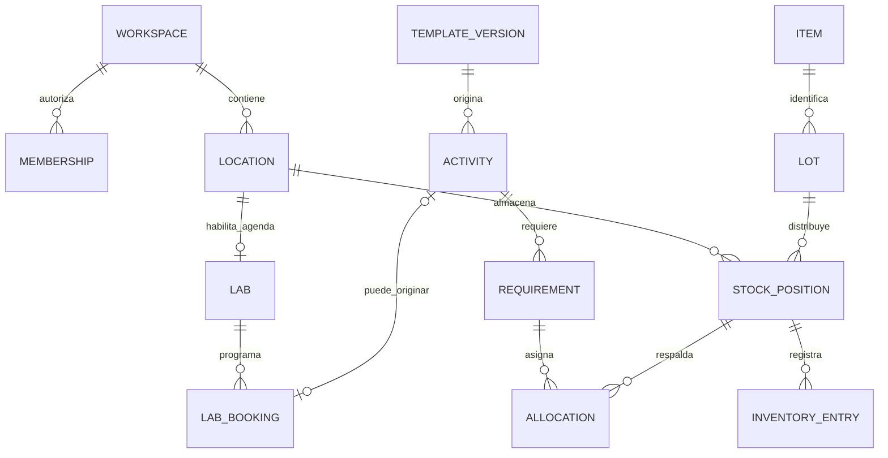

# Dominio y modelo de datos

Fecha: 24 de septiembre de 2026; revisión del 29 de septiembre. Este archivo define el modelo; las decisiones y sus motivos se registran en [ADRs](../adr/README.md).
Estado: diseño propuesto; las reglas indicadas como «por validar» todavía requieren acuerdo con los clientes piloto.
Prioridad: vender distintos paquetes desde la primera oferta. Reactivos y Equipos funcionan por separado sobre Core.
Las prácticas son el centro de la operación cuando ese módulo está contratado; no son una dependencia del inventario.

## 1. Decisiones que ordenan el modelo

- El titular jurídico, el contrato y el espacio de trabajo o tenant son entidades distintas. Se eligen espacios independientes con un propietario transferible por espacio; las licencias y los datos no pertenecen a su identidad personal.
- Una persona puede pertenecer a varias organizaciones con permisos diferentes.
- Ubicación física no equivale a laboratorio programable: Core administra ubicaciones; Laboratorios añade capacidad y agenda.
- Producto, lote, envase, saldo, reserva y movimiento son conceptos distintos.
- Plantilla de práctica, versión publicada y ejecución en una fecha son registros distintos.
- La condición física de un equipo se separa de su reserva, bloqueo temporal y custodia.
- Los movimientos y decisiones confirmados se corrigen con nuevos registros durante la operación ordinaria. La supresión o anonimización autorizada sigue un procedimiento separado de protección de datos; inmutabilidad no significa retención perpetua.
- El inventario y la agenda son capacidades internas compartidas, no módulos comerciales adicionales.
- Todos los módulos pertenecen al mismo monolito y release. La licencia controla uso, no instalaciones distintas por cliente.
- Las migraciones SQL versionadas son la única autoridad del esquema. No mantener un segundo esquema generado por un ORM.

## 2. Propiedad de datos y módulos

Cada esquema PostgreSQL tiene un propietario funcional. Otro módulo lo consulta mediante servicios internos; sus escrituras pasan por el propietario.
Esto no impide transacciones entre módulos: el caso de uso coordina sus servicios usando la misma conexión y transacción.

| Esquema | Propietario / alcance | Primera implementación |
|---|---|---|
| `core` | Espacios, personas, ubicaciones, permisos, derechos de uso, documentos y auditoría | F1 |
| `inventory` | Catálogo, lotes, saldos, movimientos, custodia y retornos según el flujo; después reservas y transferencias ampliadas | R-00 en F1a; ampliar F2–F4 |
| `reagents` | Datos químicos, documentos y perfil fiscalizado validado del módulo 2 | Mínimo R-00; completar F2 y REG-02 antes del piloto |
| `equipment` | Activos, condición y responsables, módulo 3 | F2 |
| `incidents` | Contexto, responsables y seguimiento mínimo de incidencias; capacidad compartida | F2 |
| `laboratories` | Capacidad, horarios y reglas de espacios, módulo 4 | F3 |
| `scheduling` | Reservas de espacios y activos; motor interno de conflictos | F3 |
| `practices` | Plantillas, ejecuciones, aprobación, preparación y cierre, módulo 5 | F3 |
| `materials` | Consumibles, reutilizables, préstamos y devoluciones, módulo 6 | F4 |
| `maintenance` | Planes y órdenes, módulo 7 | F5 |
| `analytics` | Indicadores, alertas configurables avanzadas, resúmenes y escalamiento, módulo 8 | F5 |
| `platform` | Administración del SaaS, titulares/contratos, outbox, trabajos, cuotas y procedimientos de salida | F1; ampliar según cada entrega |

F2 entrega al menos dos configuraciones probadas: Core + Reactivos y Core + Equipos, en organizaciones distintas.
Las reservas se diseñan ahora para evitar cambios incompatibles, pero no bloquean la primera oferta de inventario.
En F2 «disponibilidad» de equipos significa condición actual utilizable; la disponibilidad futura por horario llega en F3.

### Frontera de cliente y contratación

Decisión confirmada: derechos por espacio de trabajo, sin licencias por unidad interna. Un titular jurídico puede tener varios espacios y contratos. Dos departamentos con contratación y operación independientes disponen de espacios separados bajo el mismo titular. Dentro de un espacio se pueden gestionar varios laboratorios mediante permisos por ubicación.

Dos espacios no comparten existencias, reservas, miembros ni informes, aunque tengan el mismo titular o usuario. Una futura fusión exige migración y conciliación; no basta cambiar un ID. Dos facturas no determinan por sí solas dos tenants: la independencia operativa sí define el límite elegido. Compartir inventario entre espacios o contratar módulos distintos por unidad quedan fuera del alcance inicial.

`core.workspaces` es el nombre canónico del espacio y `workspace_id` su referencia en tablas/API, según [ADR 0001](../adr/0001_espacios_y_acceso.md). Las unidades administrativas y ubicaciones físicas son conceptos diferentes; una unidad puede gestionar varias ubicaciones. No crear unidades administrativas en F1: documentar esta distinción en T-02 y añadir su modelo solo cuando exista un caso de uso.

Las tablas descritas son el modelo objetivo por fases. F1a no crea las de todas las fases futuras. `support_grants` se difiere; envases, custodia y `return_batches` se incorporan antes del piloto que los necesite. El requisito confirmado de fiscalizados obliga a resolver esos hechos en REG-01/REG-02, sin esperar a Prácticas si ya existen en la operación del laboratorio.

## 3. Convenciones de todas las tablas

- UUID para identificadores; `created_at` y `updated_at` como `timestamptz` cuando corresponda.
- Cada tabla institucional lleva `workspace_id NOT NULL`, FK a `core.workspaces`.
- Patrón: `PRIMARY KEY(id)` y `UNIQUE(workspace_id,id)`; las FKs institucionales incluyen siempre el tenant.
- Ejemplo: `(workspace_id, location_id)` referencia `core.locations(workspace_id,id)`, nunca solamente `location_id`.
- Toda FK que añada item, lote u otro discriminador requiere una clave única correspondiente en su destino; el modelo lógico debe convertirse en esas restricciones al escribir la migración.
- Índices para las FKs y consultas habituales empezando por `workspace_id`; no añadir índices sin una consulta que los justifique.
- Códigos de laboratorio, producto y activo únicos dentro del tenant. Nombres, CAS y lotes de proveedor no son claves únicas.
- Estados como texto con `CHECK` y transiciones controladas; no dejar estados libres en JSON.
- `version` entero para detectar modificaciones concurrentes de solicitudes y configuraciones editables.
- Archivar catálogos con `archived_at`; desactivar membresías con `status`. El rol operativo no borra información histórica referenciada. La retención y disposición autorizada se rigen por [ciclo del cliente y datos](08_ciclo_cliente_y_datos.md).
- JSONB para instantáneas, configuración acotada y metadatos; relaciones, cantidades y permisos permanecen normalizados.
- Las tablas globales de identidad, permisos, módulos y unidades son excepciones explícitas a `workspace_id`.
- Las fechas de caducidad pueden ser `date`; la política institucional define hasta qué momento permiten uso.

## 4. Core, identidad y autorización

| Tabla | Campos y relaciones principales |
|---|---|
| `core.workspaces` | Espacio: `id`, `customer_account_id`, `owner_membership_id`, `code`, `name`, `timezone`, `status`, motivo y fechas de cierre; zona IANA |
| `core.identities` | `id`, `provider`, `provider_subject`, datos mínimos; único `(provider,provider_subject)` |
| `core.memberships` | `id`, `workspace_id`, `identity_id`, `status`; único `(workspace_id,identity_id)` |
| `core.invitations` | `workspace_id`, email destinatario, hash de token, expiración, invitador, roles/alcances propuestos y estado; canje único con identidad verificada; lote opcional al incorporar invitaciones CSV en F3 |
| `core.principals` | Actor institucional: humano o servicio en MVP; membresía o código de servicio según tipo; soporte como ampliación posterior |
| `core.support_grants` | Diferido: identidad del operador, aprobador del espacio, permisos, alcance, vencimiento y revocación |
| `core.permissions`, `core.roles`, `core.role_permissions` | Catálogos globales de roles/permisos fijos, definidos en código y sincronizados por migración; no editables por el cliente |
| `core.role_assignments` | `principal_id`, `role_id`, `scope_kind`, `location_id` opcional, vigencia; espacio de trabajo o ámbito de ubicación |
| `core.locations` | `id`, `parent_id`, `code`, `name`, `kind`, `status`; sede, edificio, sala, almacén, custodia o tránsito |
| `core.workspace_settings` | Políticas validadas y versionadas; evitar una colección ilimitada de ajustes arbitrarios |
| `core.documents` | `id`, `storage_key`, nombre, MIME, tamaño, hash, actor, clasificación y estado de carga |
| `core.branding` | Espacio, nombre visible, logo como documento/versionado, datos autorizados de encabezado; sin URL externa arbitraria |
| `core.audit_events` | Actor, tenant, acción, entidad, momento, correlación, motivo y cambios relevantes |

| Tabla de administración SaaS | Campos y límites |
|---|---|
| `platform.customer_accounts` | Titular jurídico/contratante y contacto; datos mínimos necesarios, visibles al operador autorizado |
| `platform.package_definitions`, `package_versions` | Identidad del paquete y versiones inmutables con módulos/límites predeterminados y publicación |
| `platform.contracts` | Titular, `workspace_id`, estado, revisión efectiva y referencia contractual; no sustituye el documento legal |
| `platform.contract_revisions` | Contrato, espacio, versión de paquete, snapshot comercial, excepciones autorizadas, vigencia y estado de aplicación |
| `platform.operator_accounts` | Identidad global, estado y capacidades del operador; independiente de membresías institucionales |
| `platform.operator_audit_events` | Actor, acción administrativa, espacio afectado, motivo y cambios de metadatos; sin copiar contenido de inventarios |
| `platform.workspace_limits` | Límites efectivos, `workspace_id`, `contract_id`, `contract_revision_id` y versión de aplicación; proyección operativa |
| `platform.usage_reservations` | Consumo reservado de almacenamiento/cargas/trabajos; comprobación, confirmación y liberación atómicas |
| `platform.workspace_readiness` | Desde F1b: espacio, alcance publicado, estado `synthetic/controlled_loading/operational`, evidencia, responsables y fechas de autorización de carga/operación; independiente de contrato y módulos |
| `platform.data_disposition_cases`, `disposition_tasks` | Instrucción del responsable, alcance, plazo aplicable, excepciones, repositorio, estado y evidencia |

Estas tablas de control tienen políticas propias: un usuario de un espacio no puede enumerar otros titulares o contratos. Todo registro que afecta a un espacio conserva su referencia; lo global no usa un tenant ficticio. La consola cambia contratos y derechos mediante comandos auditados, sin autorización general sobre datos operativos.

Las FKs de contrato/revisión/derechos/límites incluyen `workspace_id`; una proyección de A no referencia contrato de B. `apply_contract_revision` es el único camino administrativo para aplicar cambios comerciales a derechos y límites, con misma versión, auditoría y transacción. El runtime lee esas dos proyecciones, no vuelve a interpretar paquete/contrato. El [ADR 0002](../adr/0002_contratos_y_derechos.md) define autoridad, vigencia futura y reparación de inconsistencias.

Los vínculos a documentos/incidencias son tablas con FKs reales del módulo correspondiente, por ejemplo `equipment.incident_links`.
Evitar un campo genérico `resource_type/resource_id` sin integridad referencial para relacionar operaciones críticas.
Las membresías históricas permanecen aunque el usuario pierda acceso. Conservar autoría no concede permiso vigente.

Todo campo de autoría operativa (`actor_id`, creador, reportante, ejecutor) referencia `(workspace_id, principal_id)` con FK compuesta.
El principal humano referencia la membresía del mismo tenant; el de servicio tiene capacidades y alcance explícitos. El futuro principal de soporte requerirá una concesión temporal del mismo tenant; no se habilita en F1. Un `CHECK` impide mezclar clases. La identidad global autentica, pero no demuestra pertenencia institucional.
Custodios, docentes y prestatarios humanos internos referencian membresías mediante FK compuesta; las bajas no eliminan esas referencias. Prestatarios externos quedan pendientes de alcance en F4.
En trabajos iniciados por personas se conservan por separado `requested_by_principal_id` y `executed_by_principal_id`. El operador del proveedor no obtiene acceso al dominio por gestionar una licencia.

Permisos iniciales: consultar, crear, editar catálogo, ajustar stock, aprobar, preparar, cerrar, transferir, recibir y administrar acceso.
Propiedad singular del espacio y plantillas iniciales: administrador y técnico; docente y tesista se habilitan con sus casos de uso en F3. Coordinador es una posible plantilla adicional de permisos, no una jerarquía obligatoria. El propietario se deriva de `owner_membership_id`, no de un rol editable.
Asignar un rol no convierte a su titular en administrador de todos los laboratorios.
La herencia de ámbitos usa `parent_id` y CTE recursivas; impedir ciclos, cambios entre espacios y cambios de autorización durante un movimiento concurrente del árbol. `ltree` queda condicionado a medición, según [ADR 0006](../adr/0006_sql_y_pruebas.md).
Consultar inventario institucional puede permitirse sin autorizar salidas de otro laboratorio.
Transferir requiere permiso en origen; recibir requiere permiso en destino.
Autorizar la propia solicitud: deshabilitado por defecto, incluso para propietario/administrador; una excepción institucional requiere política explícita y trazabilidad.
Las invitaciones y asignaciones no pueden otorgar permisos o alcances que el administrador no esté autorizado a delegar. Separar permisos delegables de permisos ejecutables: nombrar a un técnico no exige que el propietario pueda ajustar stock. Una invitación no crea una membresía activa hasta verificar su destinatario y canjearla transaccionalmente.

### Propiedad y alta del espacio

- `owner_membership_id` es la única autoridad de propiedad. FK compuesta `(id, owner_membership_id) → core.memberships(workspace_id,id)`; nunca puede apuntar a otro espacio.
- Estados del espacio: `provisioning`, `trial`, `active`, `suspended`, `closing`, `terminated`. Durante `provisioning` puede no existir propietario y no hay operación del dominio. Pasar a `trial`/`active` exige propietario humano con membresía activa; un `CHECK` cubre nulabilidad y el comando transaccional comprueba vigencia.
- Preparar espacio, paquete e invitación es idempotente. Después de verificar la identidad externa, el canje crea membresía/principal, asigna propiedad y habilita el espacio en una transacción. Auth y correo ocurren fuera del commit SQL y admiten reintentos, sin dejar un espacio activo huérfano.
- La transferencia requiere reautenticación del propietario actual, aceptación del sucesor y membresía activa del mismo espacio. Bloquear la fila del espacio serializa transferencias, revocaciones y cambios de propiedad. Registrar las funciones que conserva el anterior propietario; no borrar su autoría.
- La baja, salida o desactivación ordinaria del propietario vigente exige transferir primero. Si no está disponible, recuperación verificada mediante representación institucional, credencial operadora reforzada y auditoría; no da al proveedor acceso implícito al inventario.
- La propiedad no acredita por sí sola representación legal, ni autorización para ordenar una purga total. Una solicitud de derechos inicia el procedimiento de [disposición](08_ciclo_cliente_y_datos.md), incluyendo relevo cuando proceda; no se deniega por una FK o por falta de sucesor.

### Docentes y tesistas en F3

Ambos son solicitantes con membresías normales y permisos por espacio; la condición de tesista no es permanente ni global en Auth. Una autorización de participación registra alcance, vigencia y responsable académico en `practices.participations`, con FKs del mismo tenant. El tesista solicita y acepta propuestas; el patrocinio académico no sustituye aprobación técnica.

La actividad distingue docencia e investigación. Para docencia se captura asignatura/grupo cuando aplique; para investigación, título de proyecto y responsable. Evitar campos de curso obligatorios para una tesis. Una baja del responsable o vencimiento de participación bloquea nuevas solicitudes y exige reasignar pendientes; no elimina reservas ni custodias históricas. Las pruebas cubren vencimiento mientras existe una entrega pendiente.

Separar `requestable_catalog.read` y permisos de solicitud propia de los de administración del inventario. La API fija el solicitante a partir de su membresía, salvo permiso explícito para actuar en nombre de otro con ambos actores registrados. El catálogo docente expone solo recursos solicitables y campos necesarios; las consultas y cambios de actividades propias verifican pertenencia además del tenant. Ver un horario ocupado no da acceso a los datos de otro solicitante.

Invitaciones masivas reutilizan `core.invitations`, con vista previa, deduplicación y correo en trabajos limitados. Revalidar destinatario, estado del espacio, invitación y delegación antes del canje. Una cuenta Auth existente recibe membresía, no una segunda cuenta por institución. El dominio del email nunca concede acceso por sí solo. No se publican búsquedas de identidades o pertenencias ajenas al espacio; [documento 10](10_acceso_institucional_y_docentes.md) describe el flujo completo.

## 5. RLS y contexto de cada operación

Toda operación del dominio entra por la API Node/Fastify, que usa SQL parametrizado mediante `pg`.
Supabase Auth autentica a la persona; la API verifica el token y resuelve identidad, membresía y organización activa.
El tenant que envía el navegador es una selección a validar, nunca una prueba de pertenencia.
El `workspace_id` de la API selecciona el espacio cuyo identificador se guarda como `workspace_id` en SQL; no se mantienen dos identificadores de aislamiento independientes.

Flujo de cada transacción:

1. Verificar token y obtener la identidad desde su emisor y sujeto.
2. Abrir transacción con un rol SQL de aplicación sin propiedad de tablas ni `BYPASSRLS`.
3. Establecer actor y tenant con `set_config(..., ..., true)` parametrizado: contexto local a esa transacción.
4. Verificar principal autorizado, membresía activa si es humano, permisos, ámbito y clase de acción permitida por el módulo dentro de la transacción.
5. Ejecutar consultas y comandos; confirmar o revertir y devolver la conexión al pool.

RLS aplica filtros de tenant y principal autorizado en lectura (`USING`) y escritura (`WITH CHECK`). Para humanos exige membresía activa; para servicios, principal habilitado, capacidad y rol SQL ejecutor admitidos. El principal de soporte permanece deshabilitado hasta implementar su concesión y pruebas completas.
Las políticas de membresía permiten comprobar la membresía propia sin referencias recursivas entre políticas.
La API además valida permisos de la acción, ámbito y transición; RLS no sustituye el workflow del dominio.
El rol de migraciones es distinto y no se utiliza para atender peticiones. El navegador no recibe credenciales SQL ni `service_role`.
Los esquemas del dominio no se exponen para lectura ni escritura mediante la Data API de Supabase.
El worker usa tenant y actor de servicio explícitos y mínimos permisos; cada trabajo abre su propia transacción.
La API deriva el principal del token y la membresía; la ampliación de soporte añadirá la concesión. Nunca acepta un actor de servicio enviado por el navegador. La conexión de worker no puede seleccionar libremente una identidad humana para saltarse sus límites.
Un dispatcher necesita descubrir trabajos antes de fijar tenant: usar una función estrecha `platform.claim_jobs(limit)` con `SECURITY DEFINER`, `search_path` fijo, SQL estático y dueño limitado a tablas de cola. Revocar ejecución a `PUBLIC`; concederla solo al rol de dispatcher. Reclama únicamente tipos permitidos y devuelve ID, tenant y concesión temporal, sin leer datos del dominio. El ejecutor usa después su rol limitado y contexto institucional. La función no concede `BYPASSRLS` general ni permite consultas arbitrarias.
Importaciones/exportaciones pedidas por usuarios revalidan al solicitante antes de ejecutar y antes de publicar el resultado; avisos de hechos confirmados usan una política de servicio. Revocar al usuario no deshace movimientos confirmados, pero sí puede impedir nuevas exportaciones.
Los enlaces temporales a Storage solo se emiten después de autorizar el documento; los buckets institucionales son privados.
No guardar secretos, tokens o archivos completos dentro de auditoría.

Los rechazos previos a autorización y los errores revertidos van a un registro de seguridad separado y minimizado. La auditoría de éxito se confirma con la operación; una transacción revertida no debe dejar un movimiento exitoso ficticio. El log de error no usa la misma transacción que acaba de revertirse.

RLS omite normalmente propietarios y roles con `BYPASSRLS`; habilitarla sin revisar el rol SQL no ofrece el aislamiento esperado.
Referencia: [políticas de seguridad por fila de PostgreSQL](https://www.postgresql.org/docs/current/ddl-rowsecurity.html).

## 6. Licencias, dependencias y desactivación

| Tabla | Campos principales |
|---|---|
| `core.module_definitions` | Código estable, nombre y versión de definición; catálogo global |
| `core.module_dependencies` | Módulo, dependencia obligatoria; las integraciones opcionales se definen aparte |
| `core.workspace_entitlements` | Espacio, módulo, vigencia efectiva, estado operativo, `contract_id`, `contract_revision_id` y versión de aplicación; único `(workspace_id,module_code)` |
| `core.entitlement_changes` | Historial de activación, cambios, actor y motivo |

Dependencias obligatorias: M2/M3/M4/M6 → M1; M5 → M1 + M4; M7 → M1 + M3; M8 → M1 + algún módulo operativo.
M5 incorpora nuevos requisitos de reactivos, equipos o materiales únicamente cuando M2, M3 o M6 admiten operaciones nuevas. Las referencias históricas y resolución de entregas existentes conservan acceso según la matriz de continuidad.
La adquisición comercial, la vigencia, el permiso de usuario y una bandera de despliegue son conceptos separados.
La configuración del menú es una consecuencia de los permisos; no constituye su control.

Estados operativos propuestos: `disabled` → `enabled` → `draining` → `read_only`; reactivación controlada desde consulta.
`disabled` representa un módulo sin uso habilitado; `read_only` conserva información de una contratación previa.

| Clase de acción | `enabled`, vigencia válida | `draining` o vigencia terminada en periodo de cierre | `read_only` |
|---|---|---|---|
| Crear nuevas operaciones/compromisos | Sí, con dependencias admitiendo nuevas operaciones | No | No |
| Resolver entrega, cancelar reserva, recibir devolución o conciliar pendiente existente | Sí | Sí, acotado al pendiente y sus dependencias históricas | No; reabrir cierre de pendientes con autorización si se descubre uno |
| Consulta, documento histórico y exportación | Sí | Sí | Sí, dentro del periodo de conservación/acceso pactado |

Todas las celdas siguen requiriendo identidad activa, permiso, alcance y acceso del espacio permitido. La continuidad comercial no permite a un usuario revocado entrar; la suspensión por seguridad es independiente. La expiración bloquea nuevas operaciones aunque la etiqueta siga en `enabled`; cambiar a `draining` será un comando administrativo en el MVP. Core mantiene consulta y resolución solo durante una prestación de salida autorizada, no indefinidamente después del fin del encargo.

- Activar: validar dependencias, registrar concesión y habilitar acciones en API.
- Desactivar: cerrar admisión de operaciones nuevas y permitir devolver, finalizar, cancelar y corregir operaciones abiertas.
- Pasar a consulta: verificar que no quedan préstamos, reservas o custodias sin resolver.
- Apagar un módulo mantiene referencias, documentos y exportación durante la relación autorizada. La finalización del encargo activa el procedimiento de disposición; nunca se borra una tabla compartida para retirar un tenant.
- No desactivar una dependencia dejando módulos dependientes admitiendo nuevas operaciones.
- Las transacciones críticas toman bloqueo compartido del entitlement; los cambios de estado toman bloqueo exclusivo.
- Vencimiento de licencia, fin del encargo y disposición son eventos distintos. No prometer un periodo de gracia de retención que contradiga la norma aplicable; ver el documento 08.

Pruebas desde F1: aislamiento entre tenants, acceso directo a endpoints de módulos apagados, dependencias y revocación de permisos.
En F2 probar expresamente clientes con combinaciones distintas; el catálogo completo desplegado no concede derechos de uso.

### Ciclo del espacio y sus datos

`provisioning → trial/active → closing → terminated`, con `suspended` como estado reversible con motivo. `provisioning` espera la aceptación del propietario. Demo y trial son distintos: el trial admite carga real controlada tras la primera autorización de G1, con encargo y garantías verificadas; la operación se habilita después de conciliar y aceptar el inventario. No depende solo de una etiqueta comercial. `closing` permite preparar exportación y resolver pendientes dentro de una prestación autorizada. `terminated` cierra acceso operativo y ejecuta instrucciones de devolución/eliminación. [ADR 0005](../adr/0005_datos_reales_y_recuperacion.md).

El proceso de disposición mantiene su estado separado: `pending | exporting | deletion_pending | deleting | retained_exception | completed`. Registrar la fecha real del fin del encargo, instrucciones y plazo normativo aplicable. No marcar `completed` hasta verificar todos los repositorios incluidos y documentar las excepciones. La definición completa, fuentes y plazos están en [ciclo del cliente y datos](08_ciclo_cliente_y_datos.md).

Eliminar un espacio no elimina automáticamente una identidad global que todavía tenga otros espacios o finalidades justificadas. La eliminación autorizada usa un rol/proceso específico, alcance acotado y evidencia, separado del CRUD diario. Las copias, adjuntos, exportaciones, texto libre y instantáneas también entran en el inventario de disposición.

## 7. Reactivos e inventario cuantificable

| Tabla | Campos y relaciones principales |
|---|---|
| `inventory.items` | Tenant, código, nombre, `kind`, `base_unit`, `tracking_mode`, archivado; catálogo común de cantidades |
| `reagents.products` | FK única al item, CAS opcional, concentración, pureza, estado físico, peligros; SDS mediante documentos versionados |
| `inventory.lots` | Item, referencia de proveedor, marca/proveedor, recepción, caducidad, condición y datos de origen |
| `inventory.containers` | Ampliación condicionada: item/lote, código interno, apertura, caducidad tras apertura y estado; no obligatoria para F2 si el proceso trabaja por lote |
| `inventory.return_batches` | Partida de retorno segregada, item/lote, posición y operación de origen, verificación y disposición; REG-02 si el piloto devuelve sobrantes |
| `inventory.custodies`, `custody_lines` | Entrega, responsable humano, posiciones/cantidades de origen/destino y conciliación; independientes de una actividad de Prácticas |
| `inventory.positions` | Item, lote, envase opcional, partida de retorno opcional, ubicación, disposición, saldo físico, cantidad reservada y versión |
| `inventory.operations` | Tipo, actor, motivo, fecha, correlación y referencia documental; cabecera de movimiento |
| `inventory.entries` | Operación, posición, cantidad con signo y unidad base; asientos inmutables |
| `inventory.allocations` | Posición, cantidad, estado y fechas; reservas de F3, vinculadas mediante FKs tipadas del módulo solicitante |
| `inventory.transfers`, `transfer_lines` | Origen, destino, estado; item/lote, solicitado, despachado, recibido y diferencia |

El lote se relaciona también con el item mediante FK compuesta; no se permite asignar a un producto el lote de otro.
La clave única de posición es `(workspace_id,item_id,lot_id,container_id,return_batch_id,location_id,disposition)`, tratando nulos como iguales. FKs compuestas validan tenant, item y lote de envase/partida, además de ubicación.
Cuando el item exige seguimiento por envase, cada posición debe identificarlo. No permitir saldo agregado sin envase y saldo por envase para las mismas existencias; cambiar de modo exige una conciliación/migración explícita. La entrega parcial preserva envase y origen aunque se registre en otra posición de custodia.
El catálogo común no crea un constructor universal de recursos: cada tipo mantiene sus reglas y sus extensiones propias.
Las extensiones de reactivo/material son únicas por item y validan su discriminador de tipo; no admitir el mismo item en ambos módulos.
Prácticas y Materiales poseen sus vínculos a asignaciones; un préstamo independiente no necesita una práctica ficticia.
Un CAS no identifica de forma suficiente un reactivo comercial; no sustituir automáticamente concentraciones o purezas.

Cantidades: `numeric(24,9)` como punto de partida; fijar precisión y límites tras revisar muestras de datos.
Los contratos JSON usan cadenas decimales; no convertir cantidades a `number` para sumarlas en TypeScript. Calcular en PostgreSQL o con aritmética decimal exacta y una política de redondeo validada. El formato visual no modifica el dato persistido.
Unidades globales con código, dimensión y factor exacto respecto a una base. El conteo indivisible exige enteros.
Conservar cantidad/unidad capturadas y cantidad normalizada; validar toda conversión en el servidor.
Permitir kg↔g y L↔mL; g↔mL necesita una transformación documentada, no una conversión genérica.
La concentración se modela con valor y unidad/tipo, no como una cantidad de stock intercambiable.

Definiciones:

```text
Existencia institucional = saldos físicos, incluyendo custodia y tránsito.
Disponible asignable = saldo en ubicaciones utilizables de lotes elegibles
                       - reservas activas todavía no entregadas.
Consumo = movimiento real confirmado; una solicitud nunca es un consumo.
```

Condición de lote: habilitado, cuarentena, bloqueado o descartado; caducidad se comprueba para la fecha de uso prevista.
La disposición de posición (utilizable, cuarentena, restringida) permite aislar una devolución sin bloquear el resto del lote. Prevalece siempre la restricción más fuerte entre lote, envase, posición y ubicación.
Un retorno pendiente crea una partida segregada vinculada a la entrega y posición de origen; no se mezcla con saldo apto. La verificación puede autorizar reintegro mediante un nuevo movimiento o disposición definitiva. Si su identidad/composición ya no corresponde al producto original, se requiere otra identificación antes de ofrecerlo como utilizable.
FEFO propone primero los lotes válidos con vencimiento más próximo; el técnico confirma cuando exista una excepción.
Una alerta de caducidad y la exclusión de lotes bloqueados pertenecen a Reactivos, aunque Analítica esté apagada.
Las entradas no se actualizan ni eliminan con el rol operativo; los saldos son su proyección transaccional reconciliable.
Saldo no negativo y reserva entre cero y saldo son restricciones locales; las sumas entre filas se protegen mediante transacciones.
Un conteo inferior a lo reservado registra discrepancia; aplicar el ajuste exige resolver/reasignar compromisos y marcar actividades afectadas.
El saldo inicial de una importación se registra como operación de apertura.
En F2 sin partidas de retorno no ofrecer un cierre químico ni reintegrar sobrantes como entrada ordinaria. Un cliente que exige caducidad por apertura/envase necesita esa ampliación antes de su puesta en producción.

Una asignación pasa de `held` a `fulfilled` o `released`; entregas parciales registran cantidades resueltas sin perder la cantidad original.
No añadir expiración automática de reservas confirmadas. Si se introducen retenciones temporales, necesitan otro tipo y vencimiento explícito.
Transferencias: `draft → approved → in_transit → partially_received → received`; puede omitirse el estado parcial si toda la recepción es conjunta.
Una cancelación posterior al despacho solo termina cuando tránsito queda conciliado; recepción y devolución nunca superan lo pendiente.

### Perfil de sustancias fiscalizadas del piloto

El usuario confirma que el laboratorio cuenta con calificación, responsable y reportes actuales, y que este alcance es obligatorio desde el piloto. REG-01 verifica su evidencia y proceso; no se considera validado un formato concreto por esa confirmación. La función pertenece a Reactivos, no requiere Analítica avanzada.

Modelo mínimo propuesto para REG-02, ajustado con esa evidencia antes de escribir sus migraciones:

| Elemento | Datos y relaciones |
|---|---|
| `reagents.regulatory_profiles` | Producto/sustancia, código oficial, lista/jurisdicción/versión, concentración y tipo/unidad; clasificación revisada y evidencia |
| `reagents.authorizations`, `authorized_sites` | Referencia de calificación, titular, vigencia, actividades, responsable y sitios vinculados a ubicaciones; workspace y FKs del mismo espacio |
| `reagents.authorized_quotas` | Sustancia, autorización, periodo, unidad, cupo y modificaciones documentadas; criterio de utilización y alcance completo/parcial |
| `reagents.regulated_operation_details` | FK al movimiento de inventario, tipo regulatorio/versionado, fecha del hecho y registro, documentos/contraparte cuando correspondan; no otro saldo editable |
| `reagents.regulatory_reports`, `report_lines` | Periodo/perímetro, operaciones incluidas con FKs, saldos conciliados, versión de reglas/formato, revisor, exportación/hash y evidencia posterior de presentación |

Cupo autorizado, existencia física y cuota comercial del SaaS son diferentes. No clasificar por CAS o nombre sin comprobar concentración y norma aplicable; no inventar valores ni equivalencias masa/volumen. Un envío interno a custodia no es consumo ni compra; el reporte deriva de hechos tipificados, no de todas las salidas del almacén sumadas indiscriminadamente.

Si el piloto entrega a docentes y recibe sobrantes, `inventory.custodies` y partidas de retorno se implementan en F2 antes de G1. Un técnico registra responsable y entrega, consumo real, retorno, verificación o disposición. No requieren agenda ni una actividad de Prácticas; F3 añadirá vínculos tipados a esos mismos hechos. La cantidad devuelta/consumida/dispuesta no supera lo entregado y el saldo institucional conserva lo que sigue en custodia, tránsito o cuarentena.

Un reporte pasa por borrador, revisión y exportación; presentación/constancia se registran solo con evidencia. Corregir un periodo preserva versión previa, motivo y conciliación; exportar no acredita envío ni aceptación oficial. La primera integración prepara el formato o documento de trabajo que el responsable valide para su proceso; no automatiza una presentación a SISALEM ni presupone API pública. El [manual oficial disponible de 2019](https://www.ministeriodegobierno.gob.ec/wp-content/uploads/2019/06/MANUAL-DE-USUARIO-SISALEM-Mayo2019.pdf) es referencia de descubrimiento, no garantía del formato vigente.

Si la autorización/cupo cubre otros espacios o sistemas, marcar el perímetro parcial y comprobar consolidación con el responsable. No replicar el cupo completo en cada espacio ni afirmar control institucional global con datos parciales. Puede usarse consolidación asistida de exportaciones autorizadas si REG-01 demuestra su integridad; si el cliente exige control global automático, diseñarlo antes de G1. Compartir titular no concede acceso cruzado.

REG-01 fija campos exigibles y acciones ante falta de evidencia: bloquear nuevas operaciones incompatibles cuando corresponda, pero permitir registrar una incidencia ya ocurrida con seguimiento. Las [pruebas de G1](06_roadmap.md) cubren conciliación del periodo, correcciones y consumo sin doble conteo. La calificación autoriza actividades concretas; PlatLab conserva evidencia y no la emite ni verifica en línea sin integración demostrada. [Trámite del Ministerio del Interior](https://www.gob.ec/mdi/tramites/aprobacion-calificacion-manejo-sustancias-catalogadas-sujetas-fiscalizacion).

## 8. Equipos, materiales e incidencias

| Tabla | Campos y relaciones principales |
|---|---|
| `equipment.assets` | Código institucional, marca/modelo, serie, ubicación, responsable, condición y archivado |
| `equipment.condition_changes` | Activo, condición anterior/nueva, actor, motivo e incidencia opcional |
| `incidents.cases`, `incidents.actions` | Ubicación, reportante, gravedad, estado, responsable y acciones; vínculos a recursos mediante tablas tipadas |
| `equipment.custodies` | Activo, receptor, entrega, devolución prevista/real y verificación; ampliar en F3 |
| `materials.products` | Extensión del item: consumible/reutilizable y seguimiento por cantidad o unidad |
| `materials.assets` | Unidades reutilizables identificables, código, producto, ubicación y condición |
| `materials.loans`, `loan_lines` | Prestatario, responsable, plazo, estado y cantidades/unidades entregadas |
| `materials.return_lines` | Línea prestada, cantidad/unidad, condición, receptor y momento; admite devoluciones parciales |
| `maintenance.plans`, `orders` | Activo, frecuencia, fecha prevista, responsable, tareas, resultado y siguiente intervención |

Condición de equipo: `operational`, `restricted`, `faulted`, `retired`.
Reserva, uso y mantenimiento son dimensiones separadas; «disponible» se calcula para un periodo y contexto.
Declarar avería bloquea nuevas asignaciones y señala reservas afectadas; no borra ni cancela silenciosamente actividades.
Mantenimiento preventivo futuro bloquea agenda; una orden abierta no cambia por sí sola la condición actual.
Volver a operativo exige un resultado y responsable, incluso si el módulo avanzado de mantenimiento no está contratado.

Incidencias mínimas disponibles con cada recurso: contexto, gravedad, estado, responsable e historial de acciones.
Estados sugeridos: abierta, en atención, resuelta, cerrada; la resolución exige resultado, no solo cambiar una etiqueta.
No toda incidencia bloquea un recurso. La regla de gravedad y autoridad se valida con la institución.

Consumibles usan el ledger de inventario. Reutilizables identificables usan entrega/devolución de activos.
Reutilizables por cantidad mantienen saldo, reservas y custodia; pérdidas y daños reducen la cantidad utilizable de forma trazable.
El préstamo solo termina cuando todas sus líneas están devueltas o resueltas mediante una decisión explícita.
Estados de préstamo: abierto, parcialmente devuelto, cerrado o cancelado antes de entregar; el retraso se deriva de plazo y pendientes.
Una restricción única parcial impide dos custodias abiertas del mismo activo identificado.
Toda devolución bloquea la línea de entrega y verifica que cantidad devuelta acumulada no supere la entregada.
Primera versión de reutilizables por cantidad: asignación conservadora hasta devolución verificada.
Reservar capacidad futura compartida exige calcular la ocupación simultánea por intervalo bajo bloqueo; se implementa solo si se valida esa necesidad.

## 9. Laboratorios, prácticas y agenda

| Tabla | Campos y relaciones principales |
|---|---|
| `laboratories.labs` | Ubicación única, código, capacidad, responsable y política de anticipación |
| `laboratories.opening_hours`, `calendar_exceptions` | Horario recurrente, cierres, festivos y excepciones autorizadas |
| `scheduling.lab_bookings` | Laboratorio, intervalo, estado, origen y responsable; reserva manual o vinculada a actividad |
| `scheduling.equipment_bookings` | FK a `equipment.assets`, intervalo, estado y tipo; uso y mantenimiento comparten protección contra conflictos |
| `scheduling.material_bookings` | FK a `materials.assets`, intervalo, estado y tipo para unidades identificables; se añade en F4 |
| `practices.templates`, `template_versions` | Plantilla, versión, instrucciones, datos académicos y publicación inmutable |
| `practices.participations` | Solicitante, tipo de participación, ámbito, vigencia y responsable académico; membresías del mismo tenant; F3 |
| `practices.activities` | Plantilla/versionada, `kind` docencia/investigación, solicitante, responsable/participación, horario solicitado y confirmado, laboratorio asignado por técnico (nullable hasta asignación), estado, revisiones y versión de concurrencia |
| `practices.activity_revisions` | Requisitos solicitados y propuesta técnica exacta, laboratorio/horario propuestos, autor, motivo, estado y decisión del solicitante; instante y vigencia |
| `practices.conditional_approvals` | Revisión exacta, principal técnico autorizante, ámbito, condiciones/política, vencimiento y revocación; no crea reservas |
| `practices.requirements` | Actividad, recurso tipado, cantidad, unidad y asignación aprobada; FKs reales |
| `practices.decisions`, `state_changes` | Revisión, decisión, actor, motivo y transiciones |
| `practices.booking_links`, `custody_links` | FKs entre actividad, reservas y custodias de inventario del mismo espacio; no duplicar movimientos |

El solicitante y el responsable académico son referencias diferentes, aunque puedan coincidir para un docente. Aceptar propuestas corresponde al solicitante; el patrocinador no se convierte en dueño de la solicitud. Reasignar un responsable o solicitante requiere comando autorizado y trazabilidad, conservando autorías previas.
El docente propone desde una plantilla fecha/franja y equipos, materiales y reactivos; no fija el laboratorio definitivo. El sistema sugiere candidatos compatibles y el técnico asigna entre salas autorizadas del mismo workspace. Una petición docente que intente establecer la asignación técnica se rechaza. «Espacio físico» es sala/laboratorio; no es el workspace que aísla al cliente.
Una versión publicada de plantilla no cambia; una ejecución preserva la versión y lo aprobado aunque el catálogo evolucione.
No duplicar una práctica completa por cada impresión: generar el formato desde su revisión y versión.
La agenda de Laboratorios admite reservas manuales sin Prácticas. Una reserva vinculada se edita desde la actividad.
El cronograma es una consulta de esas mismas reservas; no existe una matriz semanal con una segunda fuente editable.
Un espacio exclusivo por reserva es el valor inicial propuesto. Capacidad compartida o subdivisiones requieren reglas adicionales.
Los intervalos ocupados incluyen preparación/limpieza y usan rangos `[inicio,fin)` con instantes `timestamptz`.
Las recurrencias, cuando se incorporen, crean ocurrencias individuales con conflictos y cancelaciones explícitos.
Cada tabla de reservas de activos posee su propia exclusión por tenant/activo/intervalo; no usa una FK polimórfica. La capacidad interna `scheduling` puede usarse con Core + Equipos + Mantenimiento sin contratar Laboratorios. M4 habilita agenda de espacios, no el motor técnico compartido.

Workflow propuesto:

El [ADR 0007](../adr/0007_aprobacion_condicionada.md), aceptado el 29 de septiembre, define la asignación técnica, aprobación condicionada y reubicación. La sugerencia automática no aprueba ni aparta recursos.

```text
draft → submitted → scheduled → preparing → ready → running → closing → completed
            ├→ changes_requested → draft
            └→ rejected
Antes o durante la ejecución → cancelled
La cancelación puede conservar conciliación operativa pendiente.

Revisión preautorizada por el técnico:
awaiting_requester_acceptance → approved (aceptación y reserva válidas)
                            ├→ accepted_pending_review (excepción de confirmación)
                            ├→ declined
                            └→ expired / withdrawn
```

La validación automática produce resultados fechados, no requiere otro estado persistido.
Aprobar confirma agenda y recursos y pasa a `scheduled` en la misma transacción; no dejar «aprobada pero sin reserva».
Cambiar horario o requisitos aprobados requiere revisión, aceptación y nueva validación. Una reubicación equivalente se admite por comando técnico auditado según las condiciones del ADR 0007; reemplaza reservas atómicamente y notifica.
`changes_requested` pide al solicitante (docente o tesista) corregir su solicitud. `awaiting_requester_acceptance` indica que el técnico ya propuso una versión sustancial distinta y espera su decisión; esa diferencia debe verse en el panel.
Al aceptar la revisión preautorizada, el servidor revalida autoridad técnica, elegibilidad del solicitante, condiciones y disponibilidad y confirma todo conjuntamente. Una excepción conserva aceptación pendiente de revisión solo mediante el camino transaccional explícito del ADR; un rollback completo no la guarda. Declinar no altera una aprobación anterior.
Si la actividad ya está programada, la revisión pendiente no reemplaza la vigente: conservar sus reservas mientras se negocia, mostrar que la alternativa no está garantizada e impedir preparar/iniciar con una modificación sustancial pendiente hasta retirarla o resolverla. Al aprobar, liberar/reemplazar las reservas en la misma transacción; si hay conflicto, rollback conserva las anteriores.
Vencer o retirar una propuesta notifica al responsable y conserva la reserva vigente. No cancelar ni liberar reservas silenciosamente por un timeout. Una actividad iniciada registra diferencias/incidencias; no negocia retrospectivamente una versión de lo ya ejecutado.
`cancelled` describe la sesión académica; `reconciliation_status` pendiente/completa se deriva de reservas y custodias, o se mantiene transaccionalmente. Una cancelada con entregas pendientes permanece visible para el técnico y para el cierre de módulos.
El usuario confirma consumos reales; «registrar diferencias» es ayuda de interfaz, no autorización de consumo silencioso.

La impresión inicial usa una vista HTML autorizada con CSS de impresión y la función imprimir/guardar PDF del navegador. Incluye código, revisión, estado, fecha, encabezado y logo validado del espacio; identifica borradores y propuestas. Las emisiones formales conservan la revisión del contenido y branding usado. PDF generado en servidor, firmas y sellado temporal quedan fuera de ese primer alcance.



## 10. Transacciones e invariantes de concurrencia

**Aprobación y reserva.** Abrir transacción, autorizar y tomar entitlement compartido; bloquear actividad y posiciones/activos en orden estable.
Comprobar versión, estado, horas, permisos del técnico sobre todos los ámbitos afectados, elegibilidad actual del solicitante, lotes y disponibilidad; crear reservas, aumentar cantidades reservadas y confirmar agenda. Revalidar membresía/participación y permiso de solicitud del docente/tesista, sin exigirle permisos de gestión de inventario. Una baja impide nuevos compromisos en su nombre; un técnico autorizado puede resolver obligaciones existentes o tramitar una reasignación auditada.
Escribir decisión, estado, auditoría, idempotencia y outbox; confirmar todo o revertir todo. No reservar con procesos asíncronos.
Dos solicitudes de 60 g sobre 100 g disponibles no pueden aprobarse ambas. La lectura previa de la pantalla es solo orientativa.

**Preparación y entrega.** Mover la cantidad entregada desde almacén a custodia de la actividad y resolver esa parte de la reserva en la misma transacción.
Ejemplo: 100 g en almacén y 20 g reservados pasan a 80 g en almacén y 20 g en custodia; esos 20 g no vuelven a ofrecerse.
Cada entrega parcial registra actor, cantidad y momento. La existencia institucional permanece igual; todavía no hay consumo.

**Cierre.** Bloquear actividad y custodias; registrar cantidades consumidas, retornadas, descartadas y pérdidas autorizadas.
Toda entrega queda conciliada: consumida, retornada, dispuesta o pendiente transferida explícitamente a un préstamo con responsable y plazo. Por defecto no finalizar mientras queden cantidades o activos sin resolución. Desde F4, una política institucional puede permitir `completed` con préstamos delegados únicamente si M6 está publicado y autorizado para registrar esa obligación; nunca crear un préstamo nuevo para eludir un módulo en consulta. En F3 o sin M6 se resuelve la custodia antes de completar. Las incidencias abiertas conservan su seguimiento independiente. Custodia química sin disposición mantiene la actividad en `closing`.
Devolver a cuarentena cuando la aptitud de reintegro no esté verificada. Nunca sumar automáticamente un sobrante manipulado al lote original.
Finalizar libera reservas sobrantes, registra movimientos reales, devoluciones y eventos en la misma transacción.

**Cancelación.** Antes de entregar, liberar reservas y registrar motivo. Después de entregar, resolver custodia mediante retorno/consumo/disposición.
La sesión puede marcarse cancelada, pero su resolución operativa permanece pendiente hasta conciliar recursos.
Corregir un cierre confirmado mediante operación compensatoria autorizada; no editar asientos antiguos.

**Transferencia.** Autorizar origen y destino; despachar restando origen y sumando tránsito en una transacción equilibrada.
Recibir restando tránsito y sumando destino; registrar recepciones parciales y diferencias. No editar simplemente la ubicación.
Antes de despacho puede cancelarse; después debe resolverse mercancía en tránsito, incluso si se devuelve al origen.
Una transferencia entre tenants no es una transferencia interna: queda fuera del alcance inicial.

**Conflictos de agenda.** Restricción de exclusión GiST por tenant, laboratorio/activo e intervalo para reservas confirmadas, usando `btree_gist`.
Ejemplo conceptual: `EXCLUDE USING gist (workspace_id WITH =, lab_id WITH =, period WITH &&) WHERE (status = 'confirmed')`.
Los rangos deben ser finitos, no vacíos y coherentes con inicio/fin. Las reservas canceladas no bloquean.
Una avería se registra como condición real aunque existan reservas; marca las afectadas para resolución sin impedir reportar el fallo.
Fuente: [rangos y reservas sin solapamientos en PostgreSQL](https://www.postgresql.org/docs/current/rangetypes.html).

Los `CHECK` validan datos de la misma fila; no usarlos para sumar reservas de otras filas. Usar restricciones únicas/FKs/exclusiones y bloqueos.
Un orden estable de bloqueos reduce interbloqueos; los errores transitorios necesitan reintento limitado con idempotencia.
Fuente: [restricciones e integridad referencial de PostgreSQL](https://www.postgresql.org/docs/current/ddl-constraints.html).

## 11. Outbox, idempotencia, importación y verificaciones

| Tabla | Campos y garantía |
|---|---|
| `platform.idempotency_records` | Tenant, actor, operación, clave, hash del contenido y resultado; combinación única |
| `platform.outbox_events` | ID, tenant, tipo, versión del payload, entidad, fecha, intentos, próximo intento y entrega |
| `platform.jobs`, `schedules` | Trabajo, tenant, solicitante, ejecutor, capacidad necesaria, estado, concesión temporal e intentos; programación con siguiente vencimiento persistido |
| `platform.job_runs` | Evento/trabajo, consumidor, intento, resultado y error; deduplicación por efecto |
| `platform.import_batches`, `import_rows` | Archivo, versión del mapeo, fila, validación, errores y entidades creadas |

Repetir una aprobación/consumo con la misma clave devuelve su resultado; reutilizarla con otro contenido genera conflicto.
El worker del mismo monolito procesa notificaciones, exportaciones y proyecciones después del commit mediante outbox.
Entrega al menos una vez: cada consumidor deduplica. Un correo fallido no revierte una reserva confirmada.
Importar exige vista previa, validación de unidades y relaciones, resolución de duplicados y registro de cada lote confirmado.
Pruebas críticas: fuga entre tenants, FK cruzada, módulo apagado, dos reservas simultáneas, cierre repetido y devolución parcial.
También: transferencia parcial, cancelación con custodia, equipo averiado con reservas, worker repetido y fallo antes/después del commit.
Reconciliar periódicamente saldos contra movimientos, reservas contra asignaciones y actividades contra custodias pendientes.

## 12. Decisiones pendientes antes de cada fase

F1–F2: estructura real de organizaciones, ámbito de técnicos, calidad de catálogos, unidades, trazabilidad por envase y política de vigencia.
F3: quién solicita/aprueba, aceptación de cambios del técnico, anticipación, cancelaciones, espacios exclusivos y devoluciones químicas.
F4: prestatarios admitidos, plazos, pérdidas, retrasos, responsabilidad y necesidad de reservas futuras por cantidades.
F5: mantenimiento obligatorio o recomendado, responsables de liberación, destinatarios de alertas y definiciones de indicadores.
Las respuestas se convierten en reglas y criterios de aceptación; no asumir que el PRD conceptual ya las resolvió.
