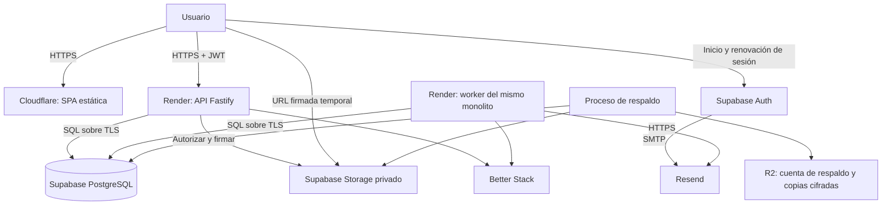

# Infraestructura y operación

Fecha: 2026-09-28. Estado: diseño revisado; no hay infraestructura desplegada ni servicios contratados. Valores de proveedores conservan su fecha de consulta y se verifican antes de contratar.

## 1. Decisión inicial

Usar servicios administrados: frontend React/Vite/TypeScript en **Cloudflare Workers Static Assets**, API Fastify en **Render Web Service**, proceso de tareas en **Render Background Worker** y **Supabase PostgreSQL + Auth + Storage**. API y worker utilizan el mismo repositorio, módulos y versión de entrega. El detalle del stack está en [Arquitectura](02_arquitectura.md).

Completar la plataforma con **Resend para correo**, **Cloudflare R2 para respaldos externos** y **Better Stack para errores, logs, métricas y monitoreo externo**. Son decisiones propuestas de implementación, sujetas al presupuesto y al ensayo técnico; no alternativas sin resolver.

Workers Static Assets sirve aquí archivos estáticos; la lógica del negocio vive en Node.js. Cloudflare Pages también permite esta SPA y es una alternativa válida si facilita la operación del equipo. La entrega de archivos estáticos es gratuita en ambos productos, dentro de sus límites técnicos; ejecutar funciones tiene otra facturación. [Workers Static Assets](https://developers.cloudflare.com/workers/static-assets/billing-and-limitations/), [Pages](https://developers.cloudflare.com/pages/functions/pricing/).

Render aporta ejecución persistente para API y tareas sin administrar el sistema operativo. Contratar instancias de pago para producción: sus servicios web gratuitos se suspenden después de 15 minutos sin tráfico. La capacidad exacta se decide con mediciones, no con el número de módulos contratados. [Servicios gratuitos](https://render.com/docs/free), [Background Workers](https://render.com/docs/background-workers).

Un monolito modular puede tener dos procesos. El worker separa la ejecución lenta; no es un microservicio con modelo de negocio independiente.

Solo API y worker realizan el acceso ordinario al dominio de la aplicación. Auth, Storage, migraciones, respaldos y administración también usan PostgreSQL con identidades separadas. El navegador usa Auth y archivos autorizados; no consulta directamente las tablas de negocio.

La primera oferta atenderá **varios clientes con paquetes distintos**: Núcleo + Reactivos, Núcleo + Equipos y su combinación. Una producción compartida mantiene espacios independientes, según [ADR 0001](../adr/0001_espacios_y_acceso.md). No crear un servidor por módulo. Un cliente dedicado usa el mismo producto y migraciones, con otra cotización. Las puertas de demo, piloto y venta están en el [roadmap](06_roadmap.md).

Se recomienda nube. No existe un requisito offline confirmado: durante descubrimiento se evaluarán cortes y conectividad de los clientes, y se acordará el procedimiento de continuidad. Una operación offline con sincronización necesitaría otro alcance y otra arquitectura de conflictos.

## 2. Despliegue, regiones y red

- `app.<dominio>`: SPA con fallback hacia `index.html` para rutas internas y archivos versionados por hash.
- `ops.<dominio>`: frontend `apps/operator` compilado por separado. Comparte API con la aplicación institucional; `/v1/operator/*` exige autorización operadora y MFA en servidor según [ADR 0004](../adr/0004_identidad_y_operacion.md).
- `api.<dominio>`: API Render con dominio propio y HTTPS. Cloudflare administra DNS; si se activa proxy, usar TLS estricto y excluir API de caché.
- Candidata principal: **Render Virginia para API/worker + Supabase North Virginia `us-east-1`**. Medir desde Ecuador antes de confirmar. Si no cumple, comparar Ohio con Supabase `us-east-2` o cambiar el proveedor de cómputo. No elegir Supabase São Paulo dejando la API en EE. UU. sin medir el costo de cada ida y vuelta SQL.
- Una instancia API y una instancia worker al inicio; esto no constituye alta disponibilidad completa. Si el contrato exige tolerar la caída de una instancia, presupuestar redundancia y verificar failover.
- Sistema de archivos de contenedores temporal. Documentos y exportaciones terminadas van a Storage; ninguna carga depende del disco local.
- Límites de tráfico, archivos y tareas por espacio de trabajo según sección 5; revisarlos con datos reales antes de publicar paquetes.

Render publica Virginia, Ohio, Oregon, Frankfurt y Singapore; Supabase permite seleccionar una región AWS específica. La proximidad geográfica **no crea una red privada entre ambos proveedores ni garantiza compartir zona de disponibilidad**: usar conexiones públicas sobre TLS validado y medirlas. La selección de región tampoco demuestra cumplimiento de residencia o transferencias de datos. [Regiones Render](https://render.com/docs/regions), [Regiones Supabase](https://supabase.com/docs/guides/platform/regions).

Configurar CORS con los orígenes exactos de cada ambiente, nunca aceptar cualquier preview para producción. CORS no reemplaza autorización. API debe autenticar y limitar tráfico incluso si alguien alcanza el hostname original de Render y evita el proxy Cloudflare.

Respuestas privadas: `Cache-Control: no-store`. Probar usuario A → usuario B y organización A → B desde el mismo navegador. Los archivos públicos de la SPA sí admiten caché; documentos institucionales privados no deben entrar en una caché compartida sin autorización.

## 3. Conexiones SQL y aislamiento

Usar `pg` con un pool pequeño por proceso. Punto de partida a medir: máximo 5 conexiones API y 3 worker, reservando margen para Auth, Storage, respaldos, administración y despliegues. Sumar todas las conexiones concurrentes al mismo proyecto; staging tiene su propio presupuesto. Verificar certificado y hostname TLS, sin desactivar su validación para solucionar la conexión.

Preferir conexión directa si Render tiene conectividad IPv6 válida; si no, **Supavisor en modo sesión**. Ambos encajan con procesos Node persistentes. El modo transacción se reserva para una necesidad demostrada de muchas conexiones breves; no soporta prepared statements y requiere revisar funciones dependientes de sesión. [Conexiones Supabase](https://supabase.com/docs/guides/database/connecting-to-postgres).

Contrato obligatorio de cada operación:

1. Verificar JWT con claves asimétricas/JWKS y controles del [ADR 0004](../adr/0004_identidad_y_operacion.md); nunca confiar en decodificarlo solamente.
2. Obtener un cliente del pool y abrir una transacción.
3. Establecer actor y organización con `SET LOCAL` o `set_config(..., true)` parametrizado; contexto derivado de identidad validada y organización solicitada.
4. Comprobar principal/membresía vigente, permiso, alcance y clase de acción admitida por el módulo antes de ejecutar el caso de uso. Nuevas operaciones requieren vigencia; resolución de pendientes y consulta siguen la matriz de continuidad de [dominio y datos](03_dominio_y_datos.md). Las políticas de membresía deben permitir verificar al propio actor sin abrir todas las membresías.
5. Ejecutar todas las consultas y cambios con ese mismo cliente; confirmar o revertir y liberarlo siempre.

El contexto transaccional no se reutiliza entre peticiones. Una consulta sin contexto debe fallar o devolver cero filas. Las migraciones usan una credencial diferente de la aplicación.

Los roles SQL de API y worker no son propietarios, superusuarios ni tienen `BYPASSRLS`. Los schemas de dominio son privados y sus tablas usan RLS por organización. Denegar a `anon`, `authenticated` y `PUBLIC` el acceso directo a tablas y funciones de dominio, incluyendo privilegios por defecto. No exponer esos schemas por la Data API. [Grants y schemas privados](https://supabase.com/docs/guides/api/securing-your-api).

RLS es una segunda barrera: no reemplaza permisos ni las reglas transaccionales. Las claves secretas de Supabase operan con privilegios que pueden omitir RLS; no usarlas como conexión habitual de los casos de uso. [RLS y claves administrativas](https://supabase.com/docs/guides/database/postgres/row-level-security).

El worker usa un principal de servicio restringido y contexto por organización. Para trabajos pedidos por una persona, volver a validar su autorización al ejecutarlos y publicar resultados; para tareas automáticas, comprobar la política de sistema y la clase de acción admitida. El dispatcher reclama trabajos mediante la función limitada `platform.claim_jobs` definida en el modelo de datos; el ejecutor obtiene después contexto institucional. Evitar que un proceso de alertas obtenga permisos para modificar stock.

## 4. Documentos y secretos

Buckets privados. La API comprueba permiso sobre el registro propietario antes de generar una URL de carga o descarga. Rutas internas: `<workspace_id>/<document_id>/<version_id>`; el cliente no decide libremente el destino.

Carga propuesta: autorizar → reservar cupo y crear registro pendiente → entregar URL firmada → subir → verificar tamaño/tipo real → confirmar consumo y marcar disponible. Los uploads pendientes consumen cupo para impedir sobrepasarlo con cargas paralelas; una limpieza recuperable elimina huérfanos y libera reservas vencidas. Cada reemplazo crea una versión con otra clave; no sobrescribir silenciosamente una SDS utilizada históricamente.

Las URL de descarga caducan en pocos minutos. Una URL emitida puede continuar válida hasta su vencimiento tras retirar un permiso; para documentos que necesiten revocación inmediata, servir la descarga a través de la API. El TTL de carga debe respetar la capacidad real de Supabase y validarse en el spike.

Una clave secreta usada para firmar desde el servidor omite controles RLS de Storage: el adaptador debe comprobar explícitamente organización, permiso, objeto y finalidad. El navegador recibe la URL, nunca la clave. No habilitar acceso amplio a `storage.objects` para resolver un error de permisos. [Seguridad Storage](https://supabase.com/docs/guides/storage/security/access-control).

Secretos separados por ambiente: credencial SQL API, credencial SQL worker, administración de Storage/Auth, correo, despliegue y respaldo. Guardarlos en los proveedores y en el almacén de secretos de CI; nunca en Git ni en variables `VITE_*`. API y worker de negocio no reciben credenciales del almacén de respaldo. MFA para cuentas operadoras, inventario de propietarios y procedimiento de rotación.

Dashboard de Supabase, migraciones y copias son caminos privilegiados fuera de la API. Mantener custodios nominativos, intervención justificada y evidencia según [ADR 0005](../adr/0005_datos_reales_y_recuperacion.md). El presupuesto Pro no incluye automáticamente auditoría completa de plataforma ni roles limitados de planes superiores; validar cobertura antes de ofrecerla. No confundir MFA interactivo con protección de todos los tokens de automatización.

## 5. Tareas, correo y límites por cliente

El proceso worker ejecuta importaciones, exportaciones, avisos y limpieza. Los efectos externos se registran primero en una **outbox dentro de la misma transacción del negocio**. Así, una práctica aprobada no pierde su aviso si el proceso cae después del commit.

Persistir estado del trabajo, organización, actor, clave de idempotencia, intentos, fecha de siguiente intento y vencimiento de la concesión de ejecución. Usar reclamación con bloqueo SQL, reintentos con espera creciente y recuperación de trabajos interrumpidos. El correo puede entregarse más de una vez: la operación consumidora debe tolerar duplicados.

No hace falta Redis al inicio. Implementar un dispatcher acotado de outbox; si las necesidades de cola superan ese alcance, evaluar pg-boss, que usa PostgreSQL y ofrece planificación y reintentos. No mantener dos colas para el mismo evento. [pg-boss](https://github.com/timgit/pg-boss).

Para periodicidad, elegir una sola autoridad: el scheduler del worker inserta trabajos con una clave única `(organización, tipo, período)`. La base persiste el próximo vencimiento y permite recuperar períodos pendientes tras una caída. No depender exclusivamente de un `setInterval` en memoria.

Supabase Cron es alternativa para encolar trabajos mediante SQL, no para duplicar las reglas del monolito ni generar informes pesados dentro de PostgreSQL. Su documentación aconseja como máximo ocho trabajos simultáneos y diez minutos por trabajo. [Supabase Cron](https://supabase.com/docs/guides/cron).

Al recibir `SIGTERM`, detener la toma de nuevos trabajos y cerrar conexiones ordenadamente. Una tarea abortada vuelve a estar disponible al vencer su concesión. El historial de ejecución y los fallos definitivos deben ser visibles al operador.

**Correo: Resend.** Supabase Auth usa SMTP personalizado para invitaciones, confirmaciones y recuperación; el worker usa la API HTTP para avisos operativos de la outbox. Verificar dominio, SPF/DKIM/DMARC y remitentes separados para autenticación y notificaciones; no enviar desde dominios institucionales sin su autorización. Registrar entregas y rebotes por identificador del proveedor, evitando contenido sensible en asuntos y logs. El SMTP predeterminado de Supabase limita destinatarios al equipo del proyecto y publica 2 correos/hora: no es solución productiva. El SMTP personalizado tiene además límites de Auth que deben configurarse y probarse; el plan de Resend no los elimina. [SMTP Supabase](https://supabase.com/docs/guides/auth/auth-smtp), [Integración Resend](https://resend.com/docs/send-with-supabase-smtp).

Usar Resend gratuito en pruebas pequeñas; publica 3 000 correos/mes y 100/día. Presupuestar **Pro USD 20/mes, 50 000 correos y sin tope diario** para la oferta comercial. Aplicar límites por espacio para que un cliente no agote el envío del resto, reservando capacidad para Auth; verificar entregabilidad con direcciones externas en F1 antes de invitar usuarios reales. [Precios Resend](https://resend.com/pricing).

Valores técnicos iniciales propuestos, configurables y sujetos a carga medida; todavía no son cupos vendidos:

| Recurso | Punto de partida | Aplicación |
|---|---|---|
| Archivos de documentos | 20 MiB por archivo; 5 GiB por espacio | Cuota atómica que cuenta documentos y cargas pendientes; validar también bytes reales |
| Importación CSV | 10 MiB y 10 000 filas; lotes de hasta 500 | Prevalidar antes de aplicar; lotes reiniciables e idempotentes con errores por fila |
| Trabajo pesado | 1 simultáneo por espacio, máximo global 2; hasta 5 pendientes por espacio | Reclamar y reservar cupos en PostgreSQL; repartir turnos entre espacios, sin FIFO global que monopolice un cliente |
| Consultas interactivas | `statement_timeout` inicial 5 s; espera de bloqueo 1 s | Responder conflicto o reintento controlado; consultas largas pasan al worker |
| Consultas de worker | 30 s por lote y concesión renovable | Partir tareas; no una transacción de minutos para toda una importación |

La política de refresco y los presupuestos HTTP separados por lectura/comando tienen una única fuente en [ADR 0003](../adr/0003_refresco_y_limites.md): memoria con una API, Redis compatible antes de múltiples réplicas, sin contador HTTP por petición en PostgreSQL. Las cuotas exactas de bytes, puestos y trabajos permanecen transaccionales en PostgreSQL incluso con una sola instancia; excederlas devuelve `QUOTA_EXCEEDED`.

## 6. Ambientes y entregas

| Ambiente | Datos y propósito | Infraestructura |
|---|---|---|
| Desarrollo | Datos sintéticos; programación y pruebas | Supabase local y procesos locales |
| Staging | Validación funcional y ensayo de migraciones | Proyecto Supabase separado y servicios de prueba |
| Producción | Datos institucionales reales | Supabase de pago, API y worker de pago |

Preview de frontend usa staging; nunca producción por defecto. No copiar datos personales a previews. Validar desde la primera oferta al menos dos organizaciones con paquetes distintos, incluyendo denegación de endpoints y tareas de módulos no contratados.

Versionar configuración de Cloudflare, Dockerfile y `render.yaml`; este último describe servicios y variables no secretas. Las migraciones SQL de Supabase son la única autoridad del esquema. Registrar cambios de proveedores que todavía requieran consola en un checklist reproducible. [Render Blueprints](https://render.com/docs/blueprint-spec).

Pipeline de entrega:

1. Tipado/generación PgTyped, lint, dependency-cruiser, pgTAP con roles reales, integración/concurrencia y migraciones sobre base vacía y versión anterior, según [ADR 0006](../adr/0006_sql_y_pruebas.md).
2. Compilar las SPA institucional/operadora y la imagen de API/worker con versiones bloqueadas; comprobar que los bundles no contienen secretos.
3. Desplegar en staging y ejecutar un flujo completo de los módulos publicados: recepción/salida, incidencia de equipo, documento y tarea; añadir agenda al publicarla y preparación/cierre al incorporar Prácticas.
4. Antes de producción, verificar copia recuperable y aplicar migraciones aditivas compatibles con la versión anterior.
5. Desplegar API y worker del mismo release; tolerar temporalmente versiones contiguas durante la sustitución. Después publicar frontend compatible.
6. Verificar salud y métricas; conservar artefacto anterior. Retirar columnas antiguas en una entrega posterior.

Un rollback de código no revierte automáticamente la base. Una migración que destruye información exige copia y procedimiento específico; no ejecutar un down destructivo como reacción automática.

## 7. Respaldo y recuperación

Supabase Pro conserva siete respaldos diarios. Esas copias cubren la base y los metadatos de Storage, **no los bytes de los archivos**. Una restauración puede requerir indisponibilidad y resetear contraseñas de roles personalizados. PITR es un adicional y exige una capacidad mínima de cómputo. [Backups Supabase](https://supabase.com/docs/guides/platform/backups).

Objetivos propuestos, sujetos a ensayo y acuerdo institucional:

| Perfil | Pérdida máxima objetivo — RPO | Tiempo de recuperación objetivo — RTO |
|---|---|---|
| Piloto de inventario | 24 horas, base y archivos | 8 horas desde declaración del incidente |
| Operación diaria con prácticas | 1 hora o menos, base y archivos | 4 horas |

El segundo perfil necesita PITR o una estrategia adicional comprobada y copia frecuente de archivos. No prometerlo con una copia diaria. En el piloto se debe acordar cómo reconstruir movimientos ocurridos después de la última copia; si eso no es aceptable, presupuestar el segundo perfil desde el inicio.

Destino elegido: **Cloudflare R2 Standard**, en cuenta de respaldo separada de la aplicación y con administración restringida. Ejecutar el respaldo mediante un proceso programado aislado, con credenciales propias; no dentro del runtime de negocio. Diseño:

- Copia diaria cifrada antes de salir al destino, con claves recuperables por un procedimiento separado. Retención normal por repositorio y eliminación anticipada definidas antes de G1; no asumir ni 30 ni 7 días como cumplimiento. [ADR 0005](../adr/0005_datos_reales_y_recuperacion.md).
- Exportación recuperable de datos, roles necesarios y configuración, incluyendo identidades Auth según el procedimiento admitido por Supabase. No asumir que una migración o un dump con exclusiones contiene todo. [Restauración con CLI](https://supabase.com/docs/guides/platform/migrating-within-supabase/backup-restore).
- Copia independiente de los bytes de Storage, transfiriendo versiones nuevas y conservando las referenciadas por snapshots vigentes. Manifiesto con ruta, tamaño y checksum; una copia se marca completa solo si resuelve todos los documentos referenciados por el snapshot. No usar sincronización que propague automáticamente los borrados del origen.
- Configuración de buckets, Auth, correo, DNS y secretos recuperable por un procedimiento aparte; no guardar secretos sin cifrar junto al dump.
- Aviso automático si la copia supera su antigüedad máxima o falla la verificación. Medir también el costo de transferencia.

R2 ofrece bucket locks que impiden borrar o sobrescribir objetos durante la retención configurada; un administrador puede modificar esas reglas. No describirlos como WORM irrevocable. Usar claves únicas, separar permisos y coordinar locks con lifecycle y supresión: no habilitar un bloqueo cuya duración impida cumplir el cierre del encargo. El procedimiento de devolución, borrado y tratamiento de copias debe satisfacer [Ciclo del cliente y datos](08_ciclo_cliente_y_datos.md) antes de alojar datos reales; no asumir una excepción jurídica automática para los respaldos. [Bucket locks](https://developers.cloudflare.com/r2/buckets/bucket-locks/).

R2 Standard publica USD 0,015/GB-mes más operaciones y no cobra salida desde R2. La transferencia **desde Supabase hacia el respaldo** puede consumir su cuota de egress; no es un flujo gratuito de extremo a extremo. Medir tamaño de dumps, versiones y frecuencia; la reserva de costos depende de ello. [Precios R2](https://developers.cloudflare.com/r2/pricing/), [Egress Supabase](https://supabase.com/docs/guides/platform/manage-your-usage/egress).

Ensayo antes del piloto y trimestralmente: restaurar en ambiente aislado → restablecer roles/configuración → comprobar usuarios, aislamiento, saldos y reservas → descargar documentos y validar checksums → registrar duración y pérdida efectiva → limpiar el ambiente de ensayo.

Antes de reabrir una restauración a usuarios, aplicar el registro separado de supresiones y cierres para no reactivar identidades o datos eliminados después del snapshot. La restauración técnica no autoriza a conservar o reutilizar información fuera de la finalidad vigente.

Restaurar la base compartida afecta a todas las organizaciones. Para recuperar una sola institución, restaurar primero una copia aislada y extraer sus datos relacionados de forma controlada; no retroceder producción completa por un error individual.

## 8. Monitoreo y capacidad

Elegir **Better Stack** para errores de frontend/API/worker, logs estructurados, métricas, disponibilidad y heartbeats de worker/respaldo. Configurar release y ambiente y cargar sourcemaps privados desde CI; probar un error controlado y una alerta de copia vencida. Desactivar captura de sesiones y contenidos por defecto. No hace falta contratar Sentry adicional para el alcance inicial; verificar integración del SDK en F1. [Producto y precios](https://betterstack.com/pricing), [SDK JavaScript](https://betterstack.com/docs/errors/js-tag/install/).

Registrar por petición `request_id`, organización, actor, módulo, operación, duración y resultado. Excluir tokens, URL firmadas y contenido de documentos. Auditoría del negocio es un registro separado de los logs técnicos.

Alertar sobre: API caída, errores sostenidos, pool agotado, consultas lentas, disco creciendo, outbox antigua, worker sin actividad, tareas fallidas y copia vencida. Medir latencia p95, tasa de error, colas y almacenamiento por institución. Definir responsable y canal de atención.

Punto de partida: disponibilidad cada minuto, heartbeat worker cada minuto y alerta tras tres ausencias, aviso si una copia diaria completa supera 26 horas; ajustar umbrales en el piloto. Usar métricas nativas de Render/Supabase para capacidad y logs del propio monolito para operaciones. No presupuestar exportación de todos los logs de Supabase mediante Log Drains como si estuviera incluida: es un adicional. La consola del operador muestra estados, cupos y fallos, con enlaces a diagnósticos; no sustituye esta observabilidad.

Antes de duplicar procesos: revisar índices, planes de consulta, paginación e importaciones por lotes. Escalar worker y API por separado solo cuando esas métricas lo justifiquen. No cachear disponibilidad ni stock como autoridad de aprobación.

No desplegar réplicas de lectura inicialmente. Analítica empieza con consultas acotadas y agregados PostgreSQL; una réplica se evalúa si sigue saturando la principal tras optimizar. Nunca aprobar consumos o reservas sobre datos de una réplica que puede estar retrasada.

La disponibilidad contractual se define después del piloto y considerando proveedores y cobertura de soporte. Un plan de pago y una instancia reiniciable no equivalen a un SLA extremo a extremo.

## 9. Presupuesto de operación

Referencia de planificación para varios clientes pequeños de baja carga, una producción compartida y un staging pequeño. No es un costo fijo por institución ni una cotización; excluye impuestos, dominio, trabajo humano, crecimiento excepcional y acuerdos empresariales.

| Componente | USD/mes de referencia | Naturaleza del importe |
|---|---:|---|
| Cloudflare: entrega estática | 0 | Tarifa publicada; límites técnicos y funciones aparte |
| Supabase Pro: primer proyecto pequeño | Desde 25 | Tarifa publicada; cómputo y consumo pueden aumentarla |
| Segundo proyecto pequeño de staging | Desde 10 adicionales | Tarifa publicada por proyecto adicional |
| Render workspace Pro | 25 | Tarifa publicada; presupuesto conservador para operación comercial |
| Render API + worker de producción y staging | 28 | 4 × 7 en plan `0.5c-512mb`; tamaño mínimo de referencia, no capacidad ya validada |
| Resend Pro | 20 | Tarifa publicada; excedentes aparte |
| Better Stack: un responder | 34 | Tarifa mensual publicada; telemetría adicional y funciones opcionales aparte |
| R2, ejecución de respaldos y consumo pequeño | Reserva de 5–20 | Estimación propia, según bytes, ejecución y transferencia |
| Subtotal de este escenario | 147–162 | Suma explícita; sin PITR ni crecimiento de cómputo |
| Presupuesto de planificación redondeado | 150–185 | Reserva orientativa para decidir viabilidad, no precio máximo garantizado |

Supabase publica Pro desde USD 25/mes, proyectos adicionales desde USD 10/mes y PITR desde USD 100/mes para siete días; PITR también requiere cómputo compatible. El escenario cuenta USD 35 de Supabase y USD 53 de Render incluyendo workspace y cuatro procesos pequeños. Si API/worker requieren más memoria, el total aumenta; generar PDFs puede elevar ese requisito. Suspender staging reduce consumo, pero exige un procedimiento reproducible para ensayar entregas. [Precios Supabase](https://supabase.com/pricing), [Precios Render](https://render.com/pricing), [Planes de cómputo Render](https://render.com/docs/compute-plans).

Better Stack publica un nivel gratuito para proyectos personales; no asumir que cubre esta operación comercial. Su cuota de telemetría incluida tiene límites y retención corta: cotizar la retención que se acuerde, fijar presupuestos de ingestión y alertar antes de excederlos. La estimación paga un responder y no presupone retención técnica ilimitada. Resend y R2 tampoco eliminan costos al superar sus cuotas. Verificar el resumen de contratación de todos los proveedores antes del piloto.

Los USD 100/mes por cliente de la proforma incluyen soporte, mantenimiento y hosting. Con un solo cliente no cubren este escenario operativo; con varios clientes pueden contribuir a una oferta viable, pero deben cubrir también atención y mantenimiento. El primer año incluido tiene costo real para el proveedor. No confundir la tarifa por cliente con toda la infraestructura compartida.

Recalcular precio como infraestructura atribuible + horas de soporte pactadas + mantenimiento del producto + contingencia + margen. Distinguir tarifa compartida y dedicada, cupos de almacenamiento, horario de soporte y objetivos de recuperación. Compartir infraestructura entre clientes mejora el reparto de costos, pero no reduce proporcionalmente el trabajo de atención.

## 10. Alternativa: VPS con Cloudflare Tunnel

Es viable para una institución que exija servidor propio o cuando exista capacidad operativa estable. Mantener el mismo Dockerfile y monolito permite cambiar Render por VPS sin rediseñar el dominio.

Topología: Cloudflare → túnel saliente `cloudflared` → API y worker en Docker Compose → Supabase administrado. Mantener inicialmente PostgreSQL/Auth/Storage administrados; autoalojar todo Supabase agrega otra responsabilidad de operación.

El túnel evita publicar directamente puertos del origen. Sus réplicas mejoran conectividad, pero dos réplicas en un único servidor no resuelven su caída. La recuperación de origen, la electricidad, la conexión a Internet y los respaldos siguen a cargo del operador. Cloudflare distingue réplicas del túnel de balanceo con chequeos de salud. [Configuración de Tunnel](https://developers.cloudflare.com/tunnel/configuration/).

Para un VPS: parches, firewall, rotación de secretos, reinicios, monitoreo externo, respaldo, restauración en otro host y persona responsable. Para servidor en campus: además UPS, conectividad redundante y aprobación institucional. Un túnel a un servidor local no vuelve al sistema offline si Auth y base siguen en la nube.

Elegir VPS solo si la exigencia institucional o el ahorro neto justifican estas tareas. Para el primer SaaS pequeño, elegir Render administrado.

## 11. Validación progresiva antes de producción

Separar la exploración de proveedores de la plataforma lista para clientes. El **spike inicial** utiliza datos sintéticos para desplegar SPA/API/worker, probar conectividad/TLS/pool, carga privada, SMTP y medición desde Ecuador. Su salida se define por evidencia, sin plazo supuesto. No incluye demostrar todo el aislamiento ni toda la recuperación productiva.

En F1 se construyen los controles siguientes y se ensayan con datos sintéticos; los flujos de inventario, agenda y prácticas se incorporan al publicarse sus módulos. El ensayo de restauración de una versión candidata completa es condición de salida antes del primer cliente real, no una promesa de terminarlo dentro del spike:

- Desplegar SPA + API + worker y conectar PostgreSQL con TLS, rol limitado y pool medido.
- Probar sesión expirada, cambio de institución, usuario revocado y fuga de contexto al reutilizar una conexión; Data API de dominio debe denegar acceso.
- Probar dos consumos concurrentes al incorporar inventario y dos reservas incompatibles al incorporar agenda; solo se confirma lo permitido, sin saldo negativo ni doble ocupación.
- Matar worker después de un commit y antes de enviar un aviso; verificar recuperación y tolerancia a duplicados.
- Cargar y descargar archivos privados; probar permisos cruzados, vencimiento y archivos huérfanos.
- Probar CORS, ausencia de caché privada, acceso directo al origen y ausencia de secretos en bundle/logs.
- Medir latencia desde Ecuador y consumo con un volumen acordado de usuarios/datos. Registrar escenario y resultados, no solo un promedio.
- Saturar importaciones y tráfico de un espacio y comprobar que otro mantiene servicio; probar reservas de cupos y liberación tras fallos.
- Verificar invitaciones externas, rebotes, observabilidad, acceso del operador y exportación/supresión conforme al ciclo de datos.
- Restaurar base y documentos en ambiente aislado; medir RPO/RTO efectivo y cerrar presupuesto antes del piloto.

Salida del spike: región candidata medida, conectividad, servicios y costo provisional. Salida previa al piloto: tamaño validado, recuperación ensayada, aislamiento, operación y cierre de datos verificables. Estas entregas están incluidas en F1/F2 del [roadmap](06_roadmap.md). Si falla un criterio crítico, corregir antes de introducir datos reales.
