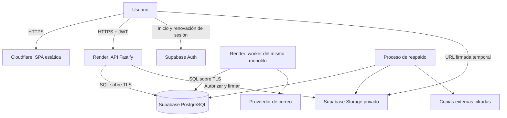

# Infraestructura y operación

Fecha: 2026-09-24. Estado: diseño propuesto; no hay infraestructura desplegada.

## 1. Decisión inicial

Usar servicios administrados: frontend React/Vite/TypeScript en **Cloudflare Workers Static Assets**, API Fastify en **Render Web Service**, proceso de tareas en **Render Background Worker** y **Supabase PostgreSQL + Auth + Storage**. API y worker utilizan el mismo repositorio, módulos y versión de entrega. El detalle del stack está en [Arquitectura](02_arquitectura.md).

Workers Static Assets sirve aquí archivos estáticos; la lógica del negocio vive en Node.js. Cloudflare Pages también permite esta SPA y es una alternativa válida si facilita la operación del equipo. La entrega de archivos estáticos es gratuita en ambos productos, dentro de sus límites técnicos; ejecutar funciones tiene otra facturación. [Workers Static Assets](https://developers.cloudflare.com/workers/static-assets/billing-and-limitations/), [Pages](https://developers.cloudflare.com/pages/functions/pricing/).

Render aporta ejecución persistente para API y tareas sin administrar el sistema operativo. Contratar instancias de pago para producción: sus servicios web gratuitos se suspenden después de 15 minutos sin tráfico. La capacidad exacta se decide con mediciones, no con el número de módulos contratados. [Servicios gratuitos](https://render.com/docs/free), [Background Workers](https://render.com/docs/background-workers).

Un monolito modular puede tener dos procesos. El worker separa la ejecución lenta; no es un microservicio con modelo de negocio independiente.

La primera oferta debe atender **varios clientes con paquetes distintos**: por ejemplo, Núcleo + Reactivos y Núcleo + Equipos. Una producción compartida mantiene organizaciones aisladas y habilitaciones por institución; no crear un servidor o un despliegue por módulo. Un cliente dedicado se cotiza como excepción, usando el mismo producto y migraciones. Prácticas se incorpora en una fase posterior.

Se recomienda nube. No existe un requisito offline confirmado: durante descubrimiento se evaluarán cortes y conectividad de los clientes, y se acordará el procedimiento de continuidad. Una operación offline con sincronización necesitaría otro alcance y otra arquitectura de conflictos.

## 2. Despliegue, regiones y red

- `app.<dominio>`: SPA con fallback hacia `index.html` para rutas internas y archivos versionados por hash.
- `api.<dominio>`: API Render con dominio propio y HTTPS. Cloudflare administra DNS; si se activa proxy, usar TLS estricto y excluir API de caché.
- Región API/worker cercana a la base de datos. Comparar dos combinaciones disponibles desde la red real de la universidad en Ecuador antes de contratar; CDN no elimina la latencia de consultas SQL.
- Una instancia API y una instancia worker al inicio; esto no constituye alta disponibilidad completa. Si el contrato exige tolerar la caída de una instancia, presupuestar redundancia y verificar failover.
- Sistema de archivos de contenedores temporal. Documentos y exportaciones terminadas van a Storage; ninguna carga depende del disco local.
- Límites iniciales de tamaño de archivo, concurrencia de exportaciones, duración de consultas y almacenamiento por institución; valores se fijan con datos de la fase de descubrimiento.

Configurar CORS con los orígenes exactos de cada ambiente, nunca aceptar cualquier preview para producción. CORS no reemplaza autorización. API debe autenticar y limitar tráfico incluso si alguien alcanza el hostname original de Render y evita el proxy Cloudflare.

Respuestas privadas: `Cache-Control: no-store`. Probar usuario A → usuario B y organización A → B desde el mismo navegador. Los archivos públicos de la SPA sí admiten caché; documentos institucionales privados no deben entrar en una caché compartida sin autorización.

## 3. Conexiones SQL y aislamiento

Usar `pg` con un pool pequeño por proceso. Punto de partida a medir: máximo 5 conexiones API y 3 worker, reservando margen para Auth, Storage, administración y despliegues. El límite total es la suma de todas las réplicas, ambientes y servicios.

Preferir conexión directa si Render tiene conectividad IPv6 válida; si no, **Supavisor en modo sesión**. Ambos encajan con procesos Node persistentes. El modo transacción se reserva para una necesidad demostrada de muchas conexiones breves; no soporta prepared statements y requiere revisar funciones dependientes de sesión. [Conexiones Supabase](https://supabase.com/docs/guides/database/connecting-to-postgres).

Contrato obligatorio de cada operación:

1. Verificar firma, emisor, audiencia y vencimiento del JWT de Supabase; nunca confiar en decodificarlo solamente.
2. Obtener un cliente del pool y abrir una transacción.
3. Establecer actor y organización con `SET LOCAL` o `set_config(..., true)` parametrizado; contexto derivado de identidad validada y organización solicitada.
4. Comprobar principal/membresía vigente, permiso, alcance y clase de acción admitida por el módulo antes de ejecutar el caso de uso. Nuevas operaciones requieren vigencia; resolución de pendientes y consulta siguen la matriz de continuidad de [dominio y datos](03_dominio_y_datos.md). Las políticas de membresía deben permitir verificar al propio actor sin abrir todas las membresías.
5. Ejecutar todas las consultas y cambios con ese mismo cliente; confirmar o revertir y liberarlo siempre.

El contexto transaccional no se reutiliza entre peticiones. Una consulta sin contexto debe fallar o devolver cero filas. Las migraciones usan una credencial diferente de la aplicación.

Los roles SQL de API y worker no son propietarios, superusuarios ni tienen `BYPASSRLS`. Los schemas de dominio son privados y sus tablas usan RLS por organización. Denegar a `anon`, `authenticated` y `PUBLIC` el acceso directo a tablas y funciones de dominio, incluyendo privilegios por defecto. No exponer esos schemas por la Data API. [Grants y schemas privados](https://supabase.com/docs/guides/api/securing-your-api).

RLS es una segunda barrera: no reemplaza permisos ni las reglas transaccionales. Las claves secretas de Supabase operan con privilegios que pueden omitir RLS; no usarlas como conexión habitual de los casos de uso. [RLS y claves administrativas](https://supabase.com/docs/guides/database/postgres/row-level-security).

El worker usa un principal de servicio restringido y contexto por organización. Para trabajos pedidos por una persona, volver a validar su autorización al ejecutarlos y publicar resultados; para tareas automáticas, comprobar la política de sistema y la clase de acción admitida. El dispatcher reclama trabajos mediante la función limitada `platform.claim_jobs` definida en el modelo de datos; el ejecutor obtiene después contexto institucional. Evitar que un proceso de alertas obtenga permisos para modificar stock.

## 4. Documentos y secretos

Buckets privados. La API comprueba permiso sobre el registro propietario antes de generar una URL de carga o descarga. Rutas internas: `<organization_id>/<document_id>/<version_id>`; el cliente no decide libremente el destino.

Carga propuesta: autorizar → crear registro pendiente → entregar URL firmada → subir → verificar tamaño/tipo real → marcar disponible. Rechazar archivos que excedan cuotas y limpiar cargas huérfanas. Cada reemplazo crea una versión con otra clave; no sobrescribir silenciosamente una SDS utilizada históricamente.

Las URL de descarga caducan en pocos minutos. Una URL emitida puede continuar válida hasta su vencimiento tras retirar un permiso; para documentos que necesiten revocación inmediata, servir la descarga a través de la API. El TTL de carga debe respetar la capacidad real de Supabase y validarse en el spike.

Una clave secreta usada para firmar desde el servidor omite controles RLS de Storage: el adaptador debe comprobar explícitamente organización, permiso, objeto y finalidad. El navegador recibe la URL, nunca la clave. No habilitar acceso amplio a `storage.objects` para resolver un error de permisos. [Seguridad Storage](https://supabase.com/docs/guides/storage/security/access-control).

Secretos separados por ambiente: credencial SQL API, credencial SQL worker, administración de Storage/Auth, correo y despliegue. Guardarlos en los proveedores y en el almacén de secretos de CI; nunca en Git ni en variables `VITE_*`. MFA para cuentas operadoras, inventario de propietarios y procedimiento de rotación.

## 5. Tareas programadas y procesos lentos

El proceso worker ejecuta importaciones, exportaciones, avisos y limpieza. Los efectos externos se registran primero en una **outbox dentro de la misma transacción del negocio**. Así, una práctica aprobada no pierde su aviso si el proceso cae después del commit.

Persistir estado del trabajo, organización, actor, clave de idempotencia, intentos, fecha de siguiente intento y vencimiento de la concesión de ejecución. Usar reclamación con bloqueo SQL, reintentos con espera creciente y recuperación de trabajos interrumpidos. El correo puede entregarse más de una vez: la operación consumidora debe tolerar duplicados.

No hace falta Redis al inicio. Implementar un dispatcher acotado de outbox; si las necesidades de cola superan ese alcance, evaluar pg-boss, que usa PostgreSQL y ofrece planificación y reintentos. No mantener dos colas para el mismo evento. [pg-boss](https://github.com/timgit/pg-boss).

Para periodicidad, elegir una sola autoridad: el scheduler del worker inserta trabajos con una clave única `(organización, tipo, período)`. La base persiste el próximo vencimiento y permite recuperar períodos pendientes tras una caída. No depender exclusivamente de un `setInterval` en memoria.

Supabase Cron es alternativa para encolar trabajos mediante SQL, no para duplicar las reglas del monolito ni generar informes pesados dentro de PostgreSQL. Su documentación aconseja como máximo ocho trabajos simultáneos y diez minutos por trabajo. [Supabase Cron](https://supabase.com/docs/guides/cron).

Al recibir `SIGTERM`, detener la toma de nuevos trabajos y cerrar conexiones ordenadamente. Una tarea abortada vuelve a estar disponible al vencer su concesión. El historial de ejecución y los fallos definitivos deben ser visibles al operador.

## 6. Ambientes y entregas

| Ambiente | Datos y propósito | Infraestructura |
|---|---|---|
| Desarrollo | Datos sintéticos; programación y pruebas | Supabase local y procesos locales |
| Staging | Validación funcional y ensayo de migraciones | Proyecto Supabase separado y servicios de prueba |
| Producción | Datos institucionales reales | Supabase de pago, API y worker de pago |

Preview de frontend usa staging; nunca producción por defecto. No copiar datos personales a previews. Validar desde la primera oferta al menos dos organizaciones con paquetes distintos, incluyendo denegación de endpoints y tareas de módulos no contratados.

Versionar configuración de Cloudflare, Dockerfile y `render.yaml`; este último describe servicios y variables no secretas. Las migraciones SQL de Supabase son la única autoridad del esquema. Registrar cambios de proveedores que todavía requieran consola en un checklist reproducible. [Render Blueprints](https://render.com/docs/blueprint-spec).

Pipeline de entrega:

1. Tipado, lint, pruebas de dominio y políticas RLS, migraciones sobre base vacía y sobre la versión anterior.
2. Compilar SPA e imagen de API/worker con versiones bloqueadas; comprobar que el bundle no contiene secretos.
3. Desplegar en staging y ejecutar un flujo completo de los módulos publicados: en F2 recepción/salida o incidencia de equipo, documento y tarea; desde F3 añadir reserva, preparación y cierre.
4. Antes de producción, verificar copia recuperable y aplicar migraciones aditivas compatibles con la versión anterior.
5. Desplegar API y worker del mismo release; tolerar temporalmente versiones contiguas durante la sustitución. Después publicar frontend compatible.
6. Verificar salud y métricas; conservar artefacto anterior. Retirar columnas antiguas en una entrega posterior.

Un rollback de código no revierte automáticamente la base. Una migración que destruye información exige copia y procedimiento específico; no ejecutar un down destructivo como reacción automática.

## 7. Respaldo y recuperación

Supabase Pro conserva siete respaldos diarios. Esas copias cubren la base y los metadatos de Storage, **no los bytes de los archivos**. Una restauración puede requerir indisponibilidad y resetear contraseñas de roles personalizados. PITR es un adicional y exige una capacidad mínima de cómputo. [Backups Supabase](https://supabase.com/docs/guides/platform/backups).

Objetivos propuestos, sujetos a ensayo y acuerdo institucional:

| Perfil | Pérdida máxima objetivo — RPO | Tiempo de recuperación objetivo — RTO |
|---|---|---|
| Piloto de inventario | 24 horas, base y archivos | 8 horas desde declaración del incidente |
| Operación diaria con prácticas | 1 hora o menos, base y archivos | 4 horas |

El segundo perfil necesita PITR o una estrategia adicional comprobada y copia frecuente de archivos. No prometerlo con una copia diaria. En el piloto se debe acordar cómo reconstruir movimientos ocurridos después de la última copia; si eso no es aceptable, presupuestar el segundo perfil desde el inicio.

Diseño del respaldo externo:

- Copia diaria cifrada y fuera del proyecto productivo; retención inicial de 30 días, a validar con la institución. Cuenta/bucket sin permiso de borrado para la aplicación.
- Exportación recuperable de datos, roles necesarios y configuración, incluyendo identidades Auth según el procedimiento admitido por Supabase. No asumir que una migración o un dump con exclusiones contiene todo. [Restauración con CLI](https://supabase.com/docs/guides/platform/migrating-within-supabase/backup-restore).
- Copia independiente de los objetos de Storage. Conservar versiones inmutables y manifiesto de ruta, tamaño y checksum. Una copia se marca completa solo si resuelve todos los documentos referenciados por el snapshot.
- Configuración de buckets, Auth, correo, DNS y secretos recuperable por un procedimiento aparte; no guardar secretos sin cifrar junto al dump.
- Aviso automático si la copia supera su antigüedad máxima o falla la verificación. Medir también el costo de transferencia.

Ensayo antes del piloto y trimestralmente: restaurar en ambiente aislado → restablecer roles/configuración → comprobar usuarios, aislamiento, saldos y reservas → descargar documentos y validar checksums → registrar duración y pérdida efectiva → limpiar el ambiente de ensayo.

Restaurar la base compartida afecta a todas las organizaciones. Para recuperar una sola institución, restaurar primero una copia aislada y extraer sus datos relacionados de forma controlada; no retroceder producción completa por un error individual.

## 8. Monitoreo y capacidad

Registrar por petición `request_id`, organización, actor, módulo, operación, duración y resultado. Excluir tokens, URL firmadas y contenido de documentos. Auditoría del negocio es un registro separado de los logs técnicos.

Alertar sobre: API caída, errores sostenidos, pool agotado, consultas lentas, disco creciendo, outbox antigua, worker sin actividad, tareas fallidas y copia vencida. Medir latencia p95, tasa de error, colas y almacenamiento por institución. Definir responsable y canal de atención.

Antes de duplicar procesos: revisar índices, planes de consulta, paginación e importaciones por lotes. Escalar worker y API por separado solo cuando esas métricas lo justifiquen. No cachear disponibilidad ni stock como autoridad de aprobación.

La disponibilidad contractual se define después del piloto y considerando proveedores y cobertura de soporte. Un plan de pago y una instancia reiniciable no equivalen a un SLA extremo a extremo.

## 9. Presupuesto de operación

Referencia de planificación para varios clientes pequeños de baja carga, una producción compartida y un staging pequeño. No es un costo fijo por institución ni una cotización; excluye impuestos, dominio, trabajo humano, crecimiento excepcional y acuerdos empresariales.

| Componente | USD/mes de referencia | Naturaleza del importe |
|---|---:|---|
| Cloudflare: entrega estática | 0 | Tarifa publicada; límites técnicos y funciones aparte |
| Supabase Pro: primer proyecto pequeño | Desde 25 | Tarifa publicada; cómputo y consumo pueden aumentarla |
| Segundo proyecto pequeño de staging | Desde 10 adicionales | Tarifa publicada por proyecto adicional |
| Render API + worker y staging bajo demanda | Reserva de 20–60 | Estimación propia; elegir recursos y horas en el cotizador |
| Respaldos externos, correo y monitoreo | Reserva de 5–25 | Estimación propia, depende de volumen y proveedores |
| Total básico orientativo | 60–120 | Suma de reservas anteriores; sin PITR |

Supabase publica Pro desde USD 25/mes, proyectos adicionales desde USD 10/mes y PITR desde USD 100/mes para siete días; PITR también requiere cómputo compatible. Revisar nuevamente al contratar. Render separa plan de workspace y consumo: incluir ambos si corresponden, y comprobar si staging permanente y transferencia exceden la reserva estimada. [Precios Supabase](https://supabase.com/pricing), [Precios Render](https://render.com/pricing).

Los USD 100/mes por institución de la proforma incluyen soporte, mantenimiento y hosting. Con un único cliente, ese importe puede consumirse casi por completo en infraestructura; PITR ya supera la reserva básica. El primer año incluido tampoco elimina ese costo para el proveedor.

Recalcular precio como infraestructura atribuible + horas de soporte pactadas + mantenimiento del producto + contingencia + margen. Distinguir tarifa compartida y dedicada, cupos de almacenamiento, horario de soporte y objetivos de recuperación. Compartir infraestructura entre clientes mejora el reparto de costos, pero no reduce proporcionalmente el trabajo de atención.

## 10. Alternativa: VPS con Cloudflare Tunnel

Es viable para una institución que exija servidor propio o cuando exista capacidad operativa estable. Mantener el mismo Dockerfile y monolito permite cambiar Render por VPS sin rediseñar el dominio.

Topología: Cloudflare → túnel saliente `cloudflared` → API y worker en Docker Compose → Supabase administrado. Mantener inicialmente PostgreSQL/Auth/Storage administrados; autoalojar todo Supabase agrega otra responsabilidad de operación.

El túnel evita publicar directamente puertos del origen. Sus réplicas mejoran conectividad, pero dos réplicas en un único servidor no resuelven su caída. La recuperación de origen, la electricidad, la conexión a Internet y los respaldos siguen a cargo del operador. Cloudflare distingue réplicas del túnel de balanceo con chequeos de salud. [Configuración de Tunnel](https://developers.cloudflare.com/tunnel/configuration/).

Para un VPS: parches, firewall, rotación de secretos, reinicios, monitoreo externo, respaldo, restauración en otro host y persona responsable. Para servidor en campus: además UPS, conectividad redundante y aprobación institucional. Un túnel a un servidor local no vuelve al sistema offline si Auth y base siguen en la nube.

Elegir VPS solo si la exigencia institucional o el ahorro neto justifican estas tareas. Para el primer SaaS pequeño, elegir Render administrado.

## 11. Spike obligatorio antes de fijar infraestructura

Duración propuesta: 3–5 días de trabajo técnico, con datos sintéticos.

- Desplegar SPA + API + worker y conectar PostgreSQL con TLS, rol limitado y pool medido.
- Probar sesión expirada, cambio de institución, usuario revocado y fuga de contexto al reutilizar una conexión; Data API de dominio debe denegar acceso.
- Lanzar dos reservas incompatibles a la vez y demostrar que solo una se confirma, sin stock negativo.
- Matar worker después de un commit y antes de enviar un aviso; verificar recuperación y tolerancia a duplicados.
- Cargar y descargar archivos privados; probar permisos cruzados, vencimiento y archivos huérfanos.
- Probar CORS, ausencia de caché privada, acceso directo al origen y ausencia de secretos en bundle/logs.
- Medir latencia desde Ecuador y consumo con un volumen acordado de usuarios/datos. Registrar escenario y resultados, no solo un promedio.
- Restaurar base y documentos en ambiente aislado; medir RPO/RTO efectivo y cerrar presupuesto antes del piloto.

Salida: decisión de región, tamaño de servicios, modo de conexión, presupuesto y riesgos pendientes documentados. Si falla un criterio crítico, corregir o ajustar el diseño antes de introducir datos reales.
