# Experiencia y dirección visual

Fecha: 24 de septiembre de 2026; revisado el 29 de septiembre. Basado en las 15 páginas de `docs/Propuesta.pdf` y los estilos de la proforma HTML.

## 1. Qué mantener

El PDF propone una aplicación clara, con fondo muy claro, títulos azul marino, tarjetas redondeadas, acciones azules y señales verdes/ámbar para el estado operativo. Sus mejores decisiones son el inicio orientado a tareas, la agenda compartida, la creación guiada de prácticas y el historial contextual.

Conservar ese lenguaje. Reducir el relieve, desenfoque, transparencias y sombras de los mockups: en una aplicación con muchas filas pueden dificultar distinguir controles y estados. Las flechas doradas y las perspectivas de las páginas 1, 14 y 15 funcionan para una presentación comercial; la aplicación necesita controles planos, alineados y legibles.

Este documento define el diseño a implementar. No es un prototipo interactivo ni pretende que las imágenes conceptuales ya resuelvan todos los estados del producto.

## 2. Sistema visual propuesto

Los siguientes son tokens de diseño propuestos; no una extracción exacta de los píxeles del PDF. Se conserva el azul `#1F5F96` de la proforma.

| Uso | Valor inicial |
|---|---|
| Fondo | `#F5F7FB` |
| Superficie | `#FFFFFF` |
| Texto principal | `#102A43` |
| Texto secundario | `#526275` |
| Acción principal | `#1F5F96`, texto blanco |
| Separadores decorativos | `#D6E0E8` |
| Borde identificable de controles | `#64748B` |
| Correcto | Texto `#166534`, fondo `#DCFCE7` |
| Atención | Texto `#854D0E`, fondo `#FEF3C7` |
| Error/bloqueo | Texto `#991B1B`, fondo `#FEE2E2` |
| Tipografía | Inter o tipografía del sistema; cuerpo 16 px, tablas 14–16 px |
| Espaciado | Escala 4, 8, 12, 16, 24, 32 px |
| Bordes redondeados | 8 px en controles, 12–16 px en tarjetas |

Una acción primaria por sección. Sombra suave solo para distinguir capas; foco de teclado visible. No usar fondos pastel con letras blancas ni color como único indicador.

Verificación de la paleta: las seis combinaciones de texto/fondo de la tabla superan 4,5:1 mediante cálculo de luminancia relativa; el borde de control sobre blanco alcanza 4,76:1. Esto verifica esos tokens, no todos los estados de una interfaz aún sin implementar.

Objetivo WCAG 2.2 AA: contraste de texto normal de al menos 4,5:1, estados con icono y texto, formularios etiquetados, navegación por teclado y mensajes de error asociados al campo. Diseñar controles táctiles de 44 px como objetivo de producto; el mínimo AA de tamaño de objetivo contempla 24 px y excepciones. Evaluar la interfaz final, no declarar accesibilidad solo por elegir una librería. [WCAG 2.2](https://www.w3.org/TR/WCAG22/).

## 3. Navegación según el paquete

Barra lateral con icono **y etiqueta** en escritorio; cabecera con espacio de trabajo activo, ubicación/filtros, búsqueda y cuenta. El menú se adapta a módulos y permisos, conservando la posición relativa de las secciones existentes.

| Paquete | Navegación visible |
|---|---|
| Reactivos | Inicio, Reactivos, Movimientos, Documentos, Configuración autorizada |
| Equipos | Inicio, Equipos, Incidencias, Documentos, Configuración autorizada |
| Operación integrada | Inicio, Agenda, Prácticas, Recursos, Incidencias, Reportes habilitados |

Los módulos no contratados se explican en Administración → Módulos. No llenar la pantalla diaria del técnico con botones bloqueados o anuncios de ampliación. Las referencias históricas de un módulo en consulta siguen siendo accesibles con su estado visible.

Si una persona pertenece a varios espacios de trabajo, el cambio es explícito y limpia los datos de pantalla. Mostrar nombre institucional y nombre del espacio/departamento cuando sean distintos. No confundir dos espacios de la misma universidad ni sugerir que comparten recursos por tener el mismo logo.

En móvil, priorizar listas de tareas, consulta y preparación. La agenda compleja usa una vista de lista por día; las tablas ofrecen columnas prioritarias y detalle. No intentar encoger toda la matriz de laboratorios en una pantalla pequeña.

## 4. Pantallas y mejoras respecto al PDF

| Referencia | Conservar | Mejorar al implementar |
|---|---|---|
| p.2, inicio | Resumen y próximas actividades | Cada contador abre trabajo filtrado; mostrar responsable, urgencia y siguiente acción |
| p.3, nueva práctica | Creación guiada y reutilización de plantilla | Docente: Plantilla → Fecha y condiciones → Recursos solicitados → Revisión; la asignación definitiva de laboratorio pertenece al técnico |
| p.4, recursos | Selección desde catálogo autorizado | Mostrar unidad y especificación; separar lo solicitado por el docente de los lotes/equipos asignados por el técnico y de lo reservado/entregado |
| p.5, validación | Errores junto a alternativas | Mostrar al técnico laboratorios candidatos con motivos y disponibilidad orientativa; sugerir no autoriza ni aparta recursos |
| p.6, revisión | Resumen y decisiones claras | El técnico asigna y confirma si respeta la solicitud; cambios sustanciales muestran diferencias y se envían con preaprobación para aceptación |
| p.7, agenda | Matriz por laboratorio y franja | Añadir fecha, leyenda, filtros, buffers de preparación/limpieza y vista de lista; bloquear edición duplicada |
| p.8, preparación | Lista verificable | Registrar cantidades entregadas y responsable; distinguir completar checklist de mover inventario |
| p.9, ejecución | Contexto y acción de terminar | Diferenciar «Finalizar actividad» de «Confirmar cierre»; mantener incidencia como acción visible |
| p.10, cierre | Capturar diferencias | Separar consumibles y reutilizables; mostrar cantidades reales y pendientes; sustituir «Deltas» por «Consumo y devolución» |
| p.11, incidencia | Contexto heredado | Añadir gravedad, responsable y efecto sobre disponibilidad; no toda incidencia requiere mantenimiento |
| p.12, búsqueda | Visión institucional por ubicación | No sumar cantidades incompatibles; indicar físico/utilizable/reservado y si se permite solicitar transferencia |
| p.13, equipo | Ficha con pestañas e historial | Separar condición actual de agenda futura; mostrar mantenimiento solo si está disponible en el paquete |

Las páginas 1 y 14–15 expresan visión y posicionamiento. Conviene mantenerlas como referencia comercial; el orden de implementación del producto está en el roadmap.

## 5. Primera experiencia del cliente

1. Desde `ops.<dominio>`, el operador del SaaS registra titular, espacio independiente y contrato, aplica el paquete e invita al propietario. El estado `provisioning` muestra «Pendiente de aceptación»; reenviar no duplica el espacio.
2. El propietario invitado verifica su cuenta y acepta; configura marca, ubicaciones y equipo. Puede incorporar administradores y operadores del laboratorio. Una persona con varios espacios elige cuál administrar; la universidad común no concede acceso al resto.
3. El asistente de importación ofrece plantilla, ejemplo y correspondencia de columnas.
4. Una vista previa separa filas válidas, advertencias y errores antes de confirmar.
5. Se publica un resumen: registros importados, filas pendientes y movimientos iniciales creados.
6. El inicio muestra tareas reales de ese paquete, sin referencias a prácticas inexistentes.

Núcleo + Reactivos: vencimientos próximos, stock mínimo, datos sin completar y últimos movimientos. Núcleo + Equipos: averías, incidencias pendientes y activos sin responsable. Operación integrada: prácticas de hoy, preparación, revisión y cierres pendientes.

En F3, «Invitar por archivo» añade docentes/tesistas con vista previa de rol, ámbitos y vigencia; muestra pendientes, aceptados, vencidos y errores de entrega. Cada destinatario acepta con su identidad. La vista del docente prioriza «Mis solicitudes», «Nueva solicitud» y agenda autorizada. Propone requisitos desde una plantilla; mientras el técnico no confirme, ve «Laboratorio por asignar», sin un selector de sala definitiva. La ocupación de terceros se muestra sin datos personales ni detalles de su trabajo por defecto. Ver [acceso institucional](10_acceso_institucional_y_docentes.md).

## 6. Flujo integrado de una práctica

```mermaid
flowchart LR
    A[Docente: plantilla y requisitos] --> B[Enviar solicitud]
    B --> C[Técnico: revisar y asignar]
    C -->|Solicitar ajuste| A
    C -->|Cambio sustancial preaprobado| J[Aceptación del solicitante]
    J -->|Aceptar revisión concreta| V[Revalidar y reservar]
    J -->|Declinar| C
    V -->|Conflicto o autorización inválida| C
    V -->|Confirmación atómica| D[Programada]
    C -->|Solicitud respetada: confirmar y reservar| D
    D --> E[Preparar y entregar]
    E --> F[Lista]
    F --> G[En ejecución]
    G --> H[Cierre y devoluciones]
    H --> I[Finalizada]
    D -->|Cancelar| K[Cancelada]
    G -->|Cancelar y conciliar entregas| K
```

El backend distingue estado, decisión y versión como se detalla en [dominio y datos](03_dominio_y_datos.md). El usuario ve el siguiente paso, el responsable y la razón si no puede avanzar. Docentes y tesistas usan este flujo: docencia muestra asignatura/grupo cuando aplique; investigación muestra proyecto y responsable. La interfaz no exige una asignatura ficticia a un tesista.

El técnico consulta candidatos dentro del mismo espacio, ve por qué cumplen o incumplen requisitos y asigna sala, lotes y equipos autorizados. Una sugerencia no aparece como «Reservada». Si la asignación inicial respeta fecha/franja, recursos y condiciones solicitadas, puede confirmar sin pedir otra aceptación por haber elegido la sala.

Para cambios sustanciales, la propuesta muestra diferencias, motivo y acciones «Aceptar y confirmar si sigue disponible» / «Rechazar propuesta». La aceptación confirma la reserva al superar las comprobaciones del [ADR 0007](../adr/0007_aprobacion_condicionada.md); una excepción muestra «Aceptada; requiere revisión» cuando ese es el resultado persistido. Una falla técnica muestra que no se pudo confirmar y permite reintentar, sin anunciar éxito. Si ya existe una actividad programada, separar reserva vigente y propuesta hasta confirmar el reemplazo; el vencimiento de una propuesta no cancela la reserva vigente.

La acción técnica «Reubicar» compara laboratorio actual y destino. Una alternativa equivalente mantiene fecha/franja, recursos y condiciones de seguridad y accesibilidad: confirmar muestra motivo y notificación al solicitante, sin otra aceptación. Fuera de esas condiciones se usa una propuesta de revisión. Solo se ofrecen destinos autorizados del mismo espacio; una sala en otro workspace no es una alternativa. Reubicar la actividad no registra por sí solo un traslado físico de existencias.

Una cancelación muestra por separado «Actividad cancelada» y «Recursos pendientes de conciliar». El panel sigue mostrando esos pendientes. No incluir una actividad cancelada en las métricas de práctica completada ni ocultar sus consumos reales.

Ejemplo de preparación: «Se entregarán 20 g del lote L-018 para esta práctica». No mostrar que se consumieron 20 g: siguen en custodia hasta registrar el uso real.

Ejemplo de cierre: entregado 20 g; consumido 17 g; retorno pendiente de verificación 3 g. La pantalla explica que esos 3 g todavía no se ofrecen a otra práctica. Para ocho tubos: entregados 8, devueltos aptos 7, dañados 1. Usar columnas distintas evita equiparar uso con consumo.

Desde F4, un cierre puede dejar préstamos pendientes solo si Materiales y Préstamos está publicado, autorizado para registrar la obligación y la política institucional lo permite. Sin ese módulo, resolver la custodia antes de completar. Las incidencias pueden seguir abiertas con responsable y seguimiento; no desaparecen al finalizar la actividad académica.

## 7. Estados que deben diseñarse además del caso ideal

| Situación | Respuesta de la interfaz |
|---|---|
| Dos técnicos intentan reservar lo mismo | Explicar que cambió la disponibilidad; conservar borrador y ofrecer revisar alternativas |
| Cambio de fecha después de aprobar | Resumen de impacto y nueva validación; no mover silenciosamente la reserva |
| Técnico propone cambios | Diferencias de una revisión concreta y responsable que debe aceptar; no sustituir datos aprobados |
| Docente envía una solicitud | Mostrar «Pendiente de asignación técnica»; no anunciar laboratorio ni recursos confirmados |
| Sistema sugiere un laboratorio | Mostrar condiciones y advertencias; la sugerencia espera decisión técnica |
| Docente acepta una propuesta preaprobada | Mostrar reserva confirmada solo tras el commit; un conflicto identifica qué debe revisar el técnico |
| Técnico reubica a una sala equivalente | Resumen de equivalencia, motivo, confirmación y aviso al solicitante; conservar reserva anterior si falla |
| Equipo averiado con prácticas futuras | Mostrar actividades afectadas y pedir sustitución/reprogramación |
| Caducidad desconocida | Indicar «Sin confirmar»; nunca mostrar el lote como vigente por defecto |
| Módulo pasando a consulta | Informar qué operaciones nuevas se bloquean y qué pendientes se pueden resolver |
| Sesión expirada | Volver a autenticar sin mostrar datos de otra cuenta ni confirmar una operación no enviada |
| Sin conexión | Avisar que no se pueden confirmar reservas o movimientos; no mostrar éxito ficticio |
| Sin permiso | Explicar acción restringida y contacto institucional, sin revelar recursos de otro cliente |
| Importación con errores | Mantener filas/causas descargables y permitir corregir sin duplicar lo ya aplicado |
| Carga lenta, vacío o fallo | Estados separados; un error nunca se presenta como inventario vacío |

Para cortes de Internet, acordar en fase 0 un procedimiento temporal de captura y conciliación. Un service worker con pantallas almacenadas no resuelve reservas concurrentes ni equivale a soporte offline.

El refresco depende de la función y vista según [ADR 0003](../adr/0003_refresco_y_limites.md). Mostrar «Actualizado hace…» y un botón de actualización; si falla la consulta, mantener aviso de datos antiguos. No usar «en vivo» como promesa de disponibilidad garantizada.

## 8. Impresión, identidad visual y consola del proveedor

El propietario o administrador autorizado configura nombre visible y logo PNG/WebP/JPEG del espacio mediante un archivo validado, con límite inicial propuesto de 2 MiB y dimensiones máximas de 2048 × 2048. Procesar una variante raster de presentación; no admitir HTML/SVG arbitrario ni URLs externas como encabezado. El color de marca puede usarse en encabezados, preservando contraste y colores semánticos de estados.

En F3, «Imprimir práctica» abre una vista HTML autorizada con CSS de impresión, tamaño A4 y saltos de página controlados. El navegador imprime o guarda PDF. Incluir logo, espacio, código, revisión, fecha, estado y responsables autorizados; identificar borrador/propuesta/aprobada. Una emisión formal conserva la revisión del encabezado y contenido; no afirmar firma digital o validez probatoria por generar un PDF. PDF idéntico generado en servidor queda para una necesidad posterior.

La aplicación en `ops.<dominio>` muestra clientes/titulares, espacios, contratos, paquete, vigencia, estado, cuotas y tareas con fallos. Separa suspender, cerrar y solicitar disposición de datos. Cambios sensibles muestran alcance y motivo antes de confirmar; el servidor verifica MFA y permiso específico. El operador no ve inventario institucional por defecto ni dispone de «entrar como usuario» en el MVP. [ADR 0004](../adr/0004_identidad_y_operacion.md).

El administrador del espacio usa su propia configuración de miembros, ubicaciones y marca. La pantalla de miembros identifica al único propietario; transferir propiedad requiere aceptación del sucesor y solo está disponible para quien esté autorizado. No presentar la propiedad como una casilla de rol duplicable. Nunca aparece como operador del SaaS por ser propietario o administrador dentro de un espacio.

## 9. Validación de diseño

Probar por entregas con tareas reales y datos sintéticos representativos: localizar un lote, registrar una salida, reportar una avería, importar una hoja y cambiar de espacio. Incorporar datos autorizados del laboratorio colaborador mediante la carga controlada y habilitación operativa de G1, según el roadmap. Al incorporar prácticas: docente propone desde plantilla, técnico asigna, solicitante acepta un cambio sustancial, técnico reubica de forma equivalente, se resuelve un conflicto, se prepara, cancela y cierra con diferencias.

Participantes propuestos: propietario/administrador y un operador de cada paquete inicial; posteriormente docente, tesista y técnico de prácticas. Probar también alta pendiente, transferencia de propiedad y participación vencida con una actividad abierta. Registrar errores, pasos omitidos y tiempo de tarea antes de ajustar componentes.

Criterio de salida: los usuarios completan los flujos críticos sin asistencia constante, distinguen propuesta/asignación/reserva y solicitado/entregado/consumido, e identifican su espacio, siguiente acción y pendientes. El docente entiende que propone requisitos; el técnico identifica cuándo puede confirmar o debe solicitar aceptación. Conservar capturas de escritorio/móvil y resultados de accesibilidad como referencia del producto implementado.
