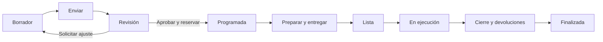

# Experiencia y dirección visual

Fecha: 24 de septiembre de 2026. Basado en la revisión visual de las 15 páginas de `docs/Propuesta.pdf` y los estilos de la proforma HTML.

## 1. Qué mantener

El PDF propone una aplicación clara, con fondo muy claro, títulos azul marino, tarjetas redondeadas, acciones azules y señales verdes/ámbar para el estado operativo. Sus mejores decisiones son el inicio orientado a tareas, la agenda compartida, la creación guiada de prácticas y el historial contextual.

Conservar ese lenguaje. Reducir el relieve, desenfoque, transparencias y sombras de los mockups: en una aplicación con muchas filas pueden dificultar distinguir controles y estados. Las flechas doradas y las perspectivas de las páginas 1, 14 y 15 funcionan para una presentación comercial; la aplicación necesita controles planos, alineados y legibles.

Este documento define el diseño a implementar. No es un prototipo interactivo ni pretende que las imágenes conceptuales ya resuelvan todos los estados del producto.

## 2. Sistema visual propuesto

Los siguientes son tokens de diseño propuestos; no una extracción exacta de los píxeles del PDF. Se conserva el azul `#1F5F96` de la proforma.

| Uso | Valor inicial |
|---|---|
| Fondo | `#F5F7FB` |
| Superficie | `#FFFFFF` |
| Texto principal | `#102A43` |
| Texto secundario | `#526275` |
| Acción principal | `#1F5F96`, texto blanco |
| Separadores decorativos | `#D6E0E8` |
| Borde identificable de controles | `#64748B` |
| Correcto | Texto `#166534`, fondo `#DCFCE7` |
| Atención | Texto `#854D0E`, fondo `#FEF3C7` |
| Error/bloqueo | Texto `#991B1B`, fondo `#FEE2E2` |
| Tipografía | Inter o tipografía del sistema; cuerpo 16 px, tablas 14–16 px |
| Espaciado | Escala 4, 8, 12, 16, 24, 32 px |
| Bordes redondeados | 8 px en controles, 12–16 px en tarjetas |

Una acción primaria por sección. Sombra suave solo para distinguir capas; foco de teclado visible. No usar fondos pastel con letras blancas ni color como único indicador.

Verificación de la paleta: las seis combinaciones de texto/fondo de la tabla superan 4,5:1 mediante cálculo de luminancia relativa; el borde de control sobre blanco alcanza 4,76:1. Esto verifica esos tokens, no todos los estados de una interfaz aún sin implementar.

Objetivo WCAG 2.2 AA: contraste de texto normal de al menos 4,5:1, estados con icono y texto, formularios etiquetados, navegación por teclado y mensajes de error asociados al campo. Diseñar controles táctiles de 44 px como objetivo de producto; el mínimo AA de tamaño de objetivo contempla 24 px y excepciones. Evaluar la interfaz final, no declarar accesibilidad solo por elegir una librería. [WCAG 2.2](https://www.w3.org/TR/WCAG22/).

## 3. Navegación según el paquete

Barra lateral con icono **y etiqueta** en escritorio; cabecera con organización activa, ubicación/filtros, búsqueda y cuenta. El menú se adapta a módulos y permisos, conservando la posición relativa de las secciones existentes.

| Paquete | Navegación visible |
|---|---|
| Reactivos | Inicio, Reactivos, Movimientos, Documentos, Configuración autorizada |
| Equipos | Inicio, Equipos, Incidencias, Documentos, Configuración autorizada |
| Operación integrada | Inicio, Agenda, Prácticas, Recursos, Incidencias, Reportes habilitados |

Los módulos no contratados se explican en Administración → Módulos. No llenar la pantalla diaria del técnico con botones bloqueados o anuncios de ampliación. Las referencias históricas de un módulo en consulta siguen siendo accesibles con su estado visible.

Si una persona pertenece a varias instituciones, el cambio de organización es explícito y limpia los datos de pantalla. Mostrar el nombre institucional en la cabecera y en exportaciones para reducir errores de contexto.

En móvil, priorizar listas de tareas, consulta y preparación. La agenda compleja usa una vista de lista por día; las tablas ofrecen columnas prioritarias y detalle. No intentar encoger toda la matriz de laboratorios en una pantalla pequeña.

## 4. Pantallas y mejoras respecto al PDF

| Referencia | Conservar | Mejorar al implementar |
|---|---|---|
| p.2, inicio | Resumen y próximas actividades | Cada contador abre trabajo filtrado; mostrar responsable, urgencia y siguiente acción |
| p.3, nueva práctica | Pasos Datos → Laboratorio → Recursos; reutilizar plantilla | Añadir revisión final, guardado de borrador y validación de horario/capacidad; copiar plantilla sin copiar aprobaciones |
| p.4, recursos | Selección desde inventario | Mostrar unidad, especificación, ubicación y disponibilidad para la fecha; distinguir solicitado/reservado/entregado |
| p.5, validación | Errores junto a alternativas | Separar bloqueo de advertencia; explicar quién puede resolverlo; ofrecer «sin alternativa disponible» |
| p.6, revisión | Resumen y tres decisiones claras | Mostrar revisión aprobada, cambios del técnico y motivo de ajuste/rechazo; revalidar al confirmar |
| p.7, agenda | Matriz por laboratorio y franja | Añadir fecha, leyenda, filtros, buffers de preparación/limpieza y vista de lista; bloquear edición duplicada |
| p.8, preparación | Lista verificable | Registrar cantidades entregadas y responsable; distinguir completar checklist de mover inventario |
| p.9, ejecución | Contexto y acción de terminar | Diferenciar «Finalizar actividad» de «Confirmar cierre»; mantener incidencia como acción visible |
| p.10, cierre | Capturar diferencias | Separar consumibles y reutilizables; mostrar cantidades reales y pendientes; sustituir «Deltas» por «Consumo y devolución» |
| p.11, incidencia | Contexto heredado | Añadir gravedad, responsable y efecto sobre disponibilidad; no toda incidencia requiere mantenimiento |
| p.12, búsqueda | Visión institucional por ubicación | No sumar cantidades incompatibles; indicar físico/utilizable/reservado y si se permite solicitar transferencia |
| p.13, equipo | Ficha con pestañas e historial | Separar condición actual de agenda futura; mostrar mantenimiento solo si está disponible en el paquete |

Las páginas 1 y 14–15 expresan visión y posicionamiento. Conviene mantenerlas como referencia comercial; el orden de implementación del producto está en el roadmap.

## 5. Primera experiencia del cliente

1. Operador crea la institución y aplica el paquete contratado; queda registro de módulos y límites.
2. Administrador invitado confirma su cuenta y configura ubicaciones y responsables.
3. El asistente de importación ofrece plantilla, ejemplo y correspondencia de columnas.
4. Una vista previa separa filas válidas, advertencias y errores antes de confirmar.
5. Se publica un resumen: registros importados, filas pendientes y movimientos iniciales creados.
6. El inicio muestra tareas reales de ese paquete, sin referencias a prácticas inexistentes.

Núcleo + Reactivos: vencimientos próximos, stock mínimo, datos sin completar y últimos movimientos. Núcleo + Equipos: averías, incidencias pendientes y activos sin responsable. Operación integrada: prácticas de hoy, preparación, revisión y cierres pendientes.

## 6. Flujo integrado de una práctica

El backend distingue estado, decisión y versión como se detalla en [dominio y datos](03_dominio_y_datos.md). El usuario ve el siguiente paso, el responsable y la razón si no puede avanzar.

Ejemplo de preparación: «Se entregarán 20 g del lote L-018 para esta práctica». No mostrar que se consumieron 20 g: siguen en custodia hasta registrar el uso real.

Ejemplo de cierre: entregado 20 g; consumido 17 g; retorno pendiente de verificación 3 g. La pantalla explica que esos 3 g todavía no se ofrecen a otra práctica. Para ocho tubos: entregados 8, devueltos aptos 7, dañados 1. Usar columnas distintas evita equiparar uso con consumo.

Desde F4, un cierre puede dejar préstamos pendientes solo si Materiales y Préstamos está publicado, autorizado para registrar la obligación y la política institucional lo permite. Sin ese módulo, resolver la custodia antes de completar. Las incidencias pueden seguir abiertas con responsable y seguimiento; no desaparecen al finalizar la actividad académica.

## 7. Estados que deben diseñarse además del caso ideal

| Situación | Respuesta de la interfaz |
|---|---|
| Dos técnicos intentan reservar lo mismo | Explicar que cambió la disponibilidad; conservar borrador y ofrecer revisar alternativas |
| Cambio de fecha después de aprobar | Resumen de impacto y nueva validación; no mover silenciosamente la reserva |
| Equipo averiado con prácticas futuras | Mostrar actividades afectadas y pedir sustitución/reprogramación |
| Caducidad desconocida | Indicar «Sin confirmar»; nunca mostrar el lote como vigente por defecto |
| Módulo pasando a consulta | Informar qué operaciones nuevas se bloquean y qué pendientes se pueden resolver |
| Sesión expirada | Volver a autenticar sin mostrar datos de otra cuenta ni confirmar una operación no enviada |
| Sin conexión | Avisar que no se pueden confirmar reservas o movimientos; no mostrar éxito ficticio |
| Sin permiso | Explicar acción restringida y contacto institucional, sin revelar recursos de otro cliente |
| Importación con errores | Mantener filas/causas descargables y permitir corregir sin duplicar lo ya aplicado |
| Carga lenta, vacío o fallo | Estados separados; un error nunca se presenta como inventario vacío |

Para cortes de Internet, acordar en fase 0 un procedimiento temporal de captura y conciliación. Un service worker con pantallas almacenadas no resuelve reservas concurrentes ni equivale a soporte offline.

## 8. Validación de diseño

Probar con tareas reales y datos sintéticos representativos: localizar un lote, registrar una salida, reportar una avería, importar una hoja y cambiar de institución. Al incorporar prácticas: crear desde plantilla, resolver un conflicto, preparar, cancelar y cerrar con diferencias.

Participantes propuestos: al menos un administrador y un operador de cada paquete inicial; posteriormente docente y técnico de prácticas. Registrar errores, pasos omitidos y tiempo de tarea antes de ajustar componentes.

Criterio de salida: los usuarios completan los flujos críticos sin asistencia constante, distinguen solicitado/reservado/entregado/consumido y pueden identificar su institución, siguiente acción y pendientes. Conservar capturas de escritorio/móvil y resultados de accesibilidad como referencia del producto implementado.
