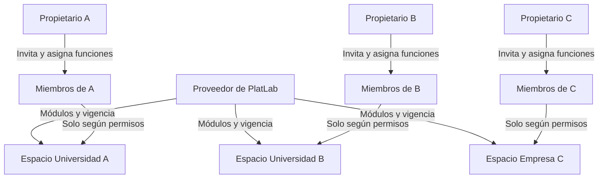

# Acceso institucional, docentes y reservas

Fecha: 26 de septiembre de 2026; revisado el 29 de septiembre. Este documento define la experiencia de incorporación, solicitudes y cambio de espacio para universidades y empresas con muchos solicitantes. Sigue siendo un plan; los controles deben implementarse y probarse.

## 1. Recomendación

Un docente tiene una identidad en PlatLab y una membresía autorizada en cada espacio donde trabaja. Dentro de un espacio caben varios laboratorios; no crear un espacio por profesor ni por cada sala. Tener muchos profesores no exige una aplicación distinta por universidad. La decisión de aislamiento y la diferencia entre titular jurídico, espacio y propietario se mantienen en [ADR 0001](../adr/0001_espacios_y_acceso.md).

## 2. Tres decisiones distintas

| Quién decide | Qué decide | Qué no concede esa decisión |
|---|---|---|
| Proveedor de PlatLab, desde la consola en `ops.dominio` | Módulos publicados habilitados, vigencia y límites de la suscripción de cada espacio | La consola no concede acceso general al contenido del cliente |
| Propietario/administrador del espacio | A quién invita, funciones delegables y laboratorios/recursos autorizados | Módulos no contratados ni acceso a otros espacios |
| API, en cada operación | Si identidad, membresía, módulo, permiso, ámbito y recurso permiten ejecutar el comando | No confía en un menú oculto, un `workspace_id` enviado ni un rol elegido por el usuario |

La suscripción se asigna al espacio, no a cada docente. El propietario administra accesos dentro de los módulos contratados. Las reglas de continuidad al vencer una contratación están en [dominio](03_dominio_y_datos.md); la fuente operativa de derechos y límites, en [ADR 0002](../adr/0002_contratos_y_derechos.md). Ningún límite comercial debe incentivar compartir cuentas.

Las flechas comerciales representan configuración de licencias, no permisos de lectura de inventarios. Una persona solo cruza a otro espacio si también tiene una membresía aceptada y vigente allí.

## 3. Incorporación de muchos docentes

Recomendación para el primer piloto docente: invitación individual o **carga de invitaciones por CSV**, usando el mismo mecanismo de Core. Cada persona conserva su cuenta y autoría. El propietario puede delegar esta tarea a administradores del espacio.

1. El administrador selecciona su espacio y carga emails, plantilla de rol, laboratorios autorizados y vencimiento cuando corresponda. Para tesistas añade responsable/participación.
2. La vista previa valida duplicados, emails, ámbitos y permisos delegables. El archivo no puede otorgar propiedad, rol del SaaS ni pertenencia a otra institución.
3. Confirmar crea invitaciones del espacio y trabajos de correo. Enviar por lotes con límites, reintentos y progreso; no mandar cientos de correos dentro de una petición HTTP.
4. El destinatario abre una pantalla que identifica el espacio y la invitación. En F3 puede continuar con Google, Microsoft o correo. Tras verificar la identidad y el destinatario, confirma la aceptación; el servidor revalida vigencia, revocación y que la delegación siga permitida antes de crear la membresía.
5. Si ya era miembro, no duplicar ni elevar sus permisos silenciosamente: mostrarlo y exigir un comando explícito de cambio. Si ya tenía cuenta en otro espacio, agregar solo la nueva membresía, sin revelar al administrador sus otras pertenencias.

La invitación **de identidad** y la invitación **a un espacio** son distintas. `core.invitations` gobierna la segunda; Supabase Auth verifica identidad. El objetivo de experiencia es un solo mensaje inicial: para una identidad nueva por correo, la invitación nativa de Auth puede confirmar el email al canjearse y continuar con la aceptación de membresía. La cuenta se crea inicialmente **sin confirmar**; no se programa un segundo correo de confirmación tras canjear ese enlace. Una identidad existente recibe una invitación de membresía, no otra alta global. [Comportamiento de las invitaciones Auth](https://supabase.com/docs/guides/auth/users#inviting-users).

OAuth permite volver a la invitación después del inicio de sesión, siempre que el destinatario corresponda a una identidad verificada. En Microsoft se configura el scope `email` y el claim `xms_edov`; no asumir que cualquier correo suministrado por Entra está verificado. La aplicación OAuth debe admitir las organizaciones objetivo; su directorio Microsoft no es un espacio de PlatLab. [Microsoft en Supabase](https://supabase.com/docs/guides/auth/social-login/auth-azure). Configuración, recuperación y verificación pertenecen a [ADR 0004](../adr/0004_identidad_y_operacion.md).

El CSV no confirma correos ni crea cuentas con `email_confirm: true`. Abrir un enlace con GET tampoco acepta la membresía ni consume automáticamente un token de un solo uso. La pantalla requiere acción explícita y contempla los analizadores de correo que precargan enlaces. Probar el canje documentado de Auth, enlaces vencidos y aceptación desde otro dispositivo; no depender del navegador del administrador que envió la invitación. [Precarga de enlaces y plantillas Auth](https://supabase.com/docs/guides/auth/auth-email-templates#email-prefetching).

Reenviar sustituye/revoca el token anterior según política, sin multiplicar altas. Validar el destinatario también cuando ya existe una sesión abierta. El rol de docente procede de la invitación autorizada y de la política fija de delegación, nunca del formulario público ni de metadatos de perfil editables. Si Auth ya creó la identidad pero falla el canje de membresía, el reintento recupera esa identidad; no crea otra. El historial registra quién invitó, aceptó, cambió permisos o revocó acceso.

Un registro público, si se habilita, crea identidad sin acceso institucional. No unir automáticamente a alguien por usar `@universidad.edu`: ese dominio puede incluir estudiantes, exmiembros y varios departamentos. Una futura opción «Solicitar acceso» requiere aprobación; no es necesaria para el primer piloto con invitaciones masivas.

Google/Microsoft OAuth de F3 no equivale a SSO institucional SAML ni automatiza bajas universitarias. SAML queda como ampliación contratada y debe considerar el ciclo de miembros y sus reglas de identidad; no construir una fusión propia de cuentas por email. [SSO e identidades](https://supabase.com/docs/guides/auth/enterprise-sso/auth-sso-saml#user-accounts-and-identities).

## 4. Qué puede hacer un docente

El docente usa una vista de **Solicitudes y reservas** para proponer una actividad a partir de una plantilla: fecha/franja, equipos, materiales, reactivos y condiciones necesarias. No selecciona un laboratorio definitivo ni asigna existencias. Consulta la agenda y el catálogo autorizados sin entrar a las pantallas administrativas de inventario; el técnico decide la sala y las asignaciones.

| Acción | Docente/solicitante | Técnico autorizado |
|---|---|---|
| Consultar laboratorios y horarios | Solo ámbitos autorizados; ocupación de terceros sin detalles personales por defecto | Ámbitos asignados y detalle necesario para operar |
| Consultar catálogo para solicitar | Recursos solicitables, unidades, condiciones y disponibilidad orientativa; documentos de seguridad autorizados | Datos operativos según su permiso |
| Proponer actividad con recursos | Propia, desde plantilla; fecha/franja y requisitos, sin laboratorio definitivo; el servidor fija solicitante y espacio | En nombre de otro solo con permiso específico y autoría separada |
| Asignar laboratorio y recursos | Consulta lo propuesto o confirmado; no asigna | Elige candidatos autorizados del mismo espacio y confirma transaccionalmente |
| Cambiar o cancelar solicitud | Propia y según estado; cambios aprobados siguen revisión y conciliación | Según el flujo y alcance, con motivo |
| Aceptar un cambio sustancial | Acepta la revisión concreta preaprobada; se confirma si siguen vigentes autoridad y disponibilidad | Emite la preaprobación y atiende excepciones; no repite aprobación cuando la aceptación ya confirma |
| Reubicar una actividad programada | Recibe aviso; acepta si se alteran sustancialmente las condiciones | Confirma reubicación equivalente con motivo; fuera de equivalencia propone revisión |
| Aprobar y asignar lotes/equipos | No por defecto | Sí, con aprobación y reserva atómicas |
| Crear productos, ajustar saldos o registrar entradas | No por ser solicitante | Solo con permisos concretos de inventario |
| Consultar solicitudes de otros | No por defecto; ver un horario ocupado no revela la solicitud completa | Dentro del ámbito de trabajo autorizado |

Separar permisos como `requestable_catalog.read`, `activities.create_own`, `activities.read_own`, `activities.approve`, `inventory.adjust` y `members.invite`. Cada permiso conserva su módulo y ámbito; los nombres son propuesta de catálogo, no endpoints ya implementados. Una función no implica todas las acciones del módulo.

Consultar recursos de M2/M3/M6 a través de Prácticas sigue exigiendo que estén contratados y que el solicitante esté autorizado a pedirlos. No permite eludir una licencia o leer datos de otro laboratorio no autorizado. El técnico puede seleccionar un lote apto dentro de su ámbito sin que el docente reciba permisos para gestionarlo. Si proponer un sustituto cambia sustancialmente la solicitud, se exige aceptación.

En una empresa, la misma función puede mostrarse como «Solicitante» y la actividad como «Trabajo de laboratorio». El mecanismo de pertenencia y permisos es el mismo. Validar ese flujo con la empresa antes de ofrecer funciones específicas: no se añade por este cambio un LIMS industrial, gestión de muestras o certificados.

## 5. Qué significa reservar con todos los recursos

**El docente propone; el técnico asigna y autoriza; el sistema comprueba y confirma.** Enviar la solicitud o calcular candidatos no aparta stock ni una sala. El técnico recibe requisitos y sugerencias de laboratorios aptos, elige dentro del mismo workspace y confirma si satisface la solicitud. La asignación inicial de una sala que respeta las condiciones no agrega un paso de aceptación docente.

Cambiar fecha/franja, recursos o condiciones sustanciales requiere una propuesta técnica preaprobada. El solicitante compara y acepta o declina esa revisión concreta. Al aceptar, el servidor revalida y confirma agenda y recursos conjuntamente; solo las excepciones vuelven a revisión. La autorización sigue perteneciendo al técnico, sin conceder permiso de aprobación al docente. El [ADR 0007](../adr/0007_aprobacion_condicionada.md), aceptado el 29 de septiembre, es la fuente de estas reglas y sus resultados de error.

Para una actividad ya programada, el técnico puede reubicarla a una sala equivalente del mismo espacio con motivo, auditoría y aviso: se conservan fecha/franja, recursos y condiciones de seguridad y accesibilidad. Si altera esas condiciones, presenta una revisión para aceptación. La vista distingue reserva vigente y alternativa, y un conflicto conserva la reserva anterior. No se reubican actividades entre universidades o entre workspaces de una misma universidad. Revocar a un docente no borra una custodia existente: el técnico autorizado sigue pudiendo resolverla.

La reserva integrada necesita M4 + M5 y cada inventario que se quiera verificar: M2 reactivos, M3 equipos, M6 materiales. F3 entrega la integración con inventarios ya publicados; la oferta completa de materiales/préstamos necesita también F4, que puede adelantarse tras F2 para su parte independiente. No anunciar «reserva completa con materiales verificados» antes de esa entrega.

M4 permite reservas directas de laboratorios con permiso específico; no concede por sí solo el flujo de práctica ni autoridad sobre inventarios. Confirmar directamente sin intervención técnica es una decisión distinta de aceptar una propuesta ya preaprobada; no se habilita por ser propietario o docente.

## 6. Cómo se evita el acceso a otra institución

Ejemplo: Ana pertenece al espacio A. Si manipula la URL para elegir B, la API rechaza por falta de membresía. Si mantiene A pero envía el ID de un equipo de B, la consulta autorizada y la FK compuesta impiden usarlo. La respuesta no revela su contenido ni si existe para otro cliente.

Los controles de autorización, RLS, referencias compuestas y credenciales se especifican en [dominio](03_dominio_y_datos.md) y [ADR 0001](../adr/0001_espacios_y_acceso.md). Las pruebas deben cubrir todos los caminos de acceso; un identificador de espacio o un menú oculto no demuestra aislamiento.

La lista de espacios solo incluye membresías vigentes de la persona. Cambiar de espacio cancela consultas anteriores, limpia la vista y evita mostrar respuestas tardías del espacio previo. Cambiar el email o pertenecer al mismo dominio no mueve miembros ni datos. Un administrador local no puede desactivar la identidad global de una persona que pertenece a otros espacios.

El docente ve solamente sus solicitudes y la ocupación autorizada. El técnico ve el trabajo correspondiente a sus laboratorios. Los roles o cambios de membresía se comprueban al operar, de modo que conservar una pestaña abierta no conserve permisos revocados.

## 7. Fuentes técnicas y actualización de vistas

Los diagramas y componentes se mantienen en [arquitectura](02_arquitectura.md) y el despliegue, regiones y proveedores en [infraestructura](04_infraestructura.md). La consola del proveedor tiene compilación y dominio propios; usa la misma API con autorización administrativa reforzada, conforme a [ADR 0004](../adr/0004_identidad_y_operacion.md).

El portal docente actualiza al cargar, regresar a la pestaña o ejecutar una acción, y ofrece «Actualizar» con la hora de los datos mostrados. La política de refresco automático del técnico, agregación de endpoints, cuotas HTTP y caché tiene una sola fuente en [ADR 0003](../adr/0003_refresco_y_limites.md). Una agenda recién actualizada no garantiza una reserva: el resultado autoritativo aparece al confirmar.

## 8. Entregas y pruebas que cierran este diseño

- F1a: pertenencia, autenticación, catálogo fijo de roles/ámbitos y módulos, auditoría y aislamiento por API/RLS entre espacios A/B; primera demo de Reactivos con datos sintéticos.
- F1b, en paralelo con F2: alta operativa, invitaciones individuales, consola del proveedor y procedimientos SaaS que exige la puerta de piloto con datos reales. Una prueba puede usar el inventario del cliente al cumplir esa puerta, el encargo y las condiciones de salida; la etiqueta `trial` no prohíbe por sí sola los datos reales.
- F2: catálogos administrativos e inventarios según paquete; preparar interfaces de consulta autorizada.
- F3: invitaciones masivas, Google/Microsoft OAuth, propuestas desde plantilla, asignación técnica, aprobación condicionada y reubicaciones autorizadas; elegibilidad revalidada y reservas atómicas. Validar por entregas con el laboratorio colaborador y probar aislamiento con espacios separados.
- F4: integrar Materiales y Préstamos; validar el paquete con los tres tipos de recurso.
- Después, solo si se justifica: solicitud de acceso autoservicio, SSO institucional o cliente dedicado.

Casos obligatorios: usuario A intenta usar ID de B; usuario con dos espacios intenta mezclar recursos; docente intenta ajustar stock o fijar una sala definitiva; técnico aprueba una petición cuyo solicitante fue revocado; invitación abierta con otra cuenta, precargada por un analizador o aceptada dos veces; CSV repetido no duplica ni eleva permisos; identidad ya existente con OAuth; correo Microsoft sin verificación suficiente; usuario autenticado sin membresía no ve dominio; cambio de espacio con respuestas en vuelo; dos aceptaciones piden el último recurso y solo una se confirma; sugerencia sin confirmación no crea reserva; reubicación equivalente fallida conserva la anterior; cambio sustancial exige aceptación. El [roadmap](06_roadmap.md) concentra las puertas de entrega.
