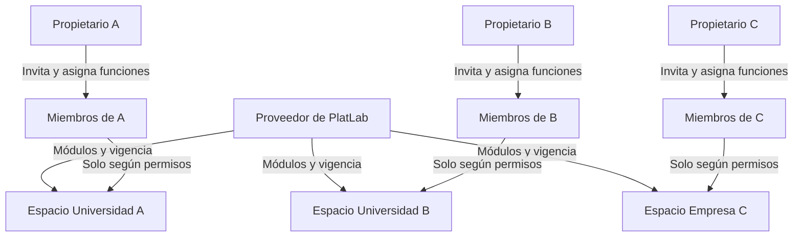
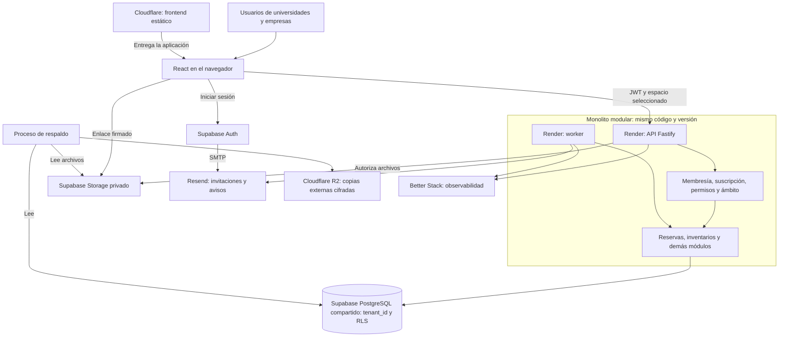

# Acceso institucional, docentes y reservas

Fecha: 26 de septiembre de 2026. Ampliación del diseño para universidades y empresas con muchos solicitantes. Sigue siendo un plan; los controles descritos deben implementarse y probarse.

## 1. Recomendación

Un producto SaaS común, con espacios de trabajo independientes y PostgreSQL compartido con aislamiento por `tenant_id`. Cada universidad o empresa puede tener uno o varios espacios según su operación y contratación. Dentro de un espacio caben varios laboratorios; no crear un tenant por profesor ni por cada sala.

| Alternativa | Evaluación | Decisión |
|---|---|---|
| Aplicación y base compartidas, datos aislados por espacio | Menor carga operativa; requiere controles de aislamiento, cuotas y pruebas en todos los caminos de acceso | Modalidad estándar |
| Misma aplicación con infraestructura/base dedicada | Mayor separación operativa y recuperación individual; más costo, despliegues y mantenimiento | Excepción contratada por requisitos concretos |
| Código distinto para cada universidad | Multiplica correcciones, versiones y riesgo de divergencia | No adoptar |

Tener muchos profesores no exige una aplicación o base por universidad. Medir usuarios simultáneos, peticiones, almacenamiento y trabajos; dimensionar y aplicar cuotas. El despliegue dedicado conserva código y migraciones comunes. Un subdominio o logo identifica al cliente, pero no constituye aislamiento de datos.

## 2. Tres decisiones distintas

| Quién decide | Qué decide | Qué no concede esa decisión |
|---|---|---|
| Proveedor de PlatLab, desde `/ops` | Módulos publicados habilitados, vigencia y límites de la suscripción de cada espacio | Acceso general al contenido del cliente |
| Propietario/administrador del espacio | A quién invita, funciones delegables y laboratorios/recursos autorizados | Módulos no contratados ni acceso a otros espacios |
| API, en cada operación | Si identidad, membresía, módulo, permiso, ámbito y recurso permiten ejecutar el comando | No confía en un menú oculto, un `tenant_id` enviado ni un rol elegido por el usuario |

Para una operación nueva: **espacio habilitado + membresía vigente + módulo contratado/vigente + permiso de acción + ámbito autorizado + reglas del recurso**. Consultas históricas y resolución de pendientes usan la matriz de continuidad del [modelo de datos](03_dominio_y_datos.md).

La suscripción se asigna al espacio. No se crea una suscripción independiente por cada docente. Los límites comerciales de usuarios pueden definirse por paquete, pero nunca reemplazan los permisos ni obligan a compartir cuentas.

Las flechas comerciales representan configuración de licencias, no permisos de lectura de inventarios. Una persona solo cruza a otro espacio si también tiene una membresía aceptada y vigente allí.

## 3. Incorporación de muchos docentes

Recomendación para el primer piloto docente: invitación individual o **carga de invitaciones por CSV**, usando el mismo mecanismo de Core. Cada persona conserva su cuenta y autoría. El propietario puede delegar esta tarea a administradores del espacio.

1. El administrador selecciona su espacio y carga emails, plantilla de rol, laboratorios autorizados y vencimiento cuando corresponda. Para tesistas añade responsable/participación.
2. La vista previa valida duplicados, emails, ámbitos y permisos delegables. El archivo no puede otorgar propiedad, rol del SaaS ni pertenencia a otra institución.
3. Confirmar crea invitaciones del espacio y trabajos de correo. Enviar por lotes con límites, reintentos y progreso; no mandar cientos de correos dentro de una petición HTTP.
4. Cada destinatario verifica su email e inicia sesión o crea su identidad; canjea una invitación de un solo uso ligada al espacio y destinatario. El servidor revalida vigencia, revocación y que la delegación siga permitida antes de crear la membresía.
5. Si ya era miembro, no duplicar ni elevar sus permisos silenciosamente: mostrarlo y exigir un comando explícito de cambio. Si ya tenía cuenta en otro espacio, agregar solo la nueva membresía, sin revelar al administrador sus otras pertenencias.

La invitación **a PlatLab Auth** y la invitación **a un espacio** son diferentes. `core.invitations` gobierna la segunda; Supabase Auth verifica identidad. No utilizar una invitación de alta de Auth como sustituto de la membresía, ni recrear una cuenta global cada vez que se agrega un espacio. Supabase dispone de una operación de invitación por email, pero la autorización institucional sigue perteneciendo a PlatLab. [Invitación de Supabase Auth](https://supabase.com/docs/reference/javascript/auth-admin-inviteuserbyemail).

Reenviar sustituye/revoca el token anterior según política, sin multiplicar altas. Validar el destinatario también cuando ya existe una sesión abierta. El rol de docente procede de la invitación autorizada, nunca del formulario público. El historial registra quién invitó, aceptó, cambió permisos o revocó acceso.

Un registro público, si se habilita, crea identidad sin acceso institucional. No unir automáticamente a alguien por usar `@universidad.edu`: ese dominio puede incluir estudiantes, exmiembros y varios departamentos. Una futura opción «Solicitar acceso» requiere aprobación; no es necesaria para el primer piloto con invitaciones masivas.

SSO institucional queda como ampliación si el cliente lo requiere: comprobar proveedor, costos, alta/baja de miembros y aislamiento. No prometer unificación automática de cuentas por email; Supabase documenta diferencias de identidad y ausencia de vinculación automática en SAML. [SSO e identidades](https://supabase.com/docs/guides/auth/enterprise-sso/auth-sso-saml#user-accounts-and-identities).

## 4. Qué puede hacer un docente

El docente usa una vista de **Solicitudes y reservas**, con laboratorios y catálogo de recursos permitidos. No necesita entrar a las pantallas administrativas de Reactivos, Equipos o Materiales para pedir esos recursos.

| Acción | Docente/solicitante | Técnico autorizado |
|---|---|---|
| Consultar laboratorios y horarios | Solo ámbitos autorizados; ocupación de terceros sin detalles personales por defecto | Ámbitos asignados y detalle necesario para operar |
| Consultar catálogo para solicitar | Recursos solicitables, unidades, condiciones y disponibilidad orientativa; documentos de seguridad autorizados | Datos operativos según su permiso |
| Crear actividad con recursos | Propia; el servidor fija solicitante y espacio a partir de identidad/membresía | En nombre de otro solo con permiso específico y autoría separada |
| Cambiar o cancelar solicitud | Propia y según estado; cambios aprobados siguen revisión y conciliación | Según el flujo y alcance, con motivo |
| Aprobar y asignar lotes/equipos | No por defecto | Sí, con aprobación y reserva atómicas |
| Crear productos, ajustar saldos o registrar entradas | No por ser solicitante | Solo con permisos concretos de inventario |
| Consultar solicitudes de otros | No por defecto; ver un horario ocupado no revela la solicitud completa | Dentro del ámbito de trabajo autorizado |

Separar permisos como `requestable_catalog.read`, `activities.create_own`, `activities.read_own`, `activities.approve`, `inventory.adjust` y `members.invite`. Cada permiso conserva su módulo y ámbito; los nombres son propuesta de catálogo, no endpoints ya implementados. Una función no implica todas las acciones del módulo.

Consultar recursos de M2/M3/M6 a través de Prácticas sigue exigiendo que estén contratados y que el solicitante esté autorizado a pedirlos. No permite eludir una licencia o leer datos de otro laboratorio no autorizado. El técnico puede seleccionar un lote apto dentro de su ámbito sin que el docente reciba permisos para gestionarlo. Si proponer un sustituto cambia sustancialmente la solicitud, se exige aceptación.

En una empresa, la misma función puede mostrarse como «Solicitante» y la actividad como «Trabajo de laboratorio». El mecanismo de pertenencia y permisos es el mismo. Validar ese flujo con la empresa antes de ofrecer funciones específicas: no se añade por este cambio un LIMS industrial, gestión de muestras o certificados.

## 5. Qué significa reservar con todos los recursos

El profesor inicia la solicitud completa: laboratorio, fecha, horario, equipos y cantidades de reactivos/materiales. La propuesta inicial mantiene aprobación técnica explícita: **enviar una solicitud no confirma ni aparta stock**. La pantalla distingue borrador, pendiente y reserva confirmada.

Al aprobar, la API comprueba en una transacción:

1. Permiso y ámbito actuales del técnico, paquete y estado del espacio.
2. Membresía y elegibilidad actuales del solicitante: actividad, laboratorio y recursos solicitados; participación vigente cuando aplique. Si se revocó, no crear un compromiso nuevo en su nombre.
3. Todos los IDs pertenecen al mismo espacio: laboratorio, recursos, personas, documentos y revisiones.
4. Horario, condición del equipo, cantidades, lotes aptos y compromisos existentes.
5. Confirmación conjunta de agenda, asignaciones, auditoría y evento; ante conflicto, no queda una reserva parcial.

El técnico debe tener permiso de compromiso sobre todos los ámbitos afectados; de lo contrario se deriva a alguien autorizado, sin aprobaciones parciales improvisadas. Reasignar solicitante/responsable exige trazabilidad. Revocar a un docente no borra una custodia existente: el técnico autorizado sigue pudiendo resolverla.

La reserva integrada necesita M4 + M5 y cada inventario que se quiera verificar: M2 reactivos, M3 equipos, M6 materiales. F3 entrega la integración con inventarios ya publicados; la oferta completa de materiales/préstamos necesita también F4, que puede adelantarse tras F2 para su parte independiente. No anunciar «reserva completa con materiales verificados» antes de esa entrega.

M4 permite reservas directas de espacios con permiso específico; no concede por sí solo el flujo de práctica ni autoridad sobre inventarios. Una futura confirmación automática requeriría política institucional y las mismas comprobaciones transaccionales; no se habilita solo por ser propietario o docente.

## 6. Cómo se evita el acceso a otra institución

Ejemplo: Ana pertenece al espacio A. Si manipula la URL para elegir B, la API rechaza por falta de membresía. Si mantiene A pero envía el ID de un equipo de B, la consulta autorizada y la FK compuesta impiden usarlo. La respuesta no revela su contenido ni si existe para otro cliente.

Controles complementarios: autorización en cada operación, `tenant_id` en tablas institucionales, FKs compuestas, políticas RLS, SQL de runtime sin propiedad/BYPASSRLS, archivos privados, trabajos con contexto explícito y caché ligada a usuario/espacio. RLS permite políticas de lectura y escritura dentro de PostgreSQL; debe configurarse junto con privilegios y pruebas. [RLS en Supabase/PostgreSQL](https://supabase.com/docs/guides/database/postgres/row-level-security).

Los permisos locales se comprueban en la base; no dependen únicamente de un rol guardado al iniciar sesión. Los JWT pueden conservar información anterior a una revocación hasta renovarse. [Vigencia de atributos JWT](https://supabase.com/docs/guides/database/postgres/row-level-security#helper-functions).

La lista de espacios solo incluye membresías vigentes de la persona. Cambiar de espacio cancela consultas anteriores, limpia la vista y evita mostrar respuestas tardías del espacio previo. Cambiar el email o pertenecer al mismo dominio no mueve miembros ni datos. Un administrador local no puede desactivar la identidad global de una persona que pertenece a otros espacios.

Aislamiento lógico reduce el riesgo mediante controles comprobables; no se declara garantizado por añadir una columna. También hay que probar búsquedas, exportaciones, documentos, colas y rutas administrativas. Copias y procedimientos privilegiados tienen sus propios controles de acceso según [infraestructura](04_infraestructura.md).

## 7. Arquitectura e infraestructura

La consola `/ops` usa esta misma aplicación y API, con autorización administrativa propia. API/worker son la vía ordinaria al dominio; Auth, Storage, migraciones y respaldos tienen accesos específicos. No hay conexión del navegador a las tablas de negocio. Región y dimensionamiento siguen las pruebas definidas en infraestructura.

## 8. Entregas y pruebas que cierran este diseño

- F1: pertenencia, invitaciones individuales, propiedad, roles/ámbitos y licencias; rechazo por API y RLS entre espacios A/B.
- F2: catálogos administrativos e inventarios según paquete; preparar interfaces de consulta autorizada.
- F3: invitaciones masivas, portal del solicitante, catálogo solicitables, solicitudes propias, elegibilidad revalidada y reservas atómicas; prueba con docentes de varias instituciones.
- F4: integrar Materiales y Préstamos; validar el paquete con los tres tipos de recurso.
- Después, solo si se justifica: solicitud de acceso autoservicio, SSO institucional o cliente dedicado.

Casos obligatorios: usuario A intenta usar ID de B; usuario con dos espacios intenta mezclar recursos; docente intenta ajustar stock; técnico aprueba una petición cuyo solicitante fue revocado; invitación enviada a un tercero o aceptada dos veces; CSV repetido no duplica ni eleva permisos; usuario autenticado sin membresía no ve dominio; cambio de espacio con respuestas en vuelo; dos docentes piden el último recurso y solo una aprobación compatible se confirma.
